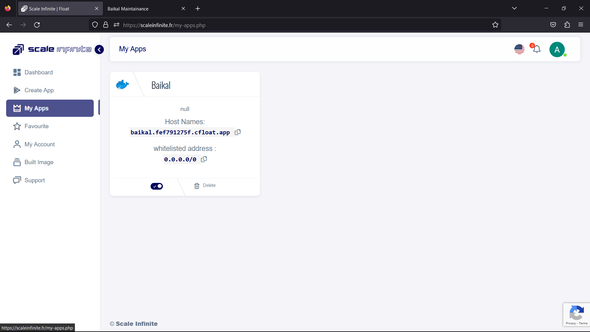
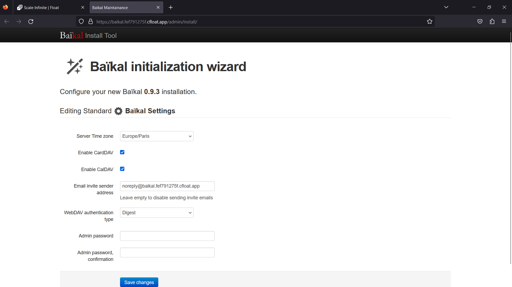
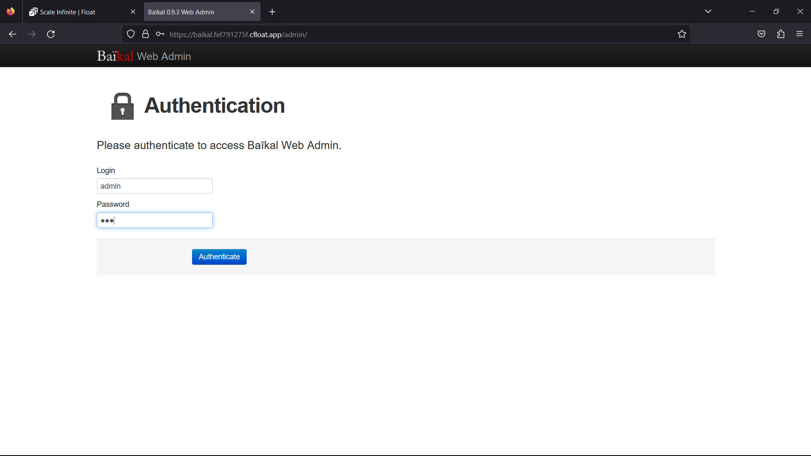
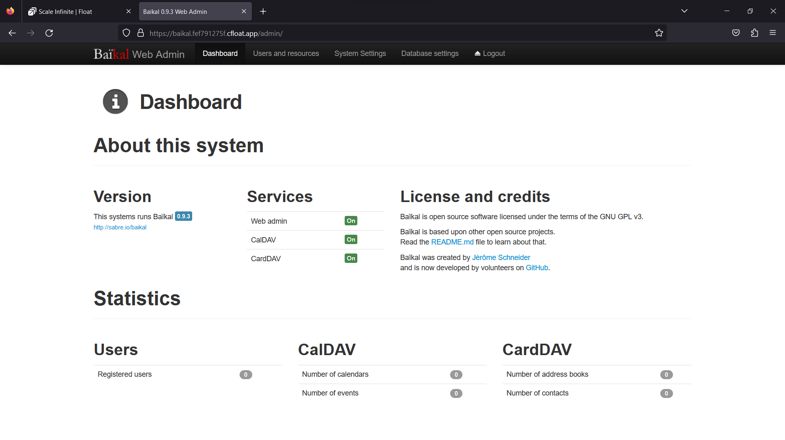

# 🖥 Baikal Deployment

### <mark style="color:blue;">What's is baikal?</mark>

<mark style="color:orange;">**1. Web Interface Mastery –**</mark> <mark style="color:orange;"></mark><mark style="color:orange;">Imagine a web interface that's not just user-friendly but genuinely intuitive. Baïkal offers exactly that. Managing users, address books, and calendars becomes a breeze. It's like having a personal assistant that understands your every command.</mark>

**2. Universal Access –** Baïkal doesn't believe in boundaries. It's your bridge to a synchronized digital life. Access your contacts and calendars from every device you own. No more hassles with compatibility issues – it's all about harmonious connectivity.

**3. The Symphony of Integration –** Think of Baïkal as the conductor of your digital orchestra. It seamlessly orchestrates your contacts and calendars, allowing you to be in perfect sync. It's like having your own digital maestro for a harmonious digital life.

**4. Digital Harmony –** Baïkal doesn't just bring order to your digital world; it transforms it into a harmonious melody. Your contacts and calendars are no longer scattered – they're in perfect alignment, like musical notes on a score.

**5. Device Agnostic –** Whether you're a fan of the latest gadgets or cherish vintage tech, Baïkal doesn't discriminate. It ensures that your contacts and calendars are at your fingertips, regardless of the device you choose to use.

**6. A Symphony of Productivity –** Baïkal isn't just a tool; it's your productivity partner. It simplifies, streamlines, and harmonizes your digital life. It's the note that brings together the entire symphony of your connected existence.

In the grand performance of digital life, Baïkal plays a pivotal role. It's your conductor, your assistant, and your guardian of seamless connectivity. With Baïkal, your contacts and calendars become a harmonious symphony, ready to be played on any device you choose. Welcome to the world of effortless digital harmony with Baïkal.

### <mark style="color:blue;">**How It Works:**</mark>

<mark style="color:orange;">**The Baïkal Ballet –**</mark> <mark style="color:orange;"></mark><mark style="color:orange;">Ever watched a ballet performance? Imagine Baïkal as the choreographer, orchestrating the beautiful dance of your digital contacts and calendars. It elegantly brings them together in a seamless web interface.</mark>

**Sync Across Universes –** Baïkal isn't just a contact manager; it's a cosmic connector. It lets you access your precious contacts and calendars from any corner of the digital universe. It's like having a universal remote for your digital life.

**Intuitive Maestro –** Baïkal's web interface is more intuitive than your grandma's chicken soup recipe. It's so easy to manage users, address books, and calendars that you'd think it reads your mind.

**Digital Symphony –** Baïkal is all about harmonizing your digital world. It takes your scattered notes and chaotic schedules and turns them into a symphony of organized bliss. It's like tidying up a room filled with chaos, but in the digital realm.

**Cross-Device Serenade –** Baïkal serenades you across all your devices. It doesn't care if you're a tech enthusiast or a collector of antique gadgets. Your contacts and calendars will be at your beck and call, no matter which device you choose.

**The Productivity Crescendo –** Baïkal is not just a tool; it's your digital maestro. It conducts your digital orchestra, creating a symphony of productivity. It's the secret sauce to your efficient digital life.

So, how does Baïkal work its magic? Picture it as a digital ballet choreographer, a universal connector, and an intuitive maestro all rolled into one. It takes your digital chaos, orchestrates it into a harmonious symphony, and delivers it seamlessly to any device. That's Baïkal – where technology meets elegance.

### <mark style="color:blue;">Steps And Procedure</mark>

&#x20;<mark style="background-color:purple;">**This deployment utilizes the official baikal Docker image. Here's a step-by-step guide to get you started:**</mark>

1. Begin by navigating to the "Create Apps" page and use the search bar to find the  [ckulka/baikal](https://hub.docker.com/r/ckulka/baikal) application.
2. Click on the "Install" button to initiate the installation process.
3. Fill in all the required fields with the necessary information.
4. If you prefer, you can click on the "Advanced" option to access additional settings (this step is optional).
5. After making your selections, press the "Install" button to proceed.
6. Once the installation is complete, you'll be directed to the "My Apps" page, where you'll find a list of all the applications you've deployed.
7. Copy the Hostname of the Baïkal  application without the NodePort and paste it into your preferred browser's address bar.
8. Voilà! You're now able to access the  Baïkal webpage and explore its content.

By following these straightforward steps, you'll have successfully deployed the Baïkal application and gained access to its features through a seamless and user-friendly process.

### <mark style="color:blue;">Installation</mark>

| Docker Image                                                                                                                        |
| ----------------------------------------------------------------------------------------------------------------------------------- |
| [baikal](https://hub.docker.com/r/ckulka/baikal) <mark style="background-color:yellow;">👈(click me,for the dockerhub image)</mark> |

| Application name                                                               |
| ------------------------------------------------------------------------------ |
| <mark style="background-color:yellow;">Eg: baikal(you can put any name)</mark> |

| Resource Allocation                                                                                                                                                     |
| ----------------------------------------------------------------------------------------------------------------------------------------------------------------------- |
| <mark style="background-color:yellow;">0-100%(</mark><mark style="color:orange;">10 % of your allocated resources (CPU, RAM) will be used for this application.)</mark> |

<mark style="background-color:yellow;">`PROTOCOL`</mark>

<table><thead><tr><th width="417">Protocol</th><th>Protocol Value</th></tr></thead><tbody><tr><td><mark style="background-color:yellow;">Http</mark></td><td><mark style="color:orange;">80</mark></td></tr><tr><td><mark style="background-color:yellow;">Tcp</mark></td><td>-</td></tr></tbody></table>

| Install with Default                                                                                                                                        | Advanced                                                                                                                                                               |
| ----------------------------------------------------------------------------------------------------------------------------------------------------------- | ---------------------------------------------------------------------------------------------------------------------------------------------------------------------- |
| <mark style="background-color:yellow;">(select this if you want install with default settings if don't have environment value and working directory)</mark> | <mark style="background-color:yellow;">(select this if you want to go with advanced settings, where you select you own environment value and working directory)</mark> |

If you choose Advanced option:

| ENV VARIABLE                                                            |
| ----------------------------------------------------------------------- |
| 
<code>Give env variable.</code>

<code>Eg:key==value</code>
 |

| WORKING DIR                                                                             |
| --------------------------------------------------------------------------------------- |
| 
<code>WORKDIR for the application.</code>

 <code>Eg:usr/src/yourAPP</code>
 |
| <mark style="color:red;">Here use ( use the path after   " :"  )</mark>                 |

<mark style="background-color:yellow;">`Access`</mark>

| Public                                      | Private                                      |
| ------------------------------------------- | -------------------------------------------- |
| (select this if you want to make it public) | (select this if you want to make it private) |

<mark style="color:purple;">**Step-by-Step Guide to baikal Deployment**</mark>

1. <mark style="color:blue;">**Docker Image Selection**</mark>**:**
   * <mark style="color:orange;">Docker Image Name: baikal</mark>
2. <mark style="color:orange;">**Application Details**</mark>**:**
   * Application Name: baikal
   * Resource Allocation: Set the desired resource allocation from 0-100%.
3. <mark style="color:orange;">**Protocol Configuration**</mark>**:**
   * Protocol: `HTTP`
   * Port: `80`
4. <mark style="color:orange;">**Installation Options**</mark>**:**
   * Choose between "Default" or "Advanced" installation.
5. <mark style="color:orange;">**Advanced Installation (Optional**</mark>**):**
   * If selecting "Advanced," you can customize the environment variables and working directory:
   *   **Environment Variables:**

       Environment variables are dynamic values used by a containerized application for configuration. They are defined as key-value pairs, like `API_KEY=xyz`, and provide flexibility to adjust an app's behavior without changing its code.

       * Environment Variables: Define environment variables with keys and values (e.g., `key=value`).
   *   **Working Directory:**

       The working directory is the starting point inside a container where an app's files are located. It affects relative file paths and operations. For example, if set to `/usr/src/yourAPP`, an app will reference files from there, like `/usr/src/yourAPP/data.txt`.

       * Working Directory: Set the working directory for the application (e.g., `usr/src/yourAPP`).
       * <mark style="color:red;">Here use ( use the path after   " :"  )</mark>
6. <mark style="color:orange;">**Access Configuration**</mark>**:**
   * Choose between "Public" or "Private" access to the deployed application.
7. <mark style="color:orange;">**Installation**</mark>**:**
   * Click the "Install" button to initiate the deployment process.

By following these steps, you can effortlessly deploy an Baïkal instance with your chosen configurations. This enables you to tailor the environment to match your application's requirements and specifications. Whether opting for the default installation or delving into advanced settings, our platform ensures a seamless deployment experience while providing you the flexibility to customize according to your needs.

### <mark style="color:blue;">Visual Snapshots</mark>

<figure><figcaption></figcaption></figure>

 

<figure><figcaption></figcaption></figure>

 

<figure><figcaption></figcaption></figure>

<figure><figcaption></figcaption></figure>

 

<figure><figcaption></figcaption></figure>

### <mark style="color:orange;">Youtube Tutorial</mark>&#x20;

Check out our youtube video for more clarification.

### <mark style="color:blue;">FAQ</mark>

**About** Baïkal **image we used.**

This is the official Baïkal  image.

**Can I deploy my own** Baïkal **image with modified configuration ?**

Yes, you can simply deploy any version or modified image to our platform by linking your docker hub account to our platform.

**Are my data persistent ?**

For the free user there is no persistence, and for the premium user you can different type of persistence.

### Join us

Stay informed and engaged with our project's latest developments and support on [Slack](https://app.slack.com/client/T04QS32JX6E/C04QKEWE146). Join us today to connect, collaborate, and keep the momentum going!&#x20;
