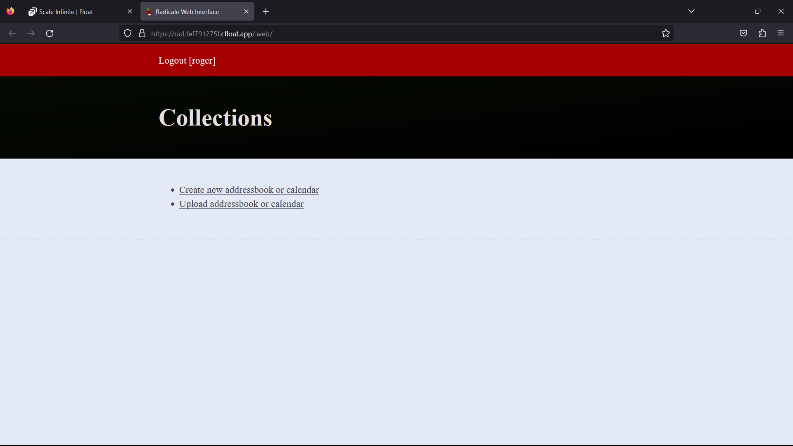
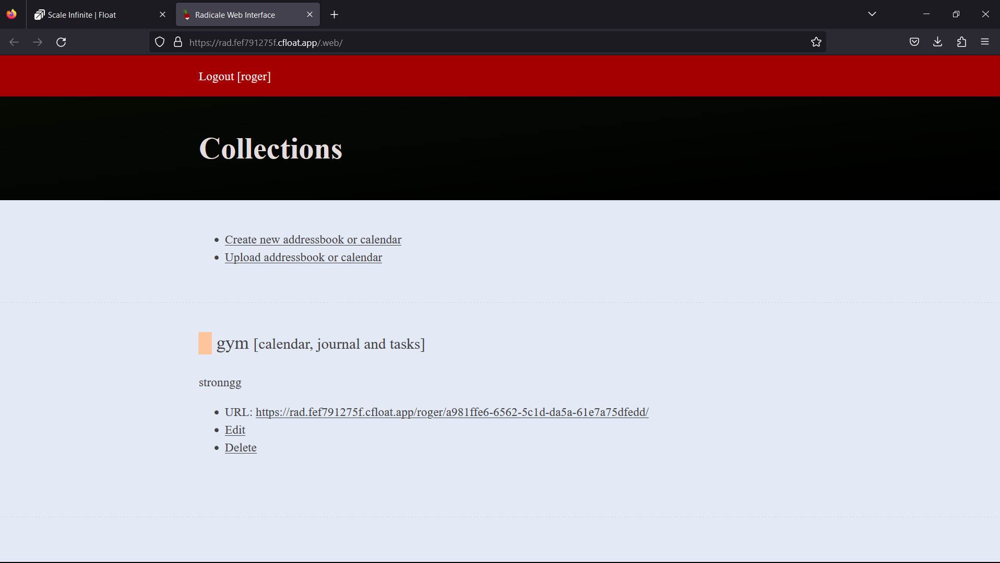
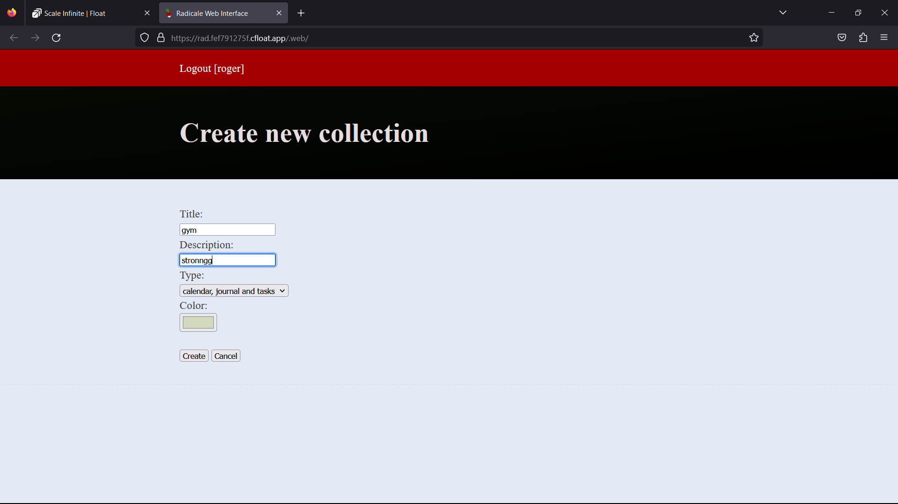

# 🖥 Radicale Deployment

### <mark style="color:blue;">What's is Radicale?</mark>

<mark style="color:orange;">**Your Personal Calendar and Contact Butler**</mark>

<mark style="color:orange;">**The Ultimate Calendar and Contact Sidekick:**</mark> Meet Radicale, your trusty companion for calendars, to-do lists, and contacts. It doesn't just manage them; it's a pro at effortlessly organizing and sharing them.

<mark style="color:yellow;">**All-in-One Organizer:**</mark> Radicale is your go-to for keeping track of events, tasks, journal entries, and those precious business cards. It's like your personal secretary for both your personal and professional life.

<mark style="color:yellow;">**Simplicity Rules:**</mark> Setting up Radicale is a walk in the park. No more struggling with complex configurations or never-ending setup steps. Radicale is all about simplicity and efficiency, getting you started in a jiffy.

<mark style="color:blue;">**Fort Knox for Your Data:**</mark> Security is a top priority, and Radicale takes it seriously. You decide who gets to peek into your calendars and contact lists. Only the authenticated ones get access.

<mark style="color:red;">**Your Data's Safe Haven:**</mark> Radicale follows a straightforward yet robust approach—it neatly stores all your precious data in a folder structure on your file system. No hidden corners or complicated databases, just easy-to-navigate organization.

In a nutshell, Radicale is your personal superhero, effortlessly managing calendars, to-do lists, and contacts. It's that dependable friend who ensures you're always on top of your tasks. With Radicale, organizing your life has never been this smooth. Give it a try and savor the simplicity of well-managed living.

### <mark style="color:blue;">**How It Works:**</mark>

_**Simplifying Your Life with Radicale: Your Personal Organizer**_

Ever wished for a personal assistant to handle your calendars, to-do lists, and contacts? Well, Radicale is that reliable sidekick—an intelligent, compact server designed to make your life easier. Here's how it works:

**1. **<mark style="color:purple;">**A Master of Sharing**</mark> Radicale is a jack of all trades, supporting CalDAV, CardDAV, and HTTP. What does that mean for you? It's a versatile tool for sharing calendars and contact lists. Whether it's events, tasks, journal entries, or business cards, Radicale effortlessly keeps your data organized.

**2. **<mark style="color:yellow;">**Out-of-the-Box Convenience**</mark> Say goodbye to the days of struggling with complicated configurations. Radicale is your hassle-free friend from the moment you start using it. It's all about simplicity and efficiency, ensuring your experience is frustration-free.

**3**<mark style="color:blue;">**. Your Data, Your Control**</mark> Privacy and security are paramount with Radicale. You call the shots when it comes to who gets access, thanks to the power of authentication. And here's the best part—your data is kept neatly in a user-friendly folder structure on your file system. It's like having a personal vault for your digital treasures.

In a nutshell, Radicale is the butler for your data, expertly managing your calendars, to-do lists, and contacts. It's your secret to staying organized and in control. With Radicale, managing your data isn't a chore; it's a breeze. Give it a try and experience the simplicity of Radicale for yourself

### <mark style="color:blue;">Steps And Procedure</mark>

&#x20;<mark style="background-color:purple;">**This deployment utilizes the official radicale Docker image. Here's a step-by-step guide to get you started:**</mark>

1. Begin by navigating to the "Create Apps" page and use the search bar to find the  [tomsquest/docker-radicale](https://hub.docker.com/r/tomsquest/docker-radicale/) application.
2. Click on the "Install" button to initiate the installation process.
3. Fill in all the required fields with the necessary information.
4. If you prefer, you can click on the "Advanced" option to access additional settings (this step is optional).
5. After making your selections, press the "Install" button to proceed.
6. Once the installation is complete, you'll be directed to the "My Apps" page, where you'll find a list of all the applications you've deployed.
7. Copy the Hostname of the radical  application without the NodePort and paste it into your preferred browser's address bar.
8. Voilà! You're now able to access the  radical webpage and explore its content.

By following these straightforward steps, you'll have successfully deployed the radical application and gained access to its features through a seamless and user-friendly process.

### <mark style="color:blue;">Installation</mark>

| Docker Image                                                                                                                                       |
| -------------------------------------------------------------------------------------------------------------------------------------------------- |
| r[adicale ](https://hub.docker.com/r/tomsquest/docker-radicale/)<mark style="background-color:yellow;">👈(click me,for the dockerhub image)</mark> |

| Application name                                                            |
| --------------------------------------------------------------------------- |
| <mark style="background-color:yellow;">Eg: rad(you can put any name)</mark> |

| Resource Allocation                                                                                                                                                     |
| ----------------------------------------------------------------------------------------------------------------------------------------------------------------------- |
| <mark style="background-color:yellow;">0-100%(</mark><mark style="color:orange;">10 % of your allocated resources (CPU, RAM) will be used for this application.)</mark> |

<mark style="background-color:yellow;">`PROTOCOL`</mark>

<table><thead><tr><th width="417">Protocol</th><th>Protocol Value</th></tr></thead><tbody><tr><td><mark style="background-color:yellow;">Http</mark></td><td>5232</td></tr><tr><td><mark style="background-color:yellow;">Tcp</mark></td><td>-</td></tr></tbody></table>

| Install with Default                                                                                                                                        | Advanced                                                                                                                                                               |
| ----------------------------------------------------------------------------------------------------------------------------------------------------------- | ---------------------------------------------------------------------------------------------------------------------------------------------------------------------- |
| <mark style="background-color:yellow;">(select this if you want install with default settings if don't have environment value and working directory)</mark> | <mark style="background-color:yellow;">(select this if you want to go with advanced settings, where you select you own environment value and working directory)</mark> |

If you choose Advanced option:

| ENV VARIABLE                                                            |
| ----------------------------------------------------------------------- |
| 
<code>Give env variable.</code>

<code>Eg:key==value</code>
 |

| WORKING DIR                                                                             |
| --------------------------------------------------------------------------------------- |
| 
<code>WORKDIR for the application.</code>

 <code>Eg:usr/src/yourAPP</code>
 |
| <mark style="color:red;">Here use ( use the path after   " :"  )</mark>                 |

<mark style="background-color:yellow;">`Access`</mark>

| Public                                      | Private                                      |
| ------------------------------------------- | -------------------------------------------- |
| (select this if you want to make it public) | (select this if you want to make it private) |

<mark style="color:purple;">**Step-by-Step Guide to radicale Deployment**</mark>

1. <mark style="color:blue;">**Docker Image Selection**</mark>**:**
   * <mark style="color:orange;">Docker Image Name: radicale</mark>
2. <mark style="color:orange;">**Application Details**</mark>**:**
   * Application Name: radicale
   * Resource Allocation: Set the desired resource allocation from 0-100%.
3. <mark style="color:orange;">**Protocol Configuration**</mark>**:**
   * Protocol: `HTTP`
   * Port: `5232`
4. <mark style="color:orange;">**Installation Options**</mark>**:**
   * Choose between "Default" or "Advanced" installation.
5. <mark style="color:orange;">**Advanced Installation (Optional**</mark>**):**
   * If selecting "Advanced," you can customize the environment variables and working directory:
   *   **Environment Variables:**

       Environment variables are dynamic values used by a containerized application for configuration. They are defined as key-value pairs, like `API_KEY=xyz`, and provide flexibility to adjust an app's behavior without changing its code.

       * Environment Variables: Define environment variables with keys and values (e.g., `key=value`).
   *   **Working Directory:**

       The working directory is the starting point inside a container where an app's files are located. It affects relative file paths and operations. For example, if set to `/usr/src/yourAPP`, an app will reference files from there, like `/usr/src/yourAPP/data.txt`.

       * Working Directory: Set the working directory for the application (e.g., `usr/src/yourAPP`).
       * <mark style="color:red;">Here use ( use the path after   " :"  )</mark>
       *
6. <mark style="color:orange;">**Access Configuration**</mark>**:**
   * Choose between "Public" or "Private" access to the deployed application.
7. <mark style="color:orange;">**Installation**</mark>**:**
   * Click the "Install" button to initiate the deployment process.

By following these steps, you can effortlessly deploy an radical instance with your chosen configurations. This enables you to tailor the environment to match your application's requirements and specifications. Whether opting for the default installation or delving into advanced settings, our platform ensures a seamless deployment experience while providing you the flexibility to customize according to your needs.

### <mark style="color:blue;">Visual Snapshots</mark>

<figure><figcaption></figcaption></figure>

 

<figure><figcaption></figcaption></figure>

 

<figure><figcaption></figcaption></figure>

<figure><figcaption></figcaption></figure>

 

<figure><figcaption></figcaption></figure>

### <mark style="color:orange;">Youtube Tutorial</mark>&#x20;

Check out our youtube video for more clarification.

### <mark style="color:blue;">FAQ</mark>

**About** radical **image we used.**

This is the official radical image.

**Can I deploy my own** radical **image with modified configuration ?**

Yes, you can simply deploy any version or modified image to our platform by linking your docker hub account to our platform.

**Are my data persistent ?**

For the free user there is no persistence, and for the premium user you can different type of persistence.

### Join us

Stay informed and engaged with our project's latest developments and support on [Slack](https://app.slack.com/client/T04QS32JX6E/C04QKEWE146). Join us today to connect, collaborate, and keep the momentum going!&#x20;

Category

Kubernetes, cloud computing, DevOps, cloud services, hosting platform, container orchestration, cloud infrastructure, cloud deployment, cloud management, cloud technology, cloud solutions, radicale

