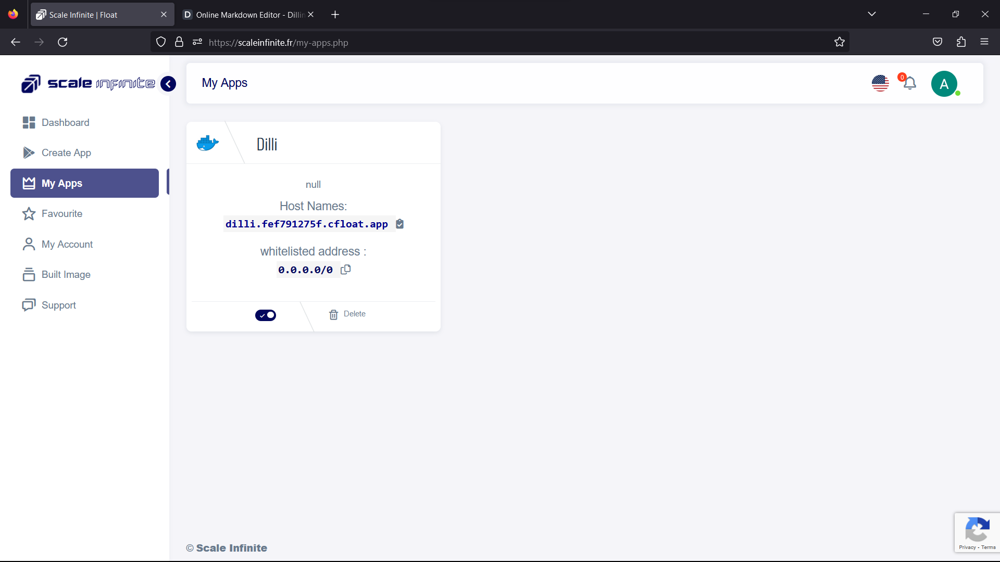
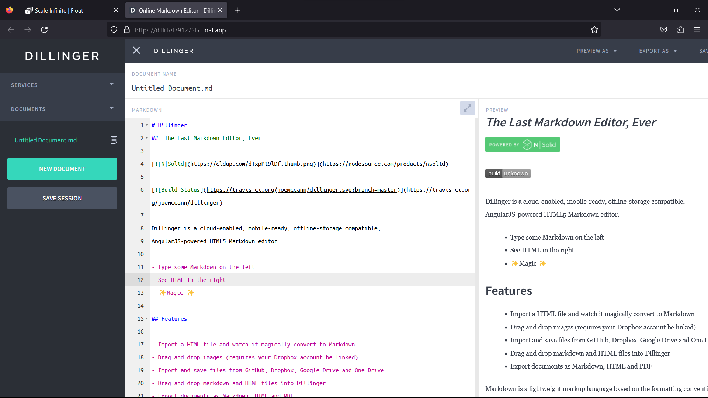
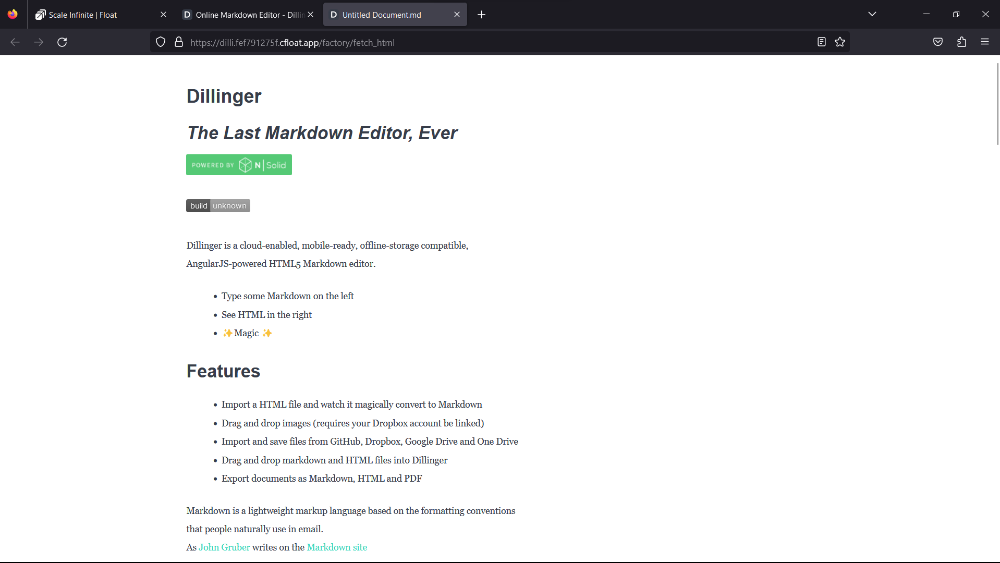
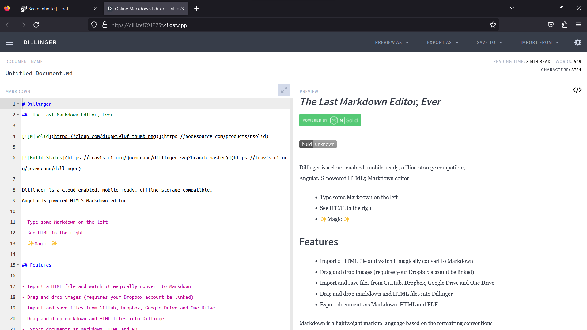

# 📓 Dillinger Deployment

### <mark style="color:blue;">What's Dillinger?</mark>

<mark style="color:orange;">**Dillinger: The Markdown Maestro**</mark>

Prepare to meet Dillinger, the HTML5 Markdown editor that's rewriting the rules. With its cloud-enabled, mobile-ready, and offline-storage-compatible prowess, Dillinger is changing the game:

**1. Markdown Mastery**: Dillinger is your gateway to the world of Markdown, a lightweight markup language that's all about simplicity and readability. It's the tool of choice for writers who focus on content, not distractions.

<mark style="color:orange;">**2. Mobile Maverick**</mark><mark style="color:orange;">:</mark> Dillinger doesn't tie you down to a desk. It's mobile-ready, which means you can craft your prose or jot down ideas from anywhere, whether you're on a bustling train or lounging at a coffee shop.

**3. Cloud Connection**: Embrace the power of the cloud with Dillinger. Your documents are securely stored online, ready for access whenever and wherever you need them. Say goodbye to lost files and the fear of hardware failures.

<mark style="color:orange;">**4. Offline Awesomeness**</mark>: Dillinger understands that the internet isn't always at your beck and call. That's why it's offline-storage compatible. You can work on your documents even when you're in the internet wilderness.

**5. AngularJS Backbone**: Powered by AngularJS, Dillinger is more than just a text editor; it's a dynamic web application. It combines the best of web technologies to offer a seamless editing experience.

<mark style="color:orange;">**6. Distraction-Free Zone**</mark><mark style="color:orange;">:</mark> Dillinger's minimalist interface keeps distractions at bay. When you're in the zone, the last thing you need is a cluttered screen. Focus on your words; Dillinger handles the rest.

**7. Markdown to HTML**: Dillinger doesn't just stop at Markdown. It effortlessly converts your Markdown documents into HTML, opening up a world of possibilities for publishing and sharing your content.

<mark style="color:orange;">**8. Real-Time Preview**</mark><mark style="color:orange;">:</mark> See your changes come to life in real-time. Dillinger provides a live preview of your Markdown as you type, so you can fine-tune your content with precision.

**9. Github Integration**: If you're a developer or open-source enthusiast, you'll love Dillinger's Github integration. Edit and preview your Github-hosted Markdown files with ease.

<mark style="color:orange;">**10. Open Source Spirit**</mark><mark style="color:orange;">:</mark> Just like Markdown itself, Dillinger embraces the open-source ethos. It's a community-driven project, constantly evolving to meet the needs of its users.

So, whether you're a wordsmith, a coder, or a creative thinker, Dillinger has your back. It's a Markdown playground that lets you focus on what matters—your ideas. Embrace the simplicity, embrace the power, and let Dillinger be your Markdown muse.


### <mark style="color:blue;">**How It Works:**</mark>

<mark style="color:orange;">**Unlock the Magic of Dillinger's Features**</mark>

Dillinger isn't just your run-of-the-mill Markdown editor; it's a feature-packed wizard that simplifies your writing journey:

**1. HTML to Markdown Sorcery**: Experience the magic of effortless HTML to Markdown conversion. Just import an HTML file into Dillinger, and watch it transform like a digital chameleon.

<mark style="color:orange;">**2. Dropbox Image Alchemy**</mark><mark style="color:orange;">:</mark> For the image sorcerers among us, Dillinger lets you seamlessly drag and drop images—thanks to your linked Dropbox account. Your visuals become an integral part of your Markdown masterpiece.

**3. Cosmic File Compatibility**: Dillinger connects to the cosmic realms of file hosting. Import and save your documents from GitHub, Dropbox, Google Drive, and OneDrive. The universe of your content is at your fingertips.

<mark style="color:orange;">**4. Drag and Drop Wizardry**</mark><mark style="color:orange;">:</mark> Embrace the power of drag and drop with Dillinger. It's as simple as it sounds—just drag and drop your Markdown and HTML files into Dillinger, and let the magic unfold.

**5. Export Enchantment**: Dillinger believes in the freedom of choice. Export your documents in various formats: Markdown, HTML, and even PDF. Whether you're sharing your thoughts or preparing a presentation, Dillinger has the spell you need.

So, if you're ready to embark on a writing journey that's both enchanting and efficient, Dillinger is your trusty companion. Watch your ideas come to life, effortlessly convert HTML, and harness the power of seamless image integration. With Dillinger, you're not just writing; you're conjuring words like a true wizard.

### <mark style="color:blue;">Steps And Procedure</mark>

*   <mark style="background-color:purple;">**This deployment utilizes the official dillinger  Docker image. Here's a step-by-step guide to get you started:**</mark>

    1. Begin by navigating to the "Create Apps" page and use the search bar to find the  [linuxserver/dillinger](https://hub.docker.com/r/linuxserver/dillinger) application.
    2. Click on the "Install" button to initiate the installation process.
    3. Fill in all the required fields with the necessary information.
    4. If you prefer, you can click on the "Advanced" option to access additional settings (this step is optional).
    5. After making your selections, press the "Install" button to proceed.
    6. Once the installation is complete, you'll be directed to the "My Apps" page, where you'll find a list of all the applications you've deployed.
    7. Copy the Hostname of the Dillinger application without the NodePort and paste it into your preferred browser's address bar.
    8. Voilà! You're now able to access the  Dillinger webpage and explore its content.

    By following these straightforward steps, you'll have successfully deployed the Dillinger application and gained access to its features through a seamless and user-friendly process.


### <mark style="color:blue;">Installation</mark>

| Docker Image                                                                                                                                                                                                                                  |
| --------------------------------------------------------------------------------------------------------------------------------------------------------------------------------------------------------------------------------------------- |
| [Dillinger](https://hub.docker.com/r/linuxserver/dillinger)  [<mark style="background-color:yellow;">👈(</mark>](https://hub.docker.com/r/linuxserver/firefox)<mark style="background-color:yellow;">click me,for the dockerhub image)</mark> |

| Application name                                                              |
| ----------------------------------------------------------------------------- |
| <mark style="background-color:yellow;">Eg: dilli(you can put any name)</mark> |

| Resource Allocation                                                                                                                                                     |
| ----------------------------------------------------------------------------------------------------------------------------------------------------------------------- |
| <mark style="background-color:yellow;">0-100%(</mark><mark style="color:orange;">10 % of your allocated resources (CPU, RAM) will be used for this application.)</mark> |

<mark style="background-color:yellow;">`PROTOCOL`</mark>

<table><thead><tr><th width="417">Protocol</th><th>Protocol Value</th></tr></thead><tbody><tr><td><mark style="background-color:yellow;">Http</mark></td><td><mark style="color:orange;">8080</mark></td></tr><tr><td><mark style="background-color:yellow;">Tcp</mark></td><td>-</td></tr></tbody></table>

| Install with Default                                                                                                                                        | Advanced                                                                                                                                                               |
| ----------------------------------------------------------------------------------------------------------------------------------------------------------- | ---------------------------------------------------------------------------------------------------------------------------------------------------------------------- |
| <mark style="background-color:yellow;">(select this if you want install with default settings if don't have environment value and working directory)</mark> | <mark style="background-color:yellow;">(select this if you want to go with advanced settings, where you select you own environment value and working directory)</mark> |

If you choose Advanced option:

| ENV VARIABLE                                                            |
| ----------------------------------------------------------------------- |
| <p><code>Give env variable.</code></p><p><code>Eg:key==value</code></p> |

| WORKING DIR                                                                                         |
| --------------------------------------------------------------------------------------------------- |
| <p><code>WORKDIR for the application.</code></p><p> <code>Eg:usr/src/yourAPP</code></p>             |
| <mark style="color:red;">Here use ( use the path after   " :"  )</mark>                             |
| <p></p><pre class="language-yaml"><code class="lang-yaml"> - /path/to/configs:/config
</code></pre> |

<mark style="background-color:yellow;">`Access`</mark>

| Public                                      | Private                                      |
| ------------------------------------------- | -------------------------------------------- |
| (select this if you want to make it public) | (select this if you want to make it private) |

<mark style="color:purple;">**Step-by-Step Guide to Dillyinger Deployment**</mark>

1. <mark style="color:blue;">**Docker Image Selection**</mark>**:**
   * <mark style="color:orange;">Docker Image Name: d</mark><mark style="color:orange;">`illyinger`</mark>
2. <mark style="color:orange;">**Application Details**</mark>**:**
   * Application Name: `dillinger`
   * Resource Allocation: Set the desired resource allocation from 0-100%.
3. <mark style="color:orange;">**Protocol Configuration**</mark>**:**
   * Protocol: `HTTP`
   * Port: `8080`
4. <mark style="color:orange;">**Installation Options**</mark>**:**
   * Choose between "Default" or "Advanced" installation.
5. <mark style="color:orange;">**Advanced Installation (Optional**</mark>**):**
   * If selecting "Advanced," you can customize the environment variables and working directory:
   *   **Environment Variables:**

       Environment variables are dynamic values used by a containerized application for configuration. They are defined as key-value pairs, like `API_KEY=xyz`, and provide flexibility to adjust an app's behavior without changing its code.

       * Environment Variables: Define environment variables with keys and values (e.g., `key=value`).
   *   **Working Directory:**

       The working directory is the starting point inside a container where an app's files are located. It affects relative file paths and operations. For example, if set to `/usr/src/yourAPP`, an app will reference files from there, like `/usr/src/yourAPP/data.txt`.

       * Working Directory: Set the working directory for the application (e.g., `usr/src/yourAPP`).
       * <mark style="color:red;">Here use ( use the path after   " :"  )</mark>
       *

           ```yaml
            - /path/to/configs:/config
           ```
6. <mark style="color:orange;">**Access Configuration**</mark>**:**
   * Choose between "Public" or "Private" access to the deployed application.
7. <mark style="color:orange;">**Installation**</mark>**:**
   * Click the "Install" button to initiate the deployment process.

By following these steps, you can effortlessly deploy an Dillinger instance with your chosen configurations. This enables you to tailor the environment to match your application's requirements and specifications. Whether opting for the default installation or delving into advanced settings, our platform ensures a seamless deployment experience while providing you the flexibility to customize according to your needs.

### <mark style="color:blue;">Visual Snapshots</mark>


<div>

<figure><figcaption></figcaption></figure>

 

<figure><figcaption></figcaption></figure>

</div>

<div>

<figure><figcaption></figcaption></figure>

 

<figure><figcaption></figcaption></figure>

</div>

### <mark style="color:orange;">Youtube Tutorial</mark>&#x20;

Check out our youtube video for more clarification.

### <mark style="color:blue;">FAQ</mark>

**About** Dillinger **image we used.**

This is the official Dillinger  mage.

**Can I deploy my own media** Dillinger **with modified configuration ?**

Yes, you can simply deploy any version or modified image to our platform by linking your docker hub account to our platform.

**Are my data persistent ?**

For the free user there is no persistence, and for the premium user you can different type of persistence.

### Join us

Stay informed and engaged with our project's latest developments and support on [Slack](https://app.slack.com/client/T04QS32JX6E/C04QKEWE146). Join us today to connect, collaborate, and keep the momentum going!&#x20;

<details>

<summary>Category</summary>

Kubernetes, cloud computing, DevOps, cloud services, hosting platform, container orchestration, cloud infrastructure, cloud deployment, cloud management, cloud technology, cloud solutions, Dillinger

</details>
