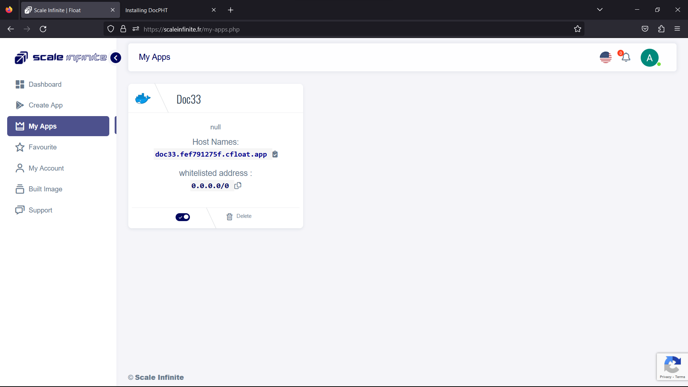
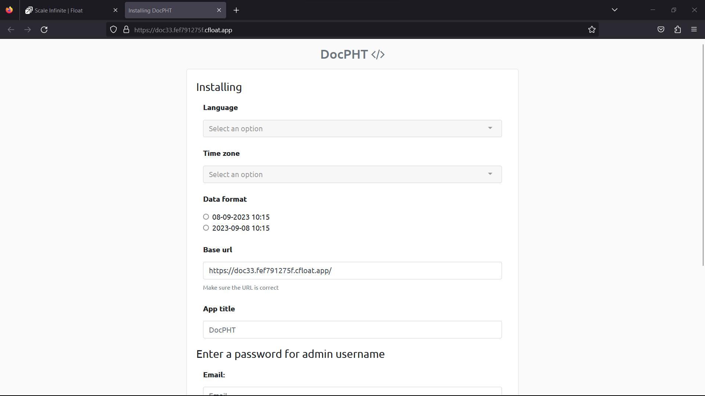
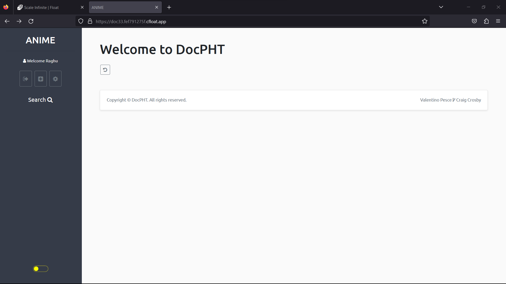
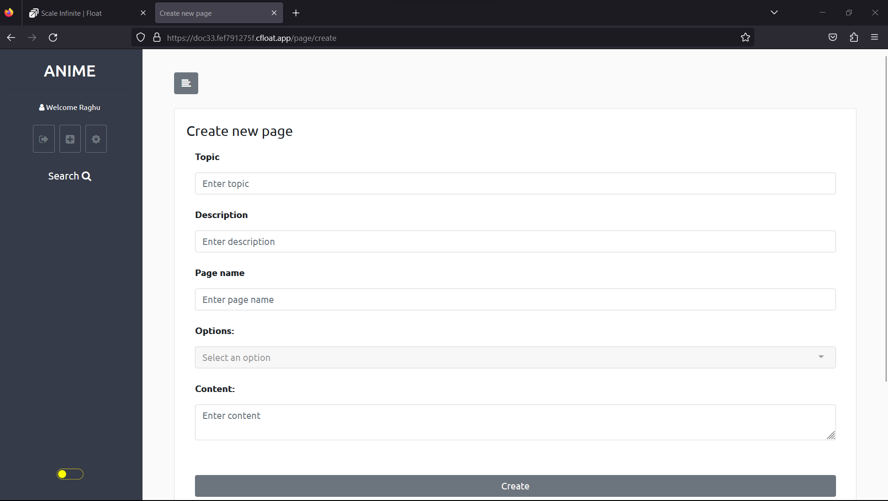
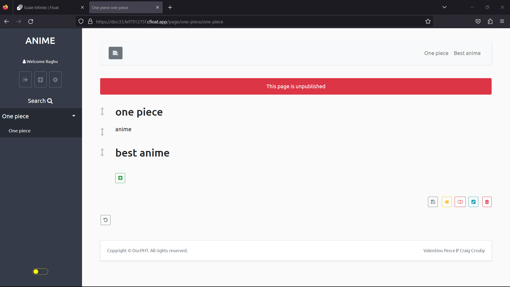

# 📓 DocPHT Deployment

### <mark style="color:blue;">What's Docpht ?</mark>

\
**DocPHT: Where Documentation Meets Simplicity**

In a world overflowing with complexity, DocPHT emerges as a refreshing breeze of simplicity and efficiency. Here's why it's the tool you won't believe until you try:

**1. Effortless Note-Taking**: DocPHT makes note-taking a breeze. Quickly jot down your thoughts, ideas, and important information. It's your digital notepad, always at your fingertips.

**2. User Management**: DocPHT is not just for solo adventurers; it's for teams too! Seamlessly manage users, making collaboration a breeze. Everyone can contribute to your digital knowledge hub.

**3. Version Control**: The wisdom of the ages is preserved with DocPHT. Save versions of your pages, ensuring you can revisit the past and track the evolution of your content.

**4. Backup Mastery**: DocPHT takes data safety seriously. Run and restore backups effortlessly, ensuring your valuable information is protected from the unexpected.

**5. Tailored Interface**: Your workspace, your rules. Customize the interface to match your preferences, creating a productive environment that suits your unique style.

**6. Database-Free Brilliance**: DocPHT defies the norm. It achieves maximum portability without relying on a database. Your documentation remains agile and adaptable.

So, here's the deal: You won't believe the power of DocPHT until you give it a spin. It's the tool that brings order to chaos, encourages collaboration, and ensures your valuable content is always within reach. Try it, and let DocPHT redefine your documentation experience. Your digital journey is about to get a whole lot simpler and smarter.

### <mark style="color:blue;">**How It Works:**</mark>

\
**DocPHT: Simplifying Documentation**

Ever felt the need for a documentation tool that's as straightforward as it is efficient? Look no further—DocPHT has your back. Here's a closer look at how it all comes together:

**1. Effortless Note-Taking**: DocPHT understands the value of capturing ideas on the fly. It's your digital notebook, always ready to record your thoughts, insights, and crucial information. Think of it as your trusted companion in the world of notes.

**2. User Management Made Easy**: Collaboration is the name of the game. DocPHT allows you to effortlessly manage users, transforming solo projects into team endeavors. With everyone on board, you can collectively build a repository of knowledge.

**3. Time Travel with Version Control**: Imagine having the power to travel back in time within your documentation. DocPHT grants you this capability by letting you save versions of your pages. It's like having a history book for your content.

**4. Backup Wizardry**: DocPHT takes data security seriously. Backing up your content is a breeze, and should the need arise, you can effortlessly restore it. Your valuable information is shielded from unforeseen events.

**5. Tailor-Made Interface**: DocPHT understands that customization is key. Personalize the interface to suit your style and preferences. It's all about creating a workspace that feels just right.

**6. Database-Free Agility**: In a world dominated by databases, DocPHT breaks free from convention. It achieves maximum portability without relying on a database. Your documentation remains flexible and adaptable.

So, the bottom line is this: DocPHT simplifies the art of documentation. It's your dependable partner for note-taking, collaboration, version control, and data security. Give it a whirl, and discover how it can revolutionize your documentation experience. With DocPHT, complexity is replaced by clarity, and your digital journey becomes a smooth ride.

### <mark style="color:blue;">Steps And Procedure</mark>

*   <mark style="background-color:purple;">**This deployment utilizes the official docpht  Docker image. Here's a step-by-step guide to get you started:**</mark>

    1. Begin by navigating to the "Create Apps" page and use the search bar to find the  [l](https://hub.docker.com/r/linuxserver/dillinger)[docpht/docpht](https://hub.docker.com/r/docpht/docpht) application.
    2. Click on the "Install" button to initiate the installation process.
    3. Fill in all the required fields with the necessary information.
    4. If you prefer, you can click on the "Advanced" option to access additional settings (this step is optional).
    5. After making your selections, press the "Install" button to proceed.
    6. Once the installation is complete, you'll be directed to the "My Apps" page, where you'll find a list of all the applications you've deployed.
    7. Copy the Hostname of the DocPHT application without the NodePort and paste it into your preferred browser's address bar.
    8. Voilà! You're now able to access the  DocPHT webpage and explore its content.

    By following these straightforward steps, you'll have successfully deployed the DocPHT application and gained access to its features through a seamless and user-friendly process.

### <mark style="color:blue;">Installation</mark>

| Docker Image                                                                                                                                                                                                                       |
| ---------------------------------------------------------------------------------------------------------------------------------------------------------------------------------------------------------------------------------- |
| [DocPHT](https://hub.docker.com/r/docpht/docpht)  [<mark style="background-color:yellow;">👈(</mark>](https://hub.docker.com/r/linuxserver/firefox)<mark style="background-color:yellow;">click me,for the dockerhub image)</mark> |

| Application name                                                               |
| ------------------------------------------------------------------------------ |
| <mark style="background-color:yellow;">Eg: dioc33(you can put any name)</mark> |

| Resource Allocation                                                                                                                                                     |
| ----------------------------------------------------------------------------------------------------------------------------------------------------------------------- |
| <mark style="background-color:yellow;">0-100%(</mark><mark style="color:orange;">10 % of your allocated resources (CPU, RAM) will be used for this application.)</mark> |

<mark style="background-color:yellow;">`PROTOCOL`</mark>

<table><thead><tr><th width="417">Protocol</th><th>Protocol Value</th></tr></thead><tbody><tr><td><mark style="background-color:yellow;">Http</mark></td><td><mark style="color:orange;">80</mark></td></tr><tr><td><mark style="background-color:yellow;">Tcp</mark></td><td>-</td></tr></tbody></table>

| Install with Default                                                                                                                                        | Advanced                                                                                                                                                               |
| ----------------------------------------------------------------------------------------------------------------------------------------------------------- | ---------------------------------------------------------------------------------------------------------------------------------------------------------------------- |
| <mark style="background-color:yellow;">(select this if you want install with default settings if don't have environment value and working directory)</mark> | <mark style="background-color:yellow;">(select this if you want to go with advanced settings, where you select you own environment value and working directory)</mark> |

If you choose Advanced option:

| ENV VARIABLE                                                            |
| ----------------------------------------------------------------------- |
| 
<code>Give env variable.</code>

<code>Eg:key==value</code>
 |

| WORKING DIR                                                                             |
| --------------------------------------------------------------------------------------- |
| 
<code>WORKDIR for the application.</code>

 <code>Eg:usr/src/yourAPP</code>
 |

<mark style="background-color:yellow;">`Access`</mark>

| Public                                      | Private                                      |
| ------------------------------------------- | -------------------------------------------- |
| (select this if you want to make it public) | (select this if you want to make it private) |

<mark style="color:purple;">**Step-by-Step Guide to Docpht  Deployment**</mark>

1. <mark style="color:blue;">**Docker Image Selection**</mark>**:**
   * <mark style="color:orange;">Docker Image Name: docpht</mark>
2. <mark style="color:orange;">**Application Details**</mark>**:**
   * Application Name: `docpht`
   * Resource Allocation: Set the desired resource allocation from 0-100%.
3. <mark style="color:orange;">**Protocol Configuration**</mark>**:**
   * Protocol: `HTTP`
   * Port: `80`
4. <mark style="color:orange;">**Installation Options**</mark>**:**
   * Choose between "Default" or "Advanced" installation.
5. <mark style="color:orange;">**Advanced Installation (Optional**</mark>**):**
   * If selecting "Advanced," you can customize the environment variables and working directory:
   *   **Environment Variables:**

       Environment variables are dynamic values used by a containerized application for configuration. They are defined as key-value pairs, like `API_KEY=xyz`, and provide flexibility to adjust an app's behavior without changing its code.

       * Environment Variables: Define environment variables with keys and values (e.g., `key=value`).
   *   **Working Directory:**

       The working directory is the starting point inside a container where an app's files are located. It affects relative file paths and operations. For example, if set to `/usr/src/yourAPP`, an app will reference files from there, like `/usr/src/yourAPP/data.txt`.

       * Working Directory: Set the working directory for the application (e.g., `usr/src/yourAPP`).
6. <mark style="color:orange;">**Access Configuration**</mark>**:**
   * Choose between "Public" or "Private" access to the deployed application.
7. <mark style="color:orange;">**Installation**</mark>**:**
   * Click the "Install" button to initiate the deployment process.

By following these steps, you can effortlessly deploy an DocPHT  instance with your chosen configurations. This enables you to tailor the environment to match your application's requirements and specifications. Whether opting for the default installation or delving into advanced settings, our platform ensures a seamless deployment experience while providing you the flexibility to customize according to your needs.

### <mark style="color:blue;">Visual Snapshots</mark>

<figure><figcaption></figcaption></figure>

 

<figure><figcaption></figcaption></figure>

<figure><figcaption></figcaption></figure>

 

<figure><figcaption></figcaption></figure>

 

<figure><figcaption></figcaption></figure>

### <mark style="color:orange;">Youtube Tutorial</mark>&#x20;

Check out our youtube video for more clarification.

### <mark style="color:blue;">FAQ</mark>

**About** DocPHT **image we used.**

This is the official DocPHT mage.

**Can I deploy my own media** DocPHT **with modified configuration ?**

Yes, you can simply deploy any version or modified image to our platform by linking your docker hub account to our platform.

**Are my data persistent ?**

For the free user there is no persistence, and for the premium user you can different type of persistence.

### Join us

Stay informed and engaged with our project's latest developments and support on [Slack](https://app.slack.com/client/T04QS32JX6E/C04QKEWE146). Join us today to connect, collaborate, and keep the momentum going!&#x20;
