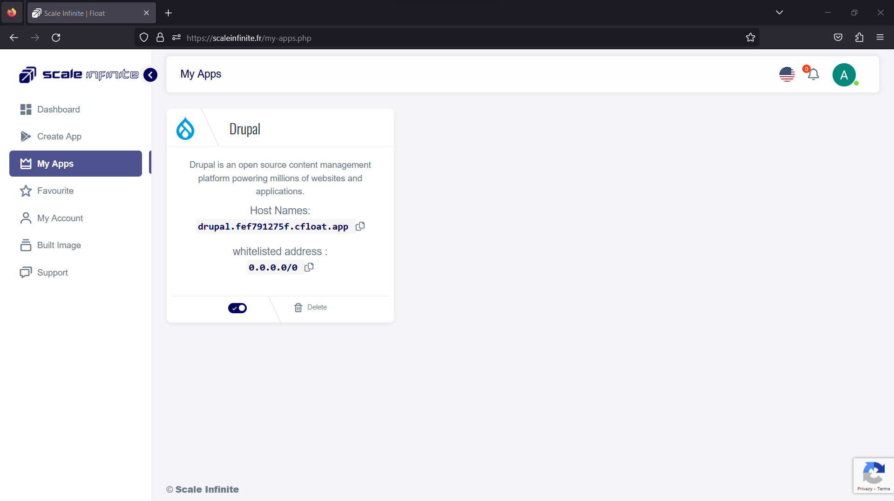
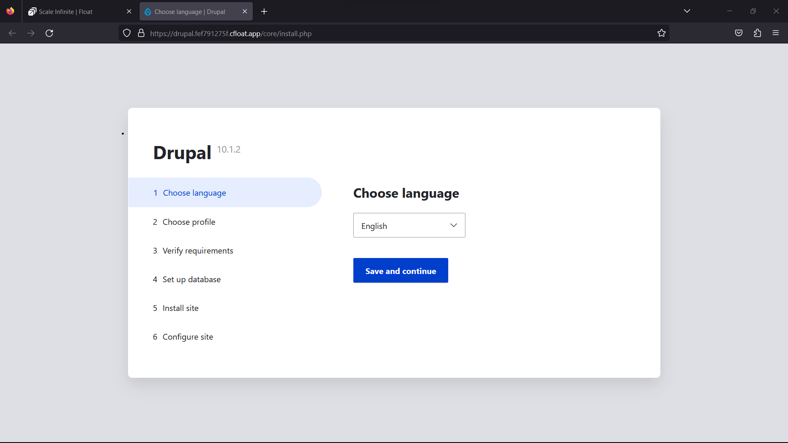
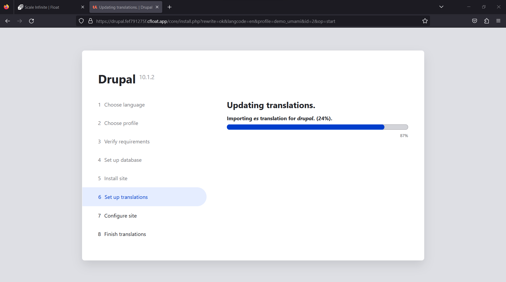
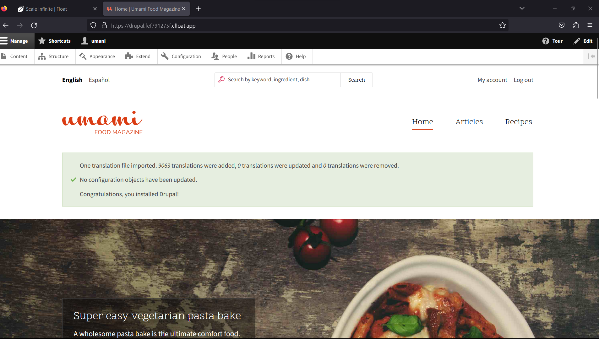

# 💧 Drupal deployment

### <mark style="color:blue;">What's Drupal?</mark>

Drupal is a dynamic and versatile open-source web content management system (CMS) that leverages the PHP scripting language to empower users in creating, managing, and customizing websites tailored to their specific requirements.

Here are the key points to note about Drupal:

Open-Source CMS: Drupal is an open-source CMS, meaning it is freely accessible to all, providing a solid foundation for website development and management without any licensing fees.

Powered by PHP: At its core, Drupal is built using PHP, a robust and flexible scripting language widely used for web development.

Modularity: Drupal boasts a modular architecture that grants users the ability to enhance and customize their websites by incorporating various modules. These modules extend the CMS's functionality to suit diverse needs.

Customization: Drupal facilitates the tailoring of a website's appearance and functionality through the utilization of themes and modules. This flexibility empowers users to craft unique and engaging digital experiences.

Community-Driven: Drupal thrives due to its vibrant and dedicated community of developers, contributors, and enthusiasts. This community actively participates in the ongoing development of Drupal, ensuring regular updates, providing support, and furnishing valuable resources to aid users in achieving their goals.

In essence, Drupal is more than just a CMS; it's a powerful and adaptable platform that enables individuals and organizations to create websites that are not only visually compelling but also rich in functionality and interactivity. Its open-source nature, coupled with its supportive community, positions Drupal as a prominent choice for web development.

### <mark style="color:blue;">**Working in Brief**</mark>

Content Creation: Drupal simplifies content creation through an intuitive and user-friendly interface, making it effortless for users to generate and structure content effectively.

Modular Architecture: The strength of Drupal lies in its modular architecture, allowing users to expand and enhance their websites by integrating specific functionalities through modules. These modules are designed to address various needs, providing flexibility and adaptability.

Themes & Appearance: Drupal offers extensive options for customizing the visual aspects of your website. Themes can be applied to modify the site's appearance, ensuring it aligns with your branding and design preferences.

PHP Processing: At the core of Drupal's functionality is PHP, a dynamic scripting language. PHP processes user requests, generating web pages and content dynamically, which allows for real-time updates and interactions.

Community Support: Drupal benefits from a thriving community of developers, contributors, and users who actively engage in its ongoing development. This collaborative ecosystem ensures regular updates, provides solutions to challenges, and introduces enhancements to the platform.

Drupal's robust capabilities and open-source foundation make it a powerful choice for web content management. Its flexibility, scalability, and the support of an engaged community contribute to its reputation as a versatile solution for a wide range of web projects.

### &#x20;<mark style="color:blue;">Steps And Procedure</mark>

<mark style="background-color:purple;">**This deployment utilizes the official drupal Docker image. Here's a step-by-step guide to get you started:**</mark>

1. Begin by navigating to the "Create Apps" page and use the search bar to find the <mark style="color:orange;">drupal</mark> application.
2. Click on the "Install" button to initiate the installation process.
3. Fill in all the required fields with the necessary information.
4. If you prefer, you can click on the "Advanced" option to access additional settings (this step is optional).
5. After making your selections, press the "Install" button to proceed.
6. Once the installation is complete, you'll be directed to the "My Apps" page, where you'll find a list of all the applications you've deployed.
7. Copy the Hostname of the <mark style="color:orange;">drupal</mark> application without the NodePort and paste it into your preferred browser's address bar.
8. Voilà! You're now able to access the  <mark style="color:orange;">drupal</mark> webpage and explore its content.

By following these straightforward steps, you'll have successfully deployed the <mark style="color:orange;">drupal</mark> application and gained access to its features through a seamless and user-friendly process.

### <mark style="color:blue;">Installation</mark>

| Docker Image                                                                                                                   |
| ------------------------------------------------------------------------------------------------------------------------------ |
| [`drupal`](https://hub.docker.com/\_/drupal)<mark style="background-color:yellow;">👈(click me,for the dockerhub image)</mark> |

| Resource Allocation                                                                                                                                                     |
| ----------------------------------------------------------------------------------------------------------------------------------------------------------------------- |
| <mark style="background-color:yellow;">0-100%(</mark><mark style="color:orange;">10 % of your allocated resources (CPU, RAM) will be used for this application.)</mark> |

| Application name                                                               |
| ------------------------------------------------------------------------------ |
| <mark style="background-color:yellow;">Eg: drupal(you can put any name)</mark> |

<mark style="background-color:yellow;">`PROTOCOL`</mark>

<table><thead><tr><th width="417">Protocol</th><th>Protocol Value</th></tr></thead><tbody><tr><td><mark style="background-color:yellow;">Http</mark></td><td><mark style="color:orange;">80</mark></td></tr><tr><td><mark style="background-color:yellow;">Tcp</mark></td><td>-</td></tr></tbody></table>

| Install with Default                                                                                                                                        | Advanced                                                                                                                                                               |
| ----------------------------------------------------------------------------------------------------------------------------------------------------------- | ---------------------------------------------------------------------------------------------------------------------------------------------------------------------- |
| <mark style="background-color:yellow;">(select this if you want install with default settings if don't have environment value and working directory)</mark> | <mark style="background-color:yellow;">(select this if you want to go with advanced settings, where you select you own environment value and working directory)</mark> |

If you choose Advanced option:

| ENV VARIABLE                                                            |
| ----------------------------------------------------------------------- |
| 
<code>Give env variable.</code>

<code>Eg:key==value</code>
 |

| WORKING DIR                                                                             |
| --------------------------------------------------------------------------------------- |
| 
<code>WORKDIR for the application.</code>

 <code>Eg:usr/src/yourAPP</code>
 |

<mark style="background-color:yellow;">`Access`</mark>

| Public                                      | Private                                      |
| ------------------------------------------- | -------------------------------------------- |
| (select this if you want to make it public) | (select this if you want to make it private) |

<mark style="color:purple;">**Step-by-Step Guide to Drupal Deployment**</mark>

1. <mark style="color:blue;">**Docker Image Selection**</mark>**:**
   * <mark style="color:orange;">Docker Image Name:</mark> <mark style="color:orange;"></mark><mark style="color:orange;">`drupal`</mark>
2. <mark style="color:orange;">**Application Details**</mark>**:**
   * Application Name: `drupal`
   * Resource Allocation: Set the desired resource allocation from 0-100%.
3. <mark style="color:orange;">**Protocol Configuration**</mark>**:**
   * Protocol: `HTTP`
   * Port: `80`
4. <mark style="color:orange;">**Installation Options**</mark>**:**
   * Choose between "Default" or "Advanced" installation.
5. <mark style="color:orange;">**Advanced Installation (Optional**</mark>**):**
   * If selecting "Advanced," you can customize the environment variables and working directory:
   *   **Environment Variables:**

       Environment variables are dynamic values used by a containerized application for configuration. They are defined as key-value pairs, like `API_KEY=xyz`, and provide flexibility to adjust an app's behavior without changing its code.

       * Environment Variables: Define environment variables with keys and values (e.g., `key=value`).
   *   **Working Directory:**

       The working directory is the starting point inside a container where an app's files are located. It affects relative file paths and operations. For example, if set to `/usr/src/yourAPP`, an app will reference files from there, like `/usr/src/yourAPP/data.txt`.

       * Working Directory: Set the working directory for the application (e.g., `usr/src/yourAPP`).
6. <mark style="color:orange;">**Access Configuration**</mark>**:**
   * Choose between "Public" or "Private" access to the deployed application.
7. <mark style="color:orange;">**Installation**</mark>**:**
   * Click the "Install" button to initiate the deployment process.

By following these steps, you can effortlessly deploy an drupal instance with your chosen configurations. This enables you to tailor the environment to match your application's requirements and specifications. Whether opting for the default installation or delving into advanced settings, our platform ensures a seamless deployment experience while providing you the flexibility to customize according to your needs.

### <mark style="color:blue;">Visual Snapshots</mark>

<figure><figcaption></figcaption></figure>

 

<figure><figcaption></figcaption></figure>

<figure><figcaption></figcaption></figure>

 

<figure><figcaption></figcaption></figure>

### <mark style="color:orange;">Youtube Tutorial</mark>&#x20;

Check out our youtube video for more clarification.



### <mark style="color:blue;">FAQ</mark>

**About Drupal image we used.**

This is the official Drupal image.

**Is the Database inbuilted in the same image ?**

No, you need to add your database while you are login and setting your website.

**Can i deploy older version of drupal or my own modified drupal image ?**

Yes, you can simply deploy any version or modified image to our platform by linking your docker hub account to our platform.

**Are my data persistent ?**

For the free user there is no persistence, and for the premium user you can different type of persistence.

### Join us

Stay informed and engaged with our project's latest developments and support on [Slack](https://app.slack.com/client/T04QS32JX6E/C04QKEWE146). Join us today to connect, collaborate, and keep the momentum going!&#x20;
