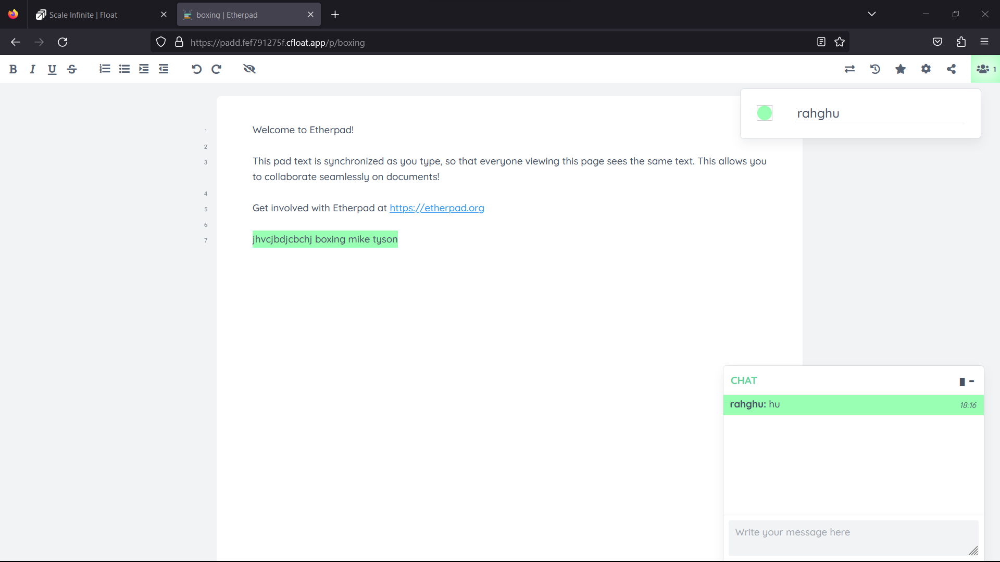
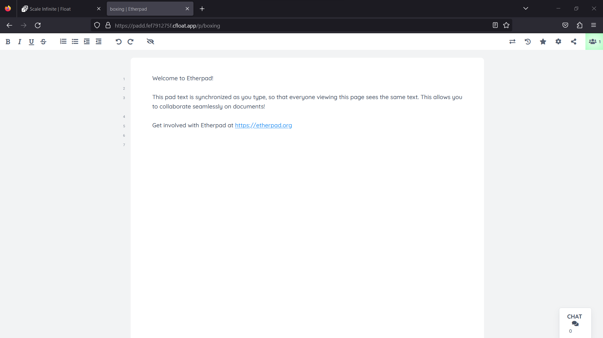

# 📓 Etherpad

### <mark style="color:blue;">What's etherpad?</mark>

📝 **Etherpad's Symphony of Features** 📝

Etherpad isn't your run-of-the-mill text editor; it's a virtuoso of collaborative writing. Here's the crescendo of its capabilities:

🖋️ **Rich Editing for Wordsmiths** 🖋️

Etherpad plays the role of a conductor for your words. Its rich text WYSIWYG editor ensures that your content shines as brilliantly as your ideas.

🧊 **Minimalist Editor for the Purists** 🧊

For those who prefer the purity of simplicity, Etherpad offers a minimalist editor that can harmoniously blend with your creative tools. It's like embedding your muse.

🌒 **Dark Mode: Night Owl's Delight** 🌒

Etherpad respects your nocturnal creativity. With dark mode themes, it creates the perfect ambiance for those late-night writing sessions, without straining your eyes.

📸 **A Pictorial Sonata** 📸

Who says words have to stand alone? Etherpad harmonizes with your visual creativity by supporting images. Let your ideas paint a vivid canvas.

🎥 **Video Chat: Collaborative Virtuoso** 🎥

It's not just about text; it's about the whole ensemble. Etherpad's plugins let you integrate video and audio chat, making your collaborative experience resonate.

🚀 **Collaboration Amplified** 🚀

Busy pads need more than just notes; they need a symphony of collaboration. Etherpad's plugins enhance the real-time collaborative experience, ensuring your ideas flow seamlessly.

🔍 **Document Analysis: The Composer's Tool** 🔍

Understanding your creation is essential. Etherpad's plugins help you analyze both the author and the document, making post-creation a performance worth applauding.

There you have it, Etherpad's feature concerto! It transforms your writing into a collaborative masterpiece, no matter your style or needs. 🎼🎭🚀

### <mark style="color:blue;">**How It Works:**</mark>

**Unlocking the Magic of Etherpad**

Etherpad isn't your ordinary text editor; it's a wizardry of collaborative writing. Here's a symphony of its inner workings:

**Real-Time Collaboration:** Imagine a virtual stage where multiple authors play in harmony. Etherpad enables real-time collaboration, allowing multiple users to edit a document simultaneously. Every keystroke is like a note in a shared masterpiece.

**Version History:** Etherpad composes a beautiful history of your document. You can review and revert to previous versions, just like a composer fine-tuning a score. It ensures your creative journey is preserved.

**Time Slider:** Think of this as your conductor's baton. The time slider lets you navigate through the document's history seamlessly, giving you complete control over your composition's evolution.

**Group Chat:** Collaboration isn't just about the document; it's also about communication. Etherpad includes a group chat feature, fostering discussions among collaborators without leaving the platform.

**Access Control:** Like an exclusive club with a guest list, Etherpad allows you to control who can access and edit your documents. You decide who gets a front-row seat to your creative process.

**Rich Media Embedding:** Words don't stand alone. Etherpad supports the embedding of rich media, like images, videos, and more. Your composition becomes a multimedia performance.

**Privacy and Self-Hosting:** Etherpad respects your privacy. You can host it on your servers, ensuring that your creations stay in your domain, just like an artist's studio.

**Customization:** Tailor Etherpad to your liking with themes and plugins. It's like arranging your writing space to inspire your best work.

**Exporting Options:** Once your magnum opus is complete, Etherpad offers various exporting options. You can publish it, print it, or save it in various formats, letting your creation take center stage.

**Cross-Platform Performance:** Etherpad is like a virtuoso that performs on all platforms, ensuring that your collaborative masterpiece is accessible to everyone.

**Open Source Symphony:** The beauty of Etherpad is its open-source nature. It's a collaborative composition itself, with a global community of contributors, ensuring it evolves like a timeless classic.

In essence, Etherpad is your conductor's wand, orchestrating collaborative writing into a harmonious masterpiece. It's where ideas unite, creativity flows, and documents come to life.

### <mark style="color:blue;">Steps And Procedure</mark>

*   <mark style="background-color:purple;">**This deployment utilizes the official etherpad Docker image. Here's a step-by-step guide to get you started:**</mark>

    1. Begin by navigating to the "Create Apps" page and use the search bar to find the [etherpad/etherpad](https://hub.docker.com/r/etherpad/etherpad) application.
    2. Click on the "Install" button to initiate the installation process.
    3. Fill in all the required fields with the necessary information.
    4. If you prefer, you can click on the "Advanced" option to access additional settings (this step is optional).
    5. After making your selections, press the "Install" button to proceed.
    6. Once the installation is complete, you'll be directed to the "My Apps" page, where you'll find a list of all the applications you've deployed.
    7. Copy the Hostname of the ETHERPAD application without the NodePort and paste it into your preferred browser's address bar.
    8. Voilà! You're now able to access the  ETHERPAD webpage and explore its content.

    By following these straightforward steps, you'll have successfully deployed the ETHERPAD application and gained access to its features through a seamless and user-friendly process.

### <mark style="color:blue;">Installation</mark>

| Docker Image                                                                                                                                                                                                                          |
| ------------------------------------------------------------------------------------------------------------------------------------------------------------------------------------------------------------------------------------- |
| [ethepad](https://hub.docker.com/r/etherpad/etherpad)[<mark style="background-color:yellow;">👈(</mark>](https://hub.docker.com/r/linuxserver/firefox)<mark style="background-color:yellow;">click me,for the dockerhub image)</mark> |

| Application name                                                                 |
| -------------------------------------------------------------------------------- |
| <mark style="background-color:yellow;">Eg: etherpad(you can put any name)</mark> |

| Resource Allocation                                                                                                                                                     |
| ----------------------------------------------------------------------------------------------------------------------------------------------------------------------- |
| <mark style="background-color:yellow;">0-100%(</mark><mark style="color:orange;">10 % of your allocated resources (CPU, RAM) will be used for this application.)</mark> |

<mark style="background-color:yellow;">`PROTOCOL`</mark>

<table><thead><tr><th width="417">Protocol</th><th>Protocol Value</th></tr></thead><tbody><tr><td><mark style="background-color:yellow;">Http</mark></td><td><mark style="color:orange;">9001</mark></td></tr><tr><td><mark style="background-color:yellow;">Tcp</mark></td><td>-</td></tr></tbody></table>

| Install with Default                                                                                                                                        | Advanced                                                                                                                                                               |
| ----------------------------------------------------------------------------------------------------------------------------------------------------------- | ---------------------------------------------------------------------------------------------------------------------------------------------------------------------- |
| <mark style="background-color:yellow;">(select this if you want install with default settings if don't have environment value and working directory)</mark> | <mark style="background-color:yellow;">(select this if you want to go with advanced settings, where you select you own environment value and working directory)</mark> |

If you choose Advanced option:

| ENV VARIABLE                                                            |
| ----------------------------------------------------------------------- |
| 
<code>Give env variable.</code>

<code>Eg:key==value</code>
 |

| WORKING DIR                                                                             |
| --------------------------------------------------------------------------------------- |
| 
<code>WORKDIR for the application.</code>

 <code>Eg:usr/src/yourAPP</code>
 |

<mark style="background-color:yellow;">`Access`</mark>

| Public                                      | Private                                      |
| ------------------------------------------- | -------------------------------------------- |
| (select this if you want to make it public) | (select this if you want to make it private) |

<mark style="color:purple;">**Step-by-Step Guide to ETHERPAD Deployment**</mark>

1. <mark style="color:blue;">**Docker Image Selection**</mark>**:**
   * <mark style="color:orange;">Docker Image Name:</mark> <mark style="color:orange;"></mark><mark style="color:orange;">`ETHERPAD`</mark>
2. <mark style="color:orange;">**Application Details**</mark>**:**
   * Application Name: `ETHERPAD`
   * Resource Allocation: Set the desired resource allocation from 0-100%.
3. <mark style="color:orange;">**Protocol Configuration**</mark>**:**
   * Protocol: `HTTP`
   * Port: `9001`
4. <mark style="color:orange;">**Installation Options**</mark>**:**
   * Choose between "Default" or "Advanced" installation.
5. <mark style="color:orange;">**Advanced Installation (Optional**</mark>**):**
   * If selecting "Advanced," you can customize the environment variables and working directory:
   *   **Environment Variables:**

       Environment variables are dynamic values used by a containerized application for configuration. They are defined as key-value pairs, like `API_KEY=xyz`, and provide flexibility to adjust an app's behavior without changing its code.

       * Environment Variables: Define environment variables with keys and values (e.g., `key=value`).
   *   **Working Directory:**

       The working directory is the starting point inside a container where an app's files are located. It affects relative file paths and operations. For example, if set to `/usr/src/yourAPP`, an app will reference files from there, like `/usr/src/yourAPP/data.txt`.

       * Working Directory: Set the working directory for the application (e.g., `usr/src/yourAPP`).
6. <mark style="color:orange;">**Access Configuration**</mark>**:**
   * Choose between "Public" or "Private" access to the deployed application.
7. <mark style="color:orange;">**Installation**</mark>**:**
   * Click the "Install" button to initiate the deployment process.

By following these steps, you can effortlessly deploy an ETHERPAD instance with your chosen configurations. This enables you to tailor the environment to match your application's requirements and specifications. Whether opting for the default installation or delving into advanced settings, our platform ensures a seamless deployment experience while providing you the flexibility to customize according to your needs.

### <mark style="color:blue;">Visual Snapshots</mark>

<figure><figcaption></figcaption></figure>

 

<figure><figcaption></figcaption></figure>

<figure><figcaption></figcaption></figure>

 

<figure><figcaption></figcaption></figure>

### <mark style="color:orange;">Youtube Tutorial</mark>&#x20;

Check out our youtube video for more clarification.

### <mark style="color:blue;">FAQ</mark>

**About** ETHERPAD **image we used.**

This is the official ETHERPAD mage.

**Can I deploy my own media** ETHERPAD **with modified configuration ?**

Yes, you can simply deploy any version or modified image to our platform by linking your docker hub account to our platform.

**Are my data persistent ?**

For the free user there is no persistence, and for the premium user you can different type of persistence.

### Join us

Stay informed and engaged with our project's latest developments and support on [Slack](https://app.slack.com/client/T04QS32JX6E/C04QKEWE146). Join us today to connect, collaborate, and keep the momentum going!&#x20;
