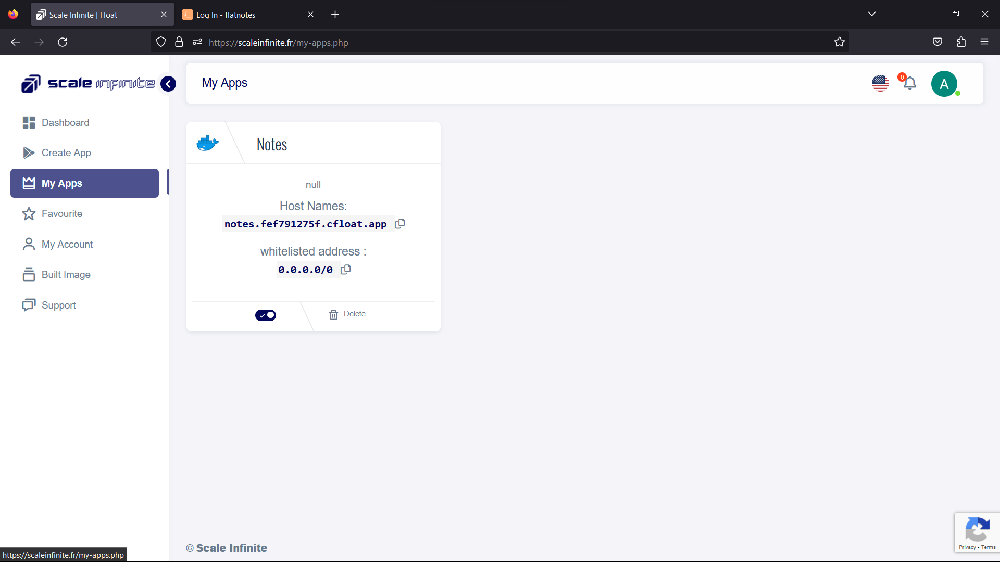
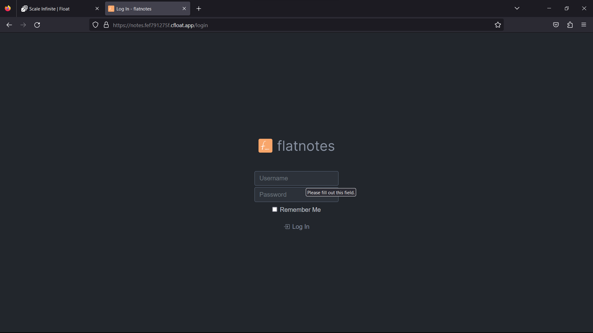
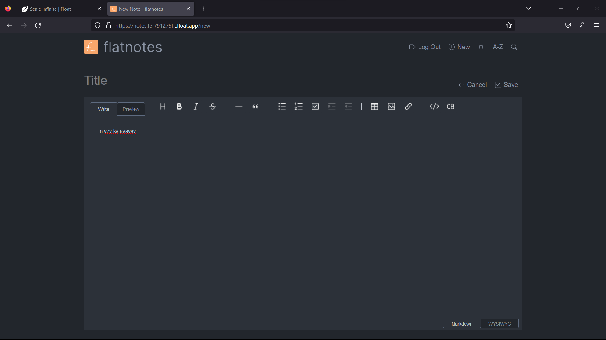

# 📜 flatnotes Deployment

### <mark style="color:blue;">What's  flatnotes?</mark>

<mark style="color:orange;">**Flatnotes: Where Simplicity Meets Note-Taking Brilliance**</mark>

Flatnotes is not your average note-taking web app; it's a breath of fresh air in the world of digital note-keeping. Let's dive into what makes Flatnotes stand out and how it caters to your note-taking needs:

<mark style="color:orange;">**1. Distraction-Free Design:**</mark>

* Say goodbye to cluttered interfaces. Flatnotes prides itself on a clean and straightforward user interface that places your note content front and center. No distractions, just your thoughts.

**2. **<mark style="color:orange;">**Organization Simplified:**</mark>

* Forget about complex folder structures or notebooks. Flatnotes takes a minimalist approach, presenting all your notes in one place. The power of this simplicity lies in its robust search and tagging functionality. Find what you need quickly and effortlessly with a full-text search accessible via a convenient keyboard shortcut ("/").

**3. **<mark style="color:orange;">**Your Notes, Your Freedom:**</mark>

* Flatnotes respects your ownership of your notes. It doesn't hold your notes hostage in a proprietary format or a convoluted database. Instead, your notes are plain markdown files—simple, portable, and entirely under your control. Move them elsewhere or use them in other applications whenever you wish.

**4. **<mark style="color:orange;">**Seamless and Responsive:**</mark>

* Whether you're on a desktop or a mobile device, Flatnotes offers a responsive web interface that adapts to your screen size. Your note-taking experience remains smooth and consistent, no matter the device you choose.

**5**<mark style="color:orange;">**. Markdown Magic:**</mark>

* Embrace the power of Markdown with Flatnotes. You can choose between Raw and WYSIWYG markdown editor modes, ensuring you have the flexibility to format your notes exactly the way you want.

**6. **<mark style="color:orange;">**Supercharged Search:**</mark>

* Finding that specific note is a breeze with Flatnotes. Its advanced search functionality lets you locate notes swiftly, even amidst a growing collection.

**7. **<mark style="color:orange;">**Organize with Tags:**</mark>

* Tagging functionality elevates your note organization. Categorize your notes intuitively, making retrieval a breeze.

**8. **<mark style="color:orange;">**Light or Dark:**</mark>

* Customize your note-taking environment with light and dark themes. Choose the one that suits your mood and enhances your focus.

**9. **<mark style="color:orange;">**Authentication Options:**</mark>

* Flatnotes offers multiple authentication levels, from none to read-only, username/password, and even 2FA. You have the flexibility to choose the level of security that aligns with your needs.

**10. **<mark style="color:orange;">**Developer-Friendly:**</mark> - For developers and tech-savvy users, Flatnotes presents a Restful API, opening doors to seamless integration and customization.

Flatnotes isn't just a note-taking app; it's a philosophy of simplicity, freedom, and functionality. It's where your thoughts find a home without the distractions, where Markdown is your creative canvas, and where you're in control of your notes. Experience the brilliance of Flatnotes for note-taking that's refreshingly simple yet incredibly powerful.


### <mark style="color:blue;">**How It Works:**</mark>

<mark style="color:orange;">**How Flat notes Works: Your Path to Effortless Note-Taking**</mark>

Flat notes is more than just a note-taking tool; it's a seamless experience that caters to your needs. Here's how it all comes together:

<mark style="color:blue;">**1. Clean and Minimalist Interface:**</mark>

* _Simplicity is the Ultimate Sophistication_: When you open Flatnotes, you're greeted by a clean and minimalist interface. It's designed for one purpose—to put your notes front and center. No distractions, no clutter, just your thoughts.

**2. **<mark style="color:orange;">**Your Notes, Your Way:**</mark>

* _Unleash Your Creativity_: Create, edit, and manage your notes with ease. Whether you're a Markdown pro or prefer a more visual approach, Flatnotes offers both Raw and WYSIWYG Markdown editor modes. Express yourself exactly as you intend.

<mark style="color:blue;">**3. Search Magic:**</mark>

* _Find What Matters_: Need to find that crucial note from weeks ago? Flatnotes has you covered with its advanced search functionality. A quick keyboard shortcut ("/") brings up a full-text search that helps you locate your notes in an instant.

**4. **<mark style="color:orange;">**Effortless Organization:**</mark>

* _Tags for Precision_: No need for complex folder structures. Flatnotes keeps it simple by using tags. Tag your notes intuitively, creating a logical and efficient way to organize your thoughts.

<mark style="color:blue;">**5. Markdown's Power:**</mark>

* _Markdown Made Easy_: Embrace the flexibility of Markdown. With Flatnotes, you have the freedom to format your notes using Markdown syntax, whether you're a seasoned Markdown user or just getting started.

**6. Responsive Across Devices:**

* _Seamless on Any Screen_: Whether you're on a desktop, tablet, or smartphone, Flatnotes offers a responsive web interface. Your note-taking experience remains consistent, no matter where you are.

<mark style="color:blue;">**7. Ownership and Portability:**</mark>

* _Your Notes, Your Control_: Flatnotes respects your ownership of your notes. They're stored as plain markdown files, ensuring they're entirely portable and under your control. Move them, share them, and use them in other applications—it's your choice.

**8. Themes to Suit You:**

* _Light or Dark_: Customize your note-taking environment with light and dark themes. Choose the theme that suits your style and enhances your focus.

<mark style="color:blue;">**9. Security Options:**</mark>

* _Your Data, Your Rules_: Flatnotes offers multiple authentication options, from basic access to enhanced security with 2FA. Your data's safety is in your hands.

**10. Developer-Friendly:** - _Endless Possibilities_: Developers and tech enthusiasts will appreciate Flatnotes' Restful API. It opens doors to endless possibilities for integration and customization.

In essence, Flatnotes is where simplicity meets note-taking brilliance. It's where your ideas take center stage without any distractions, where you can express yourself freely with Markdown, and where you're in control of your notes. With intuitive tagging, lightning-fast search, and the ability to use it on any device, Flatnotes is designed to make your note-taking experience effortless and efficient. So, go ahead, let your thoughts flow, and let Flatnotes handle the rest.

### <mark style="color:blue;">Steps And Procedure</mark>

*   <mark style="background-color:purple;">**This deployment utilizes the official flatnotes Docker image. Here's a step-by-step guide to get you started:**</mark>

    1. Begin by navigating to the "Create Apps" page and use the search bar to find the [elestio/flatnotes](https://hub.docker.com/r/elestio/flatnotes) application.
    2. Click on the "Install" button to initiate the installation process.
    3. Fill in all the required fields with the necessary information.
    4. If you prefer, you can click on the "Advanced" option to access additional settings (this step is optional).
    5. After making your selections, press the "Install" button to proceed.
    6. Once the installation is complete, you'll be directed to the "My Apps" page, where you'll find a list of all the applications you've deployed.
    7. Copy the Hostname of the Flatnotes application without the NodePort and paste it into your preferred browser's address bar.
    8. Voilà! You're now able to access the Flatnotes edit webpage and explore its content.

    By following these straightforward steps, you'll have successfully deployed   Flatnotes and gained access to its features through a seamless and user-friendly process.

### <mark style="color:blue;">Installation</mark>

| Docker Image                                                                                                                               |
| ------------------------------------------------------------------------------------------------------------------------------------------ |
| [flatnotes](https://hub.docker.com/r/elestio/flatnotes) <mark style="background-color:yellow;">👈(click me,for the dockerhub image)</mark> |

| Application name                                                                  |
| --------------------------------------------------------------------------------- |
| <mark style="background-color:yellow;">Eg: flatnotes(you can put any name)</mark> |


| Resource Allocation                                                                                                                                                     |
| ----------------------------------------------------------------------------------------------------------------------------------------------------------------------- |
| <mark style="background-color:yellow;">0-100%(</mark><mark style="color:orange;">10 % of your allocated resources (CPU, RAM) will be used for this application.)</mark> |

<mark style="background-color:yellow;">`PROTOCOL`</mark>

<table><thead><tr><th width="417">Protocol</th><th>Protocol Value</th></tr></thead><tbody><tr><td><mark style="background-color:yellow;">Http</mark></td><td>8080</td></tr><tr><td><mark style="background-color:yellow;">Tcp</mark></td><td>-</td></tr></tbody></table>

| Install with Default                                                                                                                                        | Advanced                                                                                                                                                               |
| ----------------------------------------------------------------------------------------------------------------------------------------------------------- | ---------------------------------------------------------------------------------------------------------------------------------------------------------------------- |
| <mark style="background-color:yellow;">(select this if you want install with default settings if don't have environment value and working directory)</mark> | <mark style="background-color:yellow;">(select this if you want to go with advanced settings, where you select you own environment value and working directory)</mark> |

If you choose Advanced option:

| ENV VARIABLE                                                                                                                                                                                                                              |
| ----------------------------------------------------------------------------------------------------------------------------------------------------------------------------------------------------------------------------------------- |
| <p><code>Give env variable.</code></p><p><code>Eg:key==value</code></p>                                                                                                                                                                   |
| here use:(on  right side you can write anything)                                                                                                                                                                                          |
| <p></p><pre><code> FLATNOTES_AUTH_TYPE: "password" // dont chnage this
            FLATNOTES_USERNAME: ${ADMIN_EMAIL}
            FLATNOTES_PASSWORD: ${ADMIN_PASSWORD}
            FLATNOTES_SECRET_KEY: ${ADMIN_PASSWORD}
</code></pre> |

| WORKING DIR                                                                             |
| --------------------------------------------------------------------------------------- |
| <p><code>WORKDIR for the application.</code></p><p> <code>Eg:usr/src/yourAPP</code></p> |
| <mark style="color:red;">Here use ( use the path after   " :"  )</mark>                 |
| <p></p><pre><code>- "./data:/data"
</code></pre>                                        |

<mark style="background-color:yellow;">`Access`</mark>

| Public                                      | Private                                      |
| ------------------------------------------- | -------------------------------------------- |
| (select this if you want to make it public) | (select this if you want to make it private) |

<mark style="color:purple;">**Step-by-Step Guide to flatnotes Deployment**</mark>

1. <mark style="color:blue;">**Docker Image Selection**</mark>**:**
   * <mark style="color:orange;">Docker Image Name:</mark><mark style="color:orange;">`flatnotes`</mark>
2. <mark style="color:orange;">**Application Details**</mark>**:**
   * Application Name: Flatnotes
   * Resource Allocation: Set the desired resource allocation from 0-100%.
3. <mark style="color:orange;">**Protocol Configuration**</mark>**:**
   * Protocol: `HTTP`
   * Port: `8080`
4. <mark style="color:orange;">**Installation Options**</mark>**:**
   * Choose between "Default" or "Advanced" installation.
5. <mark style="color:orange;">**Advanced Installation (Optional**</mark>**):**
   * If selecting "Advanced," you can customize the environment variables and working directory:
   *   **Environment Variables:**

       Environment variables are dynamic values used by a containerized application for configuration. They are defined as key-value pairs, like `API_KEY=xyz`, and provide flexibility to adjust an app's behavior without changing its code.

       * Environment Variables: Define environment variables with keys and values (e.g., `key=value`).
   *   **Working Directory:**

       The working directory is the starting point inside a container where an app's files are located. It affects relative file paths and operations. For example, if set to `/usr/src/yourAPP`, an app will reference files from there, like `/usr/src/yourAPP/data.txt`.

       * Working Directory: Set the working directory for the application (e.g., `usr/src/yourAPP`).
       * <mark style="color:red;">Here use ( use the path after   " :"  )</mark>
       *

           ```
           - "./data:/data"
           ```
6. <mark style="color:orange;">**Access Configuration**</mark>**:**
   * Choose between "Public" or "Private" access to the deployed application.
7. <mark style="color:orange;">**Installation**</mark>**:**
   * Click the "Install" button to initiate the deployment process.

By following these steps, you can effortlessly deploy an  Flatnotes instance with your chosen configurations. This enables you to tailor the environment to match your application's requirements and specifications. Whether opting for the default installation or delving into advanced settings, our platform ensures a seamless deployment experience while providing you the flexibility to customize according to your needs.

### <mark style="color:blue;">Visual Snapshots</mark>


<div>

<figure><figcaption></figcaption></figure>

 

<figure><figcaption></figcaption></figure>

</div>

<div>

<figure><figcaption></figcaption></figure>

 

<figure><figcaption></figcaption></figure>

 

<figure><figcaption></figcaption></figure>

 

<figure><figcaption></figcaption></figure>

</div>

### <mark style="color:orange;">Youtube Tutorial</mark>&#x20;

Check out our youtube video for more clarification.


### <mark style="color:blue;">FAQ</mark>

**About** Flatnotes **image we used.**

This is the official Flatnotes image.

**Can I deploy my own** Flatnotes **image with modified configuration ?**

Yes, you can simply deploy any version or modified image to our platform by linking your docker hub account to our platform.

**Are my data persistent ?**

For the free user there is no persistence, and for the premium user you can different type of persistence.

### Join us

Stay informed and engaged with our project's latest developments and support on [Slack](https://app.slack.com/client/T04QS32JX6E/C04QKEWE146). Join us today to connect, collaborate, and keep the momentum going!&#x20;

<details>

<summary>Category</summary>

Kubernetes, cloud computing, DevOps, cloud services, hosting platform, container orchestration, cloud infrastructure, cloud deployment, cloud management, cloud technology, cloud solutions, flatnotes

</details>
