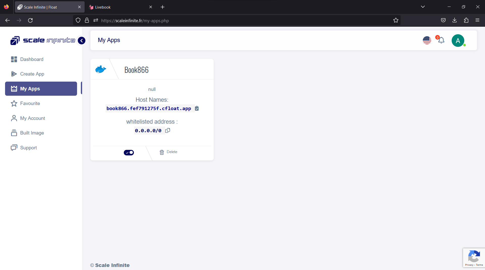
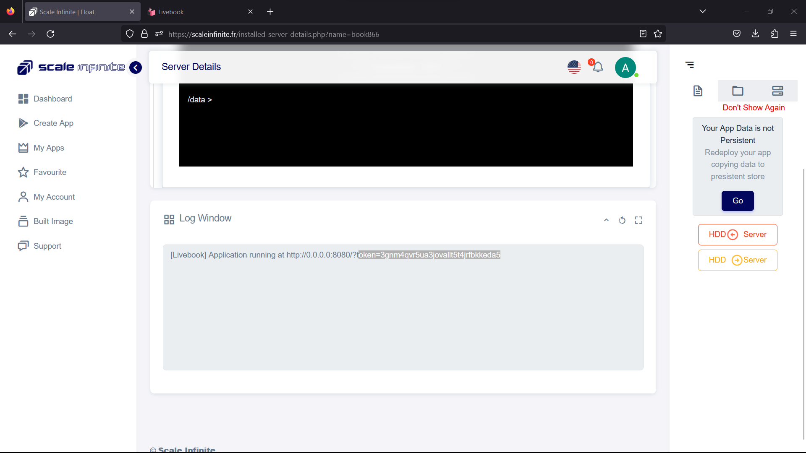
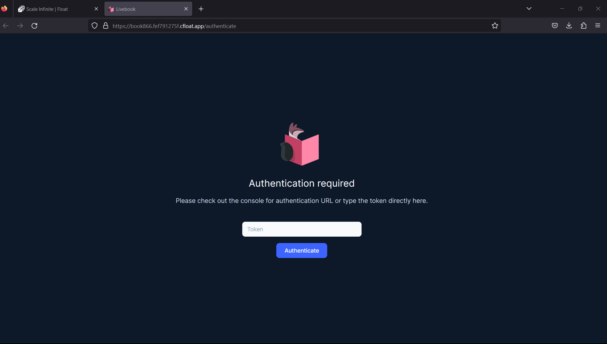
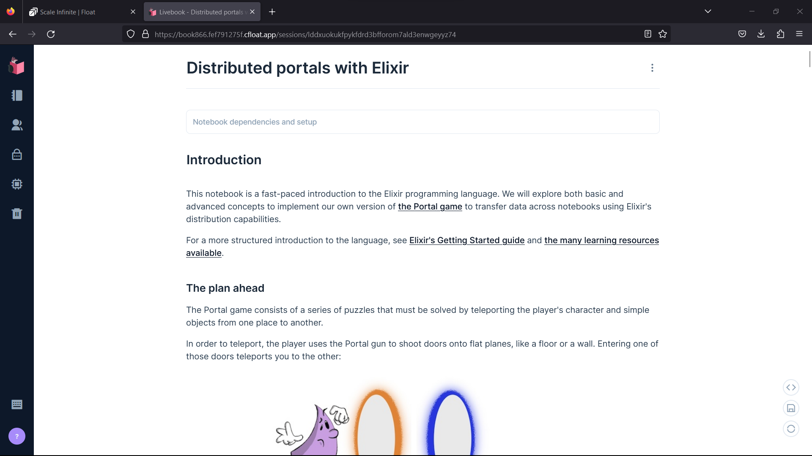
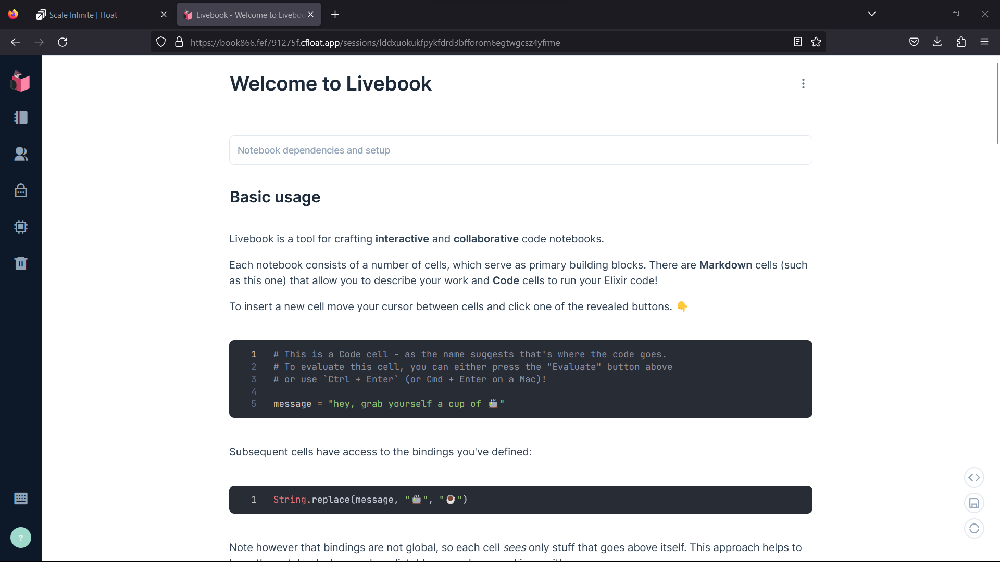
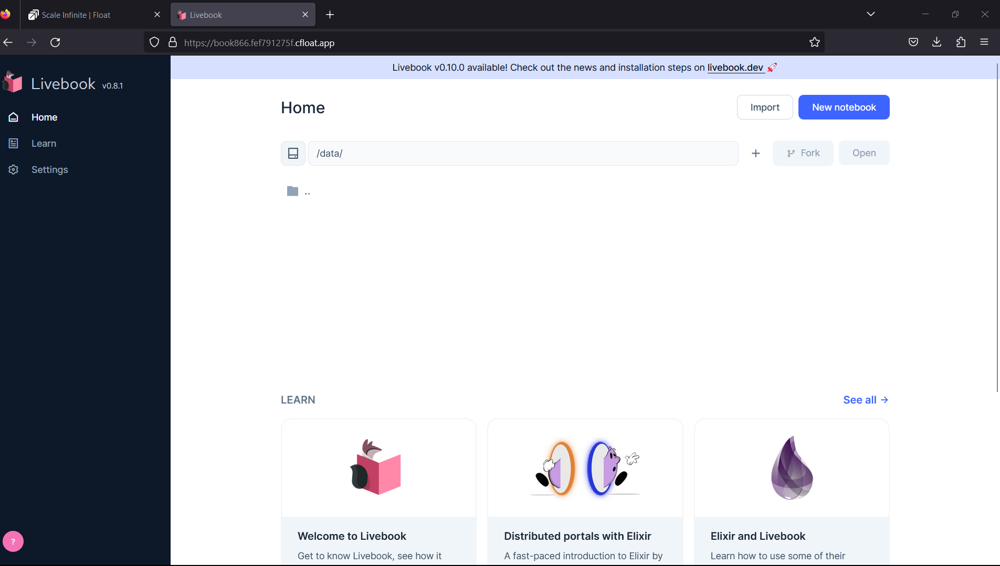

# 📓 Livebook Deployment

### <mark style="color:blue;">What's livebook?</mark>

\
<mark style="color:orange;">**Livebook: Your Collaborative Code Notebook**</mark>

In the ever-evolving realm of coding and data exploration, having the right tools can make all the difference. Enter Livebook, a versatile web application designed to be your partner in interactive, collaborative code notebook creation. Let's dive into what makes Livebook your coding confidant:

**1. Interactive Code Notebooks**: Livebook combines the best of both worlds – Markdown support and Code cells that allow you to execute Elixir code when needed. This dynamic duo makes coding and documentation seamlessly intertwined.

<mark style="color:orange;">**2. Mighty Monaco Editor**</mark><mark style="color:orange;">:</mark> Meet Monaco, your trusty code editor within Livebook. It's more than just a text box; it's packed with features like autocompletion, inline documentation, code formatting, and more. It's like having a coding companion that always knows what you need.

**3. Visualize with Kino**: Livebook introduces Kino, your gateway to interactive results. Create eye-catching Vega-Lite charts, tables, maps, and beyond. Now, your data can tell its story visually, adding depth to your notebooks.

<mark style="color:orange;">**4. Smart Cells for Efficiency**</mark><mark style="color:orange;">:</mark> Boost your productivity with Smart cells. They tackle high-level tasks, allowing you to interact with databases, plot charts, build maps, and perform other actions directly from Livebook's user-friendly interface.

**5. Reproducible and Predictable**: Livebook ensures your code runs like clockwork, maintaining predictability down to package management. Say goodbye to code chaos and hello to a structured, streamlined coding experience.

<mark style="color:orange;">**6. Collaboration at Its Best**</mark><mark style="color:orange;">:</mark> The world of coding is no longer a solo journey. Livebook fosters collaboration effortlessly, enabling multiple users to work on the same notebook simultaneously, minus the fuss of additional setup.

**7. Decentralized and Open-Source**: Livebook isn't confined by boundaries. It's open-source, ready to run wherever you need it. The "Run in Livebook" badge simplifies importing any Livebook into your personal workspace.

In the realm of coding, where innovation meets exploration, Livebook stands as your trusted companion. It seamlessly blends documentation and execution, empowers collaboration, and offers a versatile toolbox to explore and visualize data. With Livebook, coding becomes a vibrant, communal adventure.

So, whether you're building the next groundbreaking app or uncovering insights within your data, Livebook has your back. It's not just a code notebook; it's a dynamic, collaborative workspace for the curious minds of the coding world. Try Livebook and elevate your coding experience today!

### <mark style="color:blue;">**How It Works:**</mark>

<mark style="color:orange;">**How Livebook Works: Unveiling the Magic**</mark>

Coding and data exploration are about to get a whole lot more exciting with Livebook. This collaborative code notebook brings a touch of magic to your coding journey. Let's uncover the spellbinding workings of Livebook:

📘 **Interactive Code Notebooks**: Picture this – a notebook where you can seamlessly weave your code and explanations. Livebook offers Code cells that allow you to execute Elixir code on the fly, surrounded by the comfort of Markdown support.

✒️ <mark style="color:orange;">**Monaco Editor**</mark><mark style="color:orange;">:</mark> Inside Livebook, you'll find Monaco, your code-editing wizard. It's not just any editor; it's your coding sidekick. With features like autocompletion, inline documentation, and code formatting, Monaco has a solution for every coding whim.

📊 **Visual Magic with Kino**: Livebook introduces Kino, your gateway to visual enchantment. Kino lets you conjure Vega-Lite charts, tables, maps, and more. Your data comes to life with vivid visuals, adding a dash of magic to your notebooks.

<mark style="color:orange;">🔮</mark> <mark style="color:orange;"></mark><mark style="color:orange;">**Smart Cells for Efficiency**</mark>: Imagine having cells that can do your bidding! Smart cells in Livebook make complex tasks a breeze. Interact with databases, create charts, map out your data – all without leaving the Livebook interface.

🔄 **Reproducibility and Predictability**: Livebook takes the chaos out of coding. It ensures that your code follows a clear, predictable path, from package management to execution. No more surprises, just smooth coding.

<mark style="color:orange;">🤝</mark> <mark style="color:orange;"></mark><mark style="color:orange;">**Seamless Collaboration**</mark><mark style="color:orange;">:</mark> In the realm of coding, teamwork reigns supreme. Livebook makes collaboration effortless. Multiple users can work on the same notebook simultaneously, making it a hub of shared ideas and innovation.

🌐 **Decentralized and Open**: Livebook breaks free from constraints. It's open-source, ready to be your coding companion wherever you roam. The "Run in Livebook" badge simplifies importing Livebooks into your coding domain.

In the world of coding and data exploration, Livebook is more than just a tool; it's a magical adventure waiting to be embarked upon. It's where coding meets creativity, where data reveals its secrets through captivating visuals, and where collaboration knows no boundaries.

So, whether you're crafting the next big software marvel or unraveling data mysteries, Livebook is your trusty companion. It's not just a code notebook; it's a portal to a world where coding becomes an art form. Dive into the magic of Livebook and let your code take flight!

### <mark style="color:blue;">Steps And Procedure</mark>

*   <mark style="background-color:purple;">**This deployment utilizes the official  livebook  Docker image. Here's a step-by-step guide to get you started:**</mark>

    1. Begin by navigating to the "Create Apps" page and use the search bar to find the  [livebook/livebook](https://hub.docker.com/r/livebook/livebook) application.
    2. Click on the "Install" button to initiate the installation process.
    3. Fill in all the required fields with the necessary information.
    4. If you prefer, you can click on the "Advanced" option to access additional settings (this step is optional).
    5. After making your selections, press the "Install" button to proceed.
    6. Once the installation is complete, you'll be directed to the "My Apps" page, where you'll find a list of all the applications you've deployed.
    7. Copy the Hostname of the Livebook  application without the NodePort and paste it into your preferred browser's address bar.
    8. Voilà! You're now able to access the  Livebook webpage and explore its content.

    By following these straightforward steps, you'll have successfully deployed the Livebook application and gained access to its features through a seamless and user-friendly process.

### <mark style="color:blue;">Installation</mark>

| Docker Image                                                                                                                                                                                                                              |
| ----------------------------------------------------------------------------------------------------------------------------------------------------------------------------------------------------------------------------------------- |
| [Livebook](https://hub.docker.com/r/livebook/livebook)   [<mark style="background-color:yellow;">👈(</mark>](https://hub.docker.com/r/linuxserver/firefox)<mark style="background-color:yellow;">click me,for the dockerhub image)</mark> |

| Application name                                                               |
| ------------------------------------------------------------------------------ |
| <mark style="background-color:yellow;">Eg: book33(you can put any name)</mark> |

| Resource Allocation                                                                                                                                                     |
| ----------------------------------------------------------------------------------------------------------------------------------------------------------------------- |
| <mark style="background-color:yellow;">0-100%(</mark><mark style="color:orange;">10 % of your allocated resources (CPU, RAM) will be used for this application.)</mark> |

<mark style="background-color:yellow;">`PROTOCOL`</mark>

<table><thead><tr><th width="417">Protocol</th><th>Protocol Value</th></tr></thead><tbody><tr><td><mark style="background-color:yellow;">Http</mark></td><td><mark style="color:orange;">8080</mark></td></tr><tr><td><mark style="background-color:yellow;">Tcp</mark></td><td>-</td></tr></tbody></table>

| Install with Default                                                                                                                                        | Advanced                                                                                                                                                               |
| ----------------------------------------------------------------------------------------------------------------------------------------------------------- | ---------------------------------------------------------------------------------------------------------------------------------------------------------------------- |
| <mark style="background-color:yellow;">(select this if you want install with default settings if don't have environment value and working directory)</mark> | <mark style="background-color:yellow;">(select this if you want to go with advanced settings, where you select you own environment value and working directory)</mark> |

If you choose Advanced option:

| ENV VARIABLE                                                            |
| ----------------------------------------------------------------------- |
| 
<code>Give env variable.</code>

<code>Eg:key==value</code>
 |

| WORKING DIR                                                                              |
| ---------------------------------------------------------------------------------------- |
| 
<code>WORKDIR for the application.</code>

 <code>Eg:usr/src/yourAPP</code> 
 |
| <mark style="color:red;">Here use ( use the path after   " :"  )</mark>                  |
| -v $(pwd):/data [ghcr.io/livebook-dev/livebook](http://ghcr.io/livebook-dev/livebook)    |

<mark style="background-color:yellow;">`Access`</mark>

| Public                                      | Private                                      |
| ------------------------------------------- | -------------------------------------------- |
| (select this if you want to make it public) | (select this if you want to make it private) |

<mark style="color:purple;">**Step-by-Step Guide to livebook Deployment**</mark>

1. <mark style="color:blue;">**Docker Image Selection**</mark>**:**
   * <mark style="color:orange;">Docker Image Name: livebook</mark>
2. <mark style="color:orange;">**Application Details**</mark>**:**
   * Application Name: `livebook`
   * Resource Allocation: Set the desired resource allocation from 0-100%.
3. <mark style="color:orange;">**Protocol Configuration**</mark>**:**
   * Protocol: `HTTP`
   * Port: `8080`
4. <mark style="color:orange;">**Installation Options**</mark>**:**
   * Choose between "Default" or "Advanced" installation.
5. <mark style="color:orange;">**Advanced Installation (Optional**</mark>**):**
   * If selecting "Advanced," you can customize the environment variables and working directory:
   *   **Environment Variables:**

       Environment variables are dynamic values used by a containerized application for configuration. They are defined as key-value pairs, like `API_KEY=xyz`, and provide flexibility to adjust an app's behavior without changing its code.

       * Environment Variables: Define environment variables with keys and values (e.g., `key=value`).
   *   **Working Directory:**

       The working directory is the starting point inside a container where an app's files are located. It affects relative file paths and operations. For example, if set to `/usr/src/yourAPP`, an app will reference files from there, like `/usr/src/yourAPP/data.txt`.

       * Working Directory: Set the working directory for the application (e.g., `usr/src/yourAPP`).
       * <mark style="color:red;">Here use ( use the path after   " :"  )</mark>
       * \-v $(pwd):/data [ghcr.io/livebook-dev/livebook](http://ghcr.io/livebook-dev/livebook)
6. <mark style="color:orange;">**Access Configuration**</mark>**:**
   * Choose between "Public" or "Private" access to the deployed application.
7. <mark style="color:orange;">**Installation**</mark>**:**
   * Click the "Install" button to initiate the deployment process.

By following these steps, you can effortlessly deploy an Livebook instance with your chosen configurations. This enables you to tailor the environment to match your application's requirements and specifications. Whether opting for the default installation or delving into advanced settings, our platform ensures a seamless deployment experience while providing you the flexibility to customize according to your needs.

### <mark style="color:blue;">Visual Snapshots</mark>

<figure><figcaption></figcaption></figure>

 

<figure><figcaption></figcaption></figure>

<figure><figcaption></figcaption></figure>

 

<figure><figcaption></figcaption></figure>

<figure><figcaption></figcaption></figure>

 

<figure><figcaption></figcaption></figure>

### <mark style="color:orange;">Youtube Tutorial</mark>&#x20;

Check out our youtube video for more clarification.

### <mark style="color:blue;">FAQ</mark>

**About** Livebook **image we used.**

This is the official Livebook mage.

**Can I deploy my own media** Livebook **with modified configuration ?**

Yes, you can simply deploy any version or modified image to our platform by linking your docker hub account to our platform.

**Are my data persistent ?**

For the free user there is no persistence, and for the premium user you can different type of persistence.

### Join us

Stay informed and engaged with our project's latest developments and support on [Slack](https://app.slack.com/client/T04QS32JX6E/C04QKEWE146). Join us today to connect, collaborate, and keep the momentum going!&#x20;

Category

Kubernetes, cloud computing, DevOps, cloud services, hosting platform, container orchestration, cloud infrastructure, cloud deployment, cloud management, cloud technology, cloud solutions, Livebook

