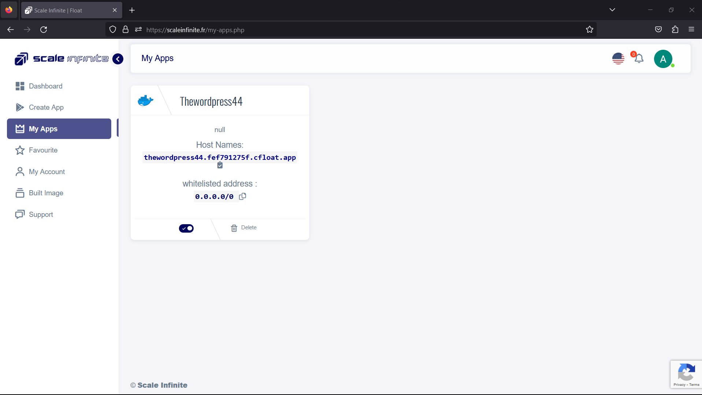
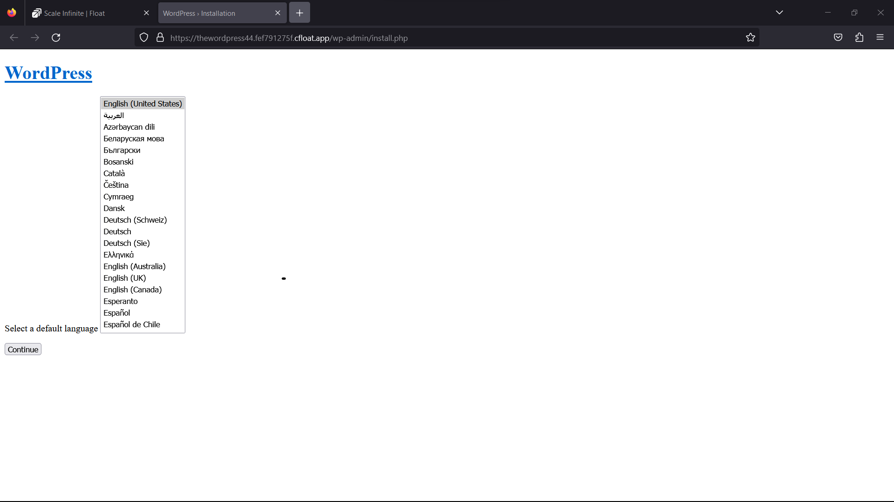
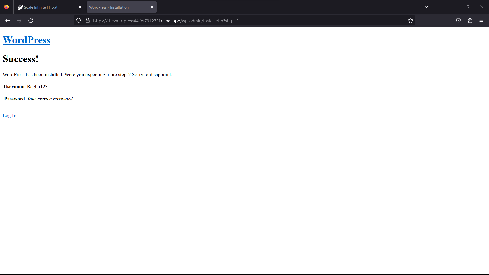

# 🖥 WordPress MySQL

### <mark style="color:blue;">What's WordPress?</mark>

<mark style="color:orange;">WordPress stands as a dynamic and open-source content management system (CMS), proficiently crafted with PHP, and designed to operate seamlessly alongside either MySQL or MariaDB databases. Additionally, it includes robust support for HTTPS, bolstering security measures for data transmission. Here are key details:</mark>

**Open-Source CMS**: WordPress extends itself as an open-source CMS, breaking down accessibility barriers and offering an adaptable platform for the creation and management of websites.

**PHP-Powered:** At its core, WordPress leverages the versatile PHP scripting language. PHP plays a pivotal role in dynamically generating and rendering web content and interactions, contributing to the platform's flexibility.

**Database Pairing**: WordPress relies on the support of MySQL or MariaDB databases for the storage of diverse elements, encompassing content, configurations, user data, and more. This partnership with robust databases enables WordPress to handle various aspects of website functionality efficiently.

**HTTPS Supported**: Recognizing the paramount importance of security in today's digital landscape, WordPress actively promotes and supports HTTPS (HyperText Transfer Protocol Secure). This encryption protocol ensures that data transmission remains confidential and safeguarded against potential threats during its journey across the internet.

WordPress embodies a user-centric approach to website development, offering a versatile and accessible solution. By embracing open-source principles and integrating PHP, robust databases, and HTTPS, WordPress empowers users to create and manage websites with both ease and security at the forefront.

### <mark style="color:blue;">**Working in Brief**</mark>

<mark style="color:orange;">WordPress empowers users to manage websites effectively through a user-friendly interface, enabling content creation, while also employing a dynamic and secure foundation. Here are key aspects:</mark>

Content Creation: WordPress facilitates the creation and publication of web content via an accessible dashboard. Users can draft articles, add media, and manage their site's pages effortlessly.

Database Interaction: WordPress engages in seamless communication with MySQL or MariaDB databases. These databases serve as repositories for an array of elements, including content, configuration settings, and user information. Such integration ensures efficient data storage and retrieval.

Themes & Plugins: WordPress extends its functionality through themes and plugins. Themes are instrumental in shaping a website's appearance, enabling customization to match specific design preferences. Meanwhile, plugins provide additional features and functionalities, allowing users to tailor their sites according to their unique requirements.

Dynamic Pages: PHP, a versatile scripting language, forms the backbone of WordPress, dynamically processing user requests. This enables the generation of web pages on-the-fly, assembling content and delivering it to visitors in real-time.

HTTPS Encryption: WordPress prioritizes security by integrating support for HTTPS (HyperText Transfer Protocol Secure). This encryption protocol safeguards data transmitted between users and the website, bolstering privacy and shielding against potential security threats.

WordPress stands as a powerful platform that streamlines website management, offering a combination of user-friendly content creation tools and an extensive repository of themes and plugins. Its dynamic PHP-driven pages and commitment to HTTPS encryption underscore its dedication to providing both functionality and security.

### <mark style="color:blue;">Steps And Procedure</mark>

&#x20;**Docker image of this application consists of following layers :**

```
'FROM ubuntu:14.04' Taking ubuntu:14.04 as the base image.

And updating and installing all the required softwares like 'mysql-server' 'mysql-client' 'nginx' for better performance 'php5-fpm' 'php5-mysql'.

And installing all the required softwares for Wordpress 'php5-curl' 'php5-gd' 'php5-intl'

Done configurations in required files like adding nginx keepalive_timeout and wordpress upload and post max file size.

Exposing 3306 and 80 ports on the container. 
```

#### Deploy Wordpress Mysql on Scaleinfinite

<mark style="background-color:purple;">**This deployment utilizes the official  wordpress Docker image. Here's a step-by-step guide to get you started:**</mark>

1. Begin by navigating to the "Create Apps" page and use the search bar to find the <mark style="color:orange;">mscaleinfinite/wpmysql</mark> application.
2. Click on the "Install" button to initiate the installation process.
3. Fill in all the required fields with the necessary information.
4. If you prefer, you can click on the "Advanced" option to access additional settings (this step is optional).
5. After making your selections, press the "Install" button to proceed.
6. Once the installation is complete, you'll be directed to the "My Apps" page, where you'll find a list of all the applications you've deployed.
7. Copy the Hostname of the wordpress application without the NodePort and paste it into your preferred browser's address bar.
8. Voilà! You're now able to access the wordpress webpage and explore its content.


### <mark style="color:blue;">Installation</mark>&#x20;

| Docker Image                                                                                                                       |
| ---------------------------------------------------------------------------------------------------------------------------------- |
| [`Wpmysql`](https://hub.docker.com/\_/wordpress)<mark style="background-color:yellow;">👈(click me,for the dockerhub image)</mark> |

| Application name                                                                  |
| --------------------------------------------------------------------------------- |
| <mark style="background-color:yellow;">Eg: wordpress(you can put any name)</mark> |

| Resource Allocation                                                                                                                                                     |
| ----------------------------------------------------------------------------------------------------------------------------------------------------------------------- |
| <mark style="background-color:yellow;">0-100%(</mark><mark style="color:orange;">10 % of your allocated resources (CPU, RAM) will be used for this application.)</mark> |

<mark style="background-color:yellow;">`PROTOCOL`</mark>

<table><thead><tr><th width="417">Protocol</th><th>Protocol Value</th></tr></thead><tbody><tr><td><mark style="background-color:yellow;">Http</mark></td><td><mark style="color:orange;">80</mark></td></tr><tr><td><mark style="background-color:yellow;">Tcp</mark></td><td>-</td></tr></tbody></table>

| Install with Default                                                                                                                                        | Advanced                                                                                                                                                               |
| ----------------------------------------------------------------------------------------------------------------------------------------------------------- | ---------------------------------------------------------------------------------------------------------------------------------------------------------------------- |
| <mark style="background-color:yellow;">(select this if you want install with default settings if don't have environment value and working directory)</mark> | <mark style="background-color:yellow;">(select this if you want to go with advanced settings, where you select you own environment value and working directory)</mark> |

If you choose Advanced option:

| ENV VARIABLE                                                            |
| ----------------------------------------------------------------------- |
| <p><code>Give env variable.</code></p><p><code>Eg:key==value</code></p> |

| WORKING DIR                                                                             |
| --------------------------------------------------------------------------------------- |
| <p><code>WORKDIR for the application.</code></p><p> <code>Eg:usr/src/yourAPP</code></p> |
| <mark style="color:red;">Here use ( use the path after   " :"  )</mark>                 |

<mark style="background-color:yellow;">`Access`</mark>

| Public                                      | Private                                      |
| ------------------------------------------- | -------------------------------------------- |
| (select this if you want to make it public) | (select this if you want to make it private) |

<mark style="color:purple;">**Step-by-Step Guide to NGINX Deployment**</mark>

1. <mark style="color:blue;">**Docker Image Selection**</mark>**:**
   * <mark style="color:orange;">Docker Image Name:</mark> <mark style="color:orange;"></mark><mark style="color:orange;">`wpmysql`</mark>
2. <mark style="color:orange;">**Application Details**</mark>**:**
   * Application Name: `wordpress`
   * Resource Allocation: Set the desired resource allocation from 0-100%.
3. <mark style="color:orange;">**Protocol Configuration**</mark>**:**
   * Protocol: `HTTP`
   * Port: `80`
4. <mark style="color:orange;">**Installation Options**</mark>**:**
   * Choose between "Default" or "Advanced" installation.
5. <mark style="color:orange;">**Advanced Installation (Optional**</mark>**):**
   * If selecting "Advanced," you can customize the environment variables and working directory:
   *   **Environment Variables:**

       Environment variables are dynamic values used by a containerized application for configuration. They are defined as key-value pairs, like `API_KEY=xyz`, and provide flexibility to adjust an app's behavior without changing its code.

       * Environment Variables: Define environment variables with keys and values (e.g., `key=value`).
   *   **Working Directory:**

       The working directory is the starting point inside a container where an app's files are located. It affects relative file paths and operations. For example, if set to `/usr/src/yourAPP`, an app will reference files from there, like `/usr/src/yourAPP/data.txt`.

       * Working Directory: Set the working directory for the application (e.g., `usr/src/yourAPP`).
       * <mark style="color:red;">Here use ( use the path after   " :"  )</mark>
6. <mark style="color:orange;">**Access Configuration**</mark>**:**
   * Choose between "Public" or "Private" access to the deployed application.
7. <mark style="color:orange;">**Installation**</mark>**:**
   * Click the "Install" button to initiate the deployment process.

By following these steps, you can effortlessly deploy an Wordpress mysql instance with your chosen configurations. This enables you to tailor the environment to match your application's requirements and specifications. Whether opting for the default installation or delving into advanced settings, our platform ensures a seamless deployment experience while providing you the flexibility to customize according to your needs.

### <mark style="color:blue;">Visual snapshots</mark>


<div>

<figure><figcaption></figcaption></figure>

 

<figure><figcaption></figcaption></figure>

</div>

<div>

<figure><figcaption></figcaption></figure>

 

<figure><figcaption></figcaption></figure>

</div>

### <mark style="color:purple;">FAQ</mark>

**About Wordpress mysql image we used.**

This image is maintained by the scaleinfinite.

**Is Mysql is in the same container ?**

Yes, both WordPress and MySQL are inbuilt into the same container securely.

**Do the image secure to use ?**

The image is created and verified by the scaleinfinite. it is a 100% secure image.

**Are my data persistent ?**

For the free user there is no persistence, and for the premium user you can different type of persistence.

### Join us

Stay informed and engaged with our project's latest developments and support on [Slack](https://app.slack.com/client/T04QS32JX6E/C04QKEWE146). Join us today to connect, collaborate, and keep the momentum going!&#x20;

<details>

<summary>Category</summary>

Kubernetes, cloud computing, DevOps, cloud services, hosting platform, container orchestration, cloud infrastructure, cloud deployment, cloud management, cloud technology, cloud solutions, wordpress

</details>
