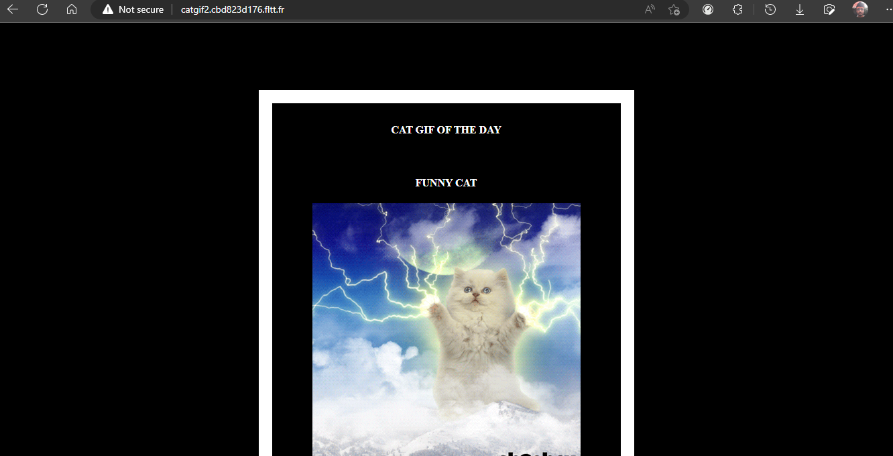

# Simple Static Website

* The code for the application is uploaded on github.

[Github Link](https://github.com/younesfakallah/catgifFront)

* Make sure you have your dockerhub account linked to scaleinfinte you can find the process here [Link](https://file+.vscode-resource.vscode-cdn.net/c%3A/Users/AMARTYA/OneDrive/Documents/GitHub/scale-infinite.github.io/content/quick\_start/my\_account)
* Use [Build image](https://file+.vscode-resource.vscode-cdn.net/c%3A/Users/AMARTYA/OneDrive/Documents/GitHub/scale-infinite.github.io/content/quick\_start/build\_image) page to create a docker image and push into your docker hub account.
* Search the docker image you have created in Create app page.
* Click on the Install button.
* Fill all the reqired feilds.

| PRODUCT NAME             |
| ------------------------ |
| `<name of docker image>` |

`PROTOCOL`

| HTTP | TCP/UDP |
| ---- | ------- |
| `80` |         |

* click on Advanced.

| ENV VARIABLE        | WHITELIST                                       | WORKING DIR                   |
| ------------------- | ----------------------------------------------- | ----------------------------- |
| `Give env variable` | `If you want to white list any ports list here` | `WORKDIR for the application` |

* You will be redirected to My Apps page, Here you can find all the applications you deployed.

<figure><figcaption></figcaption></figure>

&#x20;Copy the application Hostname without NodePort and search the Url.

<figure><figcaption></figcaption></figure>

* The Application is running successfully

### FAQ

**Can i install my own Static Application?**

Absolutely, you can install your own Static applcation, Make Sure you have proper Docker image created on your dockerhub.

#### [Join us](https://app.slack.com/client/T04QS32JX6E/C04QKEWE146)&#x20;
