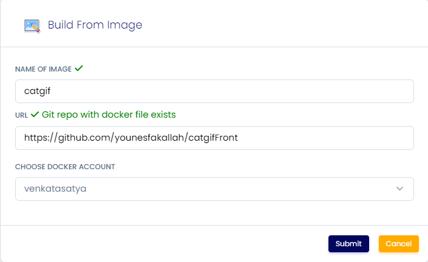
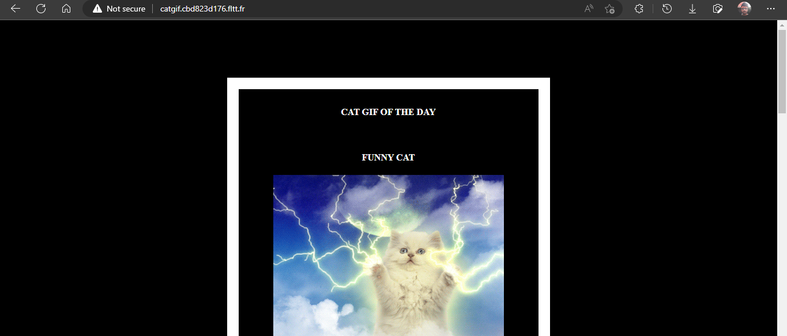

# Simple Website with Node.js

A simple single page Node.js application.

➡️ The code for the application is uploaded on github.

[Github Link](https://github.com/younesfakallah/catgif2)

➡️Make sure you have your dockerhub account linked to scaleinfinte you can find the process here Link

➡️ Use Build image page to create a docker image and push into your docker hub account.

➡️ Search the docker image you have created in Create app page.

➡️ Click on the Install button.

➡️ Fill all the reqired feilds.

| PRODUCT NAME             |
| ------------------------ |
| `<name of docker image>` |

`PROTOCOL`

| HTTP   | TCP/UDP |
| ------ | ------- |
| `3000` |         |

➡️ click on Advanced.

| ENV VARIABLE        | WHITELIST                                       | WORKING DIR                   |
| ------------------- | ----------------------------------------------- | ----------------------------- |
| `Give env variable` | `If you want to white list any ports list here` | `WORKDIR for the application` |

➡️ You will be redirected to My Apps page, Here you can find all the applications you deployed.

<figure><figcaption></figcaption></figure>

➡️ Copy the application Hostname without NodePort and search the Url.

<figure><figcaption></figcaption></figure>

 

<figure><figcaption></figcaption></figure>

➡️ The Application is running successfully

### FAQ

**Can i install my own node.js Application?**

Absolutely, you can install your own applcation, Make Sure you have proper Docker image created on your dockerhub.
