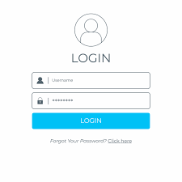

# Drupal deployment

### <mark style="color:blue;">What's Drupal?</mark>

Drupal is a powerful, open-source web content management system (CMS) built using the PHP scripting language. It offers a versatile platform for creating, managing, and customizing websites to meet your specific needs.

**Key Points:**

1. **Open-Source CMS:** Drupal is freely accessible, providing a foundation for website development and management.
2. <mark style="color:orange;">**PHP-Powered**</mark>**:** The core of Drupal is written in PHP, a versatile scripting language.
3. **Modularity:** Drupal's modular architecture allows you to add and customize features using modules.
4. <mark style="color:orange;">**Customization**</mark>**:** Tailor your site's appearance and functionality with themes and modules.
5. **Community-Driven:** A thriving community contributes to Drupal's development, providing updates, support, and resources.

### <mark style="color:blue;">**Working in Brief**</mark>

1. <mark style="color:orange;">**Content Creation**</mark>**:** Easily create and organize content using Drupal's user-friendly interface.
2. **Modular Architecture:** Add functionalities with modules that offer specific features or integrations.
3. <mark style="color:orange;">**Themes & Appearance**</mark>**:** Customize your site's look and feel with themes, ensuring a unique design.
4. **PHP Processing:** PHP processes user requests, dynamically generating web pages and content.
5. <mark style="color:orange;">**Community Support**</mark>**:** Benefit from a community of developers and users providing updates, solutions, and enhancements.

Drupal empowers website management by providing flexibility, scalability, and a robust ecosystem of modules and themes. Its open-source nature and dedicated community make it a versatile choice for various web projects.

### &#x20;<mark style="color:blue;">Steps And Procedure</mark>

* &#x20;<mark style="background-color:orange;">**This deployment uses the official Drupal Docker image.**</mark>
* &#x20;Go to create apps page and Search Drupal on the search bar.
* Click on install button.
* &#x20;Fill all the required fields.
* &#x20;click on Advanced.
* &#x20;Click on the Install button.
* &#x20;You will be redirected to My Apps page, Here you can find all the applications you deployed.
* &#x20;Copy the Drupal application Hostname without NodePort and search the Url.
* &#x20;Now you can access the Drupal login page.
* &#x20;Then you will be redirected to the Drupal dashboard page.

### <mark style="color:blue;">Installation</mark>

| Docker Image                                 |
| -------------------------------------------- |
| [`drupal`](https://hub.docker.com/\_/drupal) |

`PROTOCOL`

| HTTP | TCP/UDP |
| ---- | ------- |
| `80` |         |

| ENV VARIABLE                                                                                                                                                                                                                        | WHITELIST                                       | WORKING DIR                                       |
| ----------------------------------------------------------------------------------------------------------------------------------------------------------------------------------------------------------------------------------- | ----------------------------------------------- | ------------------------------------------------- |
| 
<code>You can set multiple ENV for database connection</code> <code>Give env variable.</code>

<code>Eg:key==value MYSQL_DATABASE, MYSQL_USER</code>, <code>MYSQL_PASSWORD</code>, and <code>MYSQL_ROOT_PASSWORD</code>
 | `If you want to white list any ports list here` | `WORKDIR for the application. Eg:usr/src/yourAPP` |

### <mark style="color:blue;">Visual Snapshots</mark>

<figure><figcaption></figcaption></figure>

<figure><figcaption></figcaption></figure>

<figure><figcaption></figcaption></figure>

### <mark style="color:blue;">FAQ</mark>

**About Drupal image we used.**

This is the official Drupal image.

**Is the Database inbuilted in the same image ?**

No, you need to add your database while you are login and setting your website.

**Can i deploy older version of drupal or my own modified drupal image ?**

Yes, you can simply deploy any version or modified image to our platform by linking your docker hub account to our platform.

**Are my data persistent ?**

For the free user there is no persistence, and for the premium user you can different type of persistence.

### Join us

Stay informed and engaged with our project's latest developments and support on [Slack](https://app.slack.com/client/T04QS32JX6E/C04QKEWE146). Join us today to connect, collaborate, and keep the momentum going!&#x20;
