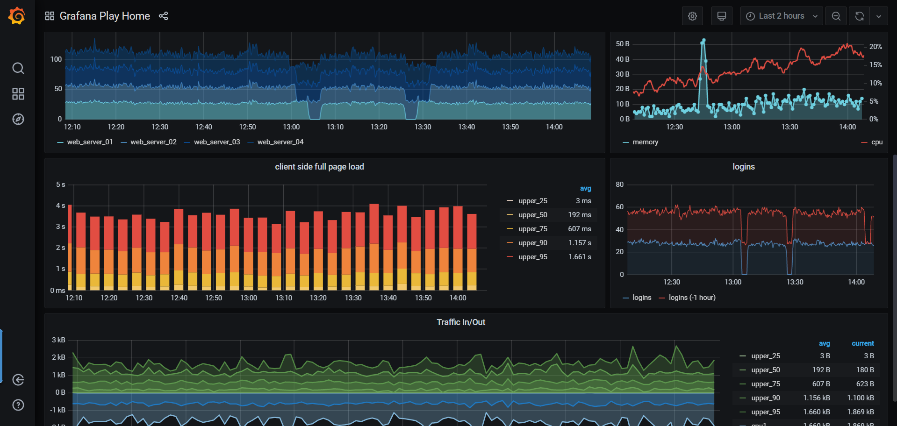

# Grafana deployment

### <mark style="color:blue;">What's Grafana?</mark>

Grafana is a versatile, open-source analytics and interactive visualization web application. It empowers users to create compelling charts, graphs, and alerts by connecting to supported data sources.

**Key Points:**

1. **Multi-Platform Analytics:** Grafana is available across various platforms, making data analysis accessible.
2. **Open-Source:** It's freely available, fostering collaboration and customization.
3. **Interactive Visualization:** Grafana offers dynamic charts, graphs, and dashboards to illustrate data trends.
4. **Data Source Connectivity:** It connects to various data sources, like databases, APIs, and cloud services.
5. **Alerting System:** Grafana can trigger alerts based on preset conditions to notify users of changes.

### <mark style="color:blue;">**Working in Brief:**</mark>

1. **Data Source Connection:** Grafana connects to your chosen data source, whether it's a database or cloud service.
2. **Dashboard Creation:** Users design dashboards by selecting data metrics, visualizations, and layout.
3. **Interactive Visuals:** Charts and graphs respond in real-time to user interactions, aiding analysis.
4. **Alert Configuration:** Set conditions for alerts to notify users when specific thresholds are met.
5. **Real-Time Insights:** Grafana visualizes data trends, helping users grasp patterns and make informed decisions.

Grafana transforms raw data into visually engaging insights, enhancing data-driven decision-making. Its open-source nature and compatibility with multiple data sources make it an invaluable tool for monitoring and understanding complex datasets.

### <mark style="color:blue;">Installation</mark>

* &#x20;<mark style="background-color:yellow;">**This deployment uses the official Grafana Docker image.**</mark>
* &#x20;Go to create apps page and Search grafana on the search bar.
* &#x20;Click on install button.
* &#x20;Fill all the reqired feilds.

| PRODUCT NAME |
| ------------ |
| `grafana`    |

`PROTOCOL`

| HTTP   | TCP/UDP |
| ------ | ------- |
| `3000` |         |

* &#x20;click on Advanced.

| ENV VARIABLE        | WHITELIST                                       | WORKING DIR                   |
| ------------------- | ----------------------------------------------- | ----------------------------- |
| `Give env variable` | `If you want to white list any ports list here` | `WORKDIR for the application` |

* &#x20;Click on the Install button.
* &#x20;You will be redirected to My Apps page, Here you can find all the applications you deployed.
* &#x20;Copy the grafana application Hostname without NodePort and search the Url.
* &#x20;Now you will access the application. And you need to login to grafana.
* &#x20;Default Username and Password for grafana is admin.
* &#x20;After you will be required to add datasources and create dashboards to visualize your data.    `ADD DATASOURCE`
* &#x20;Now you can create the dashboard and select the data source to visualize the data you need.

### <mark style="color:blue;">Visual Snapshots</mark>

<figure><figcaption></figcaption></figure>

<figure><figcaption></figcaption></figure>

<figure><figcaption></figcaption></figure>

<figure><figcaption></figcaption></figure>

### <mark style="color:blue;">FAQ</mark>

**About grafana image we used.**

This is the official grafana image.

**Are there any restrictions on adding data sources ?**

you can add any data source that grafana supports.

**Can i deploy older version of grafana or my own modified grafana image ?**

Yes, you can simply deploy any version or modified image to our platform by linking your docker hub account to our platform.

**Are my data persistent ?**

For the free user there is no persistence, and for the premium user you can different type of persistence.

### Join us

Stay informed and engaged with our project's latest developments and support on [Slack](https://app.slack.com/client/T04QS32JX6E/C04QKEWE146). Join us today to connect, collaborate, and keep the momentum going!&#x20;
