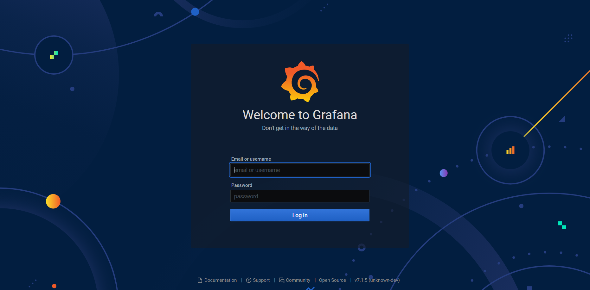
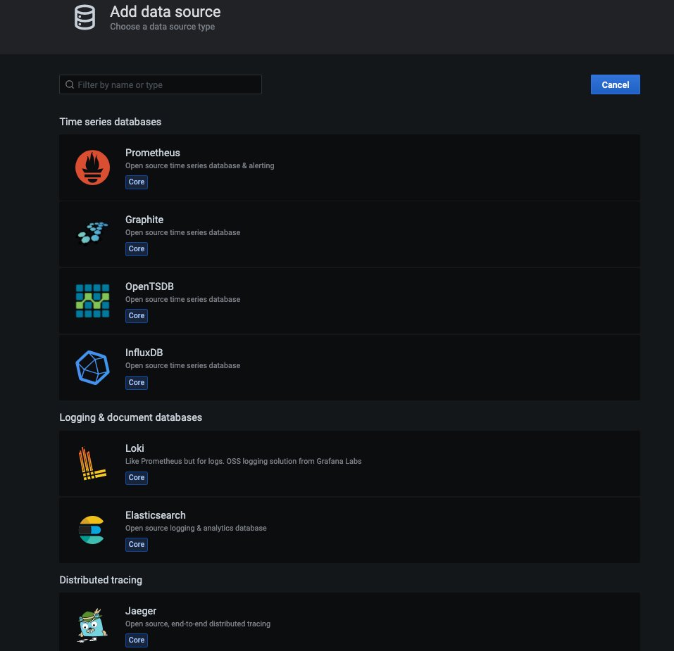

# Grafana deployment

Grafana is a multi-platform open source analytics and interactive visualization web application. It provides charts, graphs, and alerts for the web when connected to supported data sources.

* &#x20;**This deployment uses the official Grafana Docker image.**
* &#x20;Go to create apps page and Search grafana on the search bar.
* &#x20;Click on install button.
* &#x20;Fill all the reqired feilds.

| PRODUCT NAME |
| ------------ |
| `grafana`    |

`PROTOCOL`

| HTTP   | TCP/UDP |
| ------ | ------- |
| `3000` |         |

* &#x20;click on Advanced.

| ENV VARIABLE        | WHITELIST                                       | WORKING DIR                   |
| ------------------- | ----------------------------------------------- | ----------------------------- |
| `Give env variable` | `If you want to white list any ports list here` | `WORKDIR for the application` |

* &#x20;Click on the Install button.
* &#x20;You will be redirected to My Apps page, Here you can find all the applications you deployed.

<figure><figcaption></figcaption></figure>

* &#x20;Copy the grafana application Hostname without NodePort and search the Url.
* &#x20;Now you will access the application. And you need to login to grafana.

<figure><figcaption></figcaption></figure>

* &#x20;Default Username and Password for grafana is admin.
* &#x20;After you will be required to add datasources and create dashboards to visualize your data.

<figure><figcaption></figcaption></figure>

`ADD DATASOURCE`

* &#x20;Now you can create the dashboard and select the data source to visualize the data you need.

<figure><figcaption></figcaption></figure>

### FAQ

**About grafana image we used.**

This is the official grafana image.

**Are there any restrictions on adding data sources ?**

you can add any data source that grafana supports.

**Can i deploy older version of grafana or my own modified grafana image ?**

Yes, you can simply deploy any version or modified image to our platform by linking your docker hub account to our platform.

**Are my data persistent ?**

For the free user there is no persistence, and for the premium user you can different type of persistence.

#### [Join us](https://app.slack.com/client/T04QS32JX6E/C04QKEWE146)&#x20;
