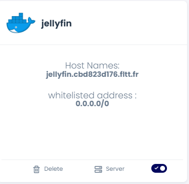
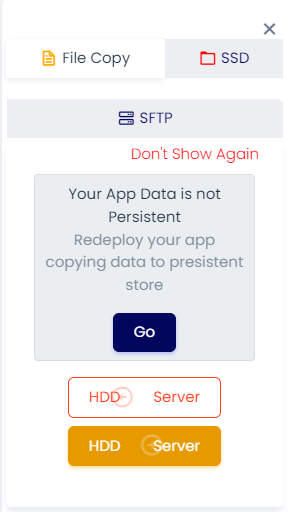
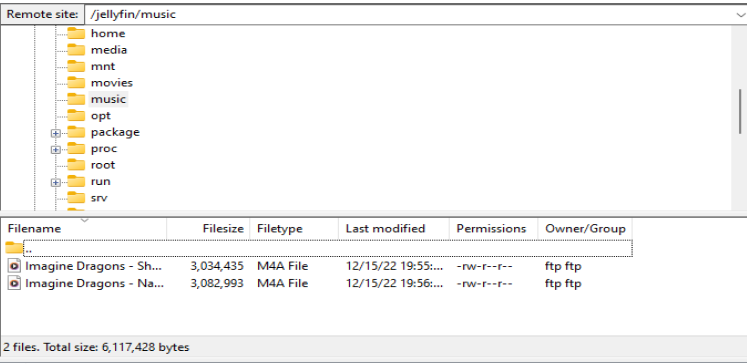

# Jellyfin Deployment

Jellyfin is a free and open-source media server software that allows users to organize and stream their personal media, such as music, videos, and pictures, to a variety of different devices.

* &#x20;**This deployment uses the linuxserver/jellyfin Docker image.**
* &#x20;Go to create apps page and Search linuxserver/jellyfin on the search bar.
* &#x20;Click on install button.
* &#x20;Fill all the reqired feilds.

| PRODUCT NAME |
| ------------ |
| `Jellyfin`   |

`PROTOCOL`

| HTTP   | TCP/UDP |
| ------ | ------- |
| `8096` |         |

* click on Advanced.

| ENV VARIABLE        | WHITELIST                                       | WORKING DIR                   |
| ------------------- | ----------------------------------------------- | ----------------------------- |
| `Give env variable` | `If you want to white list any ports list here` | `WORKDIR for the application` |

* Default Installation is enough for Jellyfin to be up and running. Click install
* You will be redirected to My Apps page, Here you can find all the applications you deployed.

<figure><figcaption></figcaption></figure>

* &#x20;Copy the Jellyfin application Hostname without NodePort and search the Url.
* &#x20;Now you will access the application. And start setting up the application.
* &#x20;Now Follow the on screen instructions and setup your account
* &#x20;We’ll add media files using ftp
* &#x20;Goto SFTP section in right-side bar menu and click 'Reinitilze password'
* &#x20;You will get credentials to login to your sftp storage. SFTP storage can be accessed using various tools, example:- Filezilla

<figure><figcaption></figcaption></figure>

* Select HDD to Server
* &#x20;Make sure you have provided right From and To file paths

<figure><figcaption></figcaption></figure>

➡️ Add the uploaded media files into the jellyfin using its web interface

### FAQ

**About Jellyfin image we used.**

This is the official linuxserver/jellyfin image.

**Are there any restrictions on adding data sources ?**

you can add any data source that Jellyfin supports.

**Can i deploy older version of Jellyfin or my own modified Jellyfin image ?**

Yes, you can simply deploy any version or modified image to our platform by linking your docker hub account to our platform.

**Are my data persistent ?**

For the free user there is no persistence, and for the premium user you can different type of persistence.
