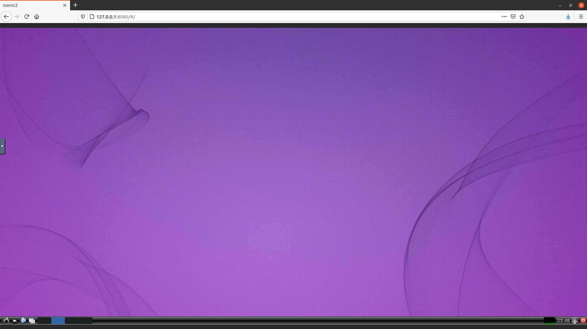

# Linux VPS deployment

#### <mark style="color:blue;">What's Linux VPS?</mark>

The Linux Virtual Private Server (VPS) is your personal virtual environment that you can set up in mere seconds, connect to, and utilize. Similar to your personal computer, it offers a controlled space for your projects, experiments, and applications.

**Key Points:**

1. **Virtual Private Server:** A virtual instance on a physical server, providing a dedicated environment for your activities.
2. **Swift Setup:** Within seconds, you can launch your Linux VPS, skipping the traditional hardware and OS setup.
3. **Connect & Use:** Access your VPS remotely, just like using your computer, through a terminal or SSH connection.
4. **Controlled Environment:** Customize your VPS with the software, configurations, and tools you need.
5. **Isolation:** Your VPS is isolated from other users' activities, ensuring privacy and security.

#### <mark style="color:blue;">**Working in Brief:**</mark>

1. **Server Virtualization:** The physical server is divided into multiple virtual compartments, each functioning independently.
2. **VPS Creation:** You select your preferred Linux distribution and configuration, and the VPS is created swiftly.
3. **Remote Access:** Via SSH or a terminal, you access your VPS from anywhere.
4. **Customization:** Install software, deploy applications, and tailor the environment to your liking.
5. **Utilization:** Run websites, applications, experiments, and more within your controlled VPS space.

With Linux VPS, you gain a versatile, isolated environment that's ready to adapt to your needs – all without the hassle of hardware setup.

#### Installations

* &#x20;**Docker image of this application consists of following layers**&#x20;

```
'FROM ubuntu:20.04' Taking ubuntu:20.04 as the base image.

And updating and installing all the required packages like 'supervisor' a system that allows users to monitor and control a number of processes 'nginx' 'xz-utils' 'dbus-x11' 'dbus-x11' and important tools like 'net-tools'  for controlling the network subsystem of the Linux kernel.

Then installed the 'vim-tiny' 'firefox' 'lxde' and 'vnc' virtual network computing software is very important for this application.

And 'copying' all the required files to the image.

Exposing the port '80' to access the vps.

```

#### Deploy LinuxVPS on Scaleinfinite

* &#x20;Go to create apps page and Search scaleinfinite/linuxvps on the search bar.
* Click on install button.
* &#x20;Fill all the reqired feilds.

| PRODUCT NAME |
| ------------ |
| `Linux VPS`  |

`PROTOCOL`

| HTTP | TCP/UDP |
| ---- | ------- |
| `80` |         |

* &#x20;click on Advanced.

| ENV VARIABLE        | WHITELIST                                                      | WORKING DIR                   |
| ------------------- | -------------------------------------------------------------- | ----------------------------- |
| `Give env variable` | `If you want to white list any ports list here` `Example` `82` | `WORKDIR for the application` |

* Click on the Install button.
* You will be redirected to My Apps page, Here you can find all the applications you deployed.
* Copy the Linuxvps application Hostname without NodePort and search the Url.
* &#x20;Now you can see a similar window like this.
* &#x20;From pressing the LADE symbol button you can access to terminal and file-system etc..,

#### <mark style="color:blue;">Visual Snapshots</mark>

<figure><figcaption></figcaption></figure>

<figure><figcaption></figcaption></figure>

<figure><figcaption></figcaption></figure>

### <mark style="color:blue;">FAQ</mark>

**About Linux VPS image we used.**

This image is maintained by the scale infinite.

**Do the image secure to use?**

The image is created and verified by the scale infinite. it is a 100% secure image.

**Are my data persistent ?**

For the free user there is no persistence, and for the premium user you can different type of persistence.

#### Join us

Stay informed and engaged with our project's latest developments and support on [Slack](https://app.slack.com/client/T04QS32JX6E/C04QKEWE146). Join us today to connect, collaborate, and keep the momentum going!&#x20;
