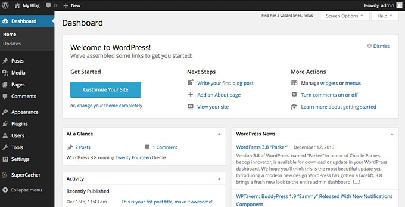

# Wordpress Sqlite

SQLite is a opensource SQL database that stores data to a text file on a device. WordPress is a free and open-source content management system written in hypertext preprocessor language and paired with a MySQL or MariaDB database with supported HTTPS.

**➡️ Docker image of this application consists of following layers :**

```
'FROM wordpress:latest' Taking Wordpress as the base image

Used PHP scripts to 'install' the SQLite plugin and setting up the database so that the wordpress will recognize the sqlite database. 

```

#### Deploy Wordpress SQLite on Scaleinfinite

➡️ Go to create apps page and Search scaleinfinite/wpsqlite on the search bar.

➡️ Click on install button.

➡️ Fill all the reqired feilds.

| PRODUCT NAME |
| ------------ |
| `Wpsqlite`   |

`PROTOCOL`

| HTTP | TCP/UDP |
| ---- | ------- |
| `80` |         |

➡️ click on Advanced.

| ENV VARIABLE        | WHITELIST                                       | WORKING DIR     |
| ------------------- | ----------------------------------------------- | --------------- |
| `Give env variable` | `If you want to white list any ports list here` | `/var/www/html` |

➡️ Click on the Install button.

➡️ You will be redirected to My Apps page, Here you can find all the applications you deployed.


<figure><figcaption></figcaption></figure>

➡️ Copy the wpsqlite application Hostname without NodePort and search the Url.

➡️ Now you can see the wordpress language selection page.


<figure><figcaption></figcaption></figure>

➡️ After selecting language you will be directly redirected to site creation page and fill all the fields like site name and username and so on.


<figure><figcaption></figcaption></figure>

➡️ Then Login with that detials.

➡️ Then you will be redirected to the wordpress Admin dashboard.

### FAQ

**About Wordpress sqlite image we used.**

This image is maintained by the scaleinfinite.

**Is sqlite good with wordpress ?**

Sqlite is widely used and lightweight database which makes your sight fast.

**Do the image secure to use ?**

The image is created and verified by the scaleinfinite. it is a 100% secure image.

**Are my data persistent ?**

For the free user there is no persistence, and for the premium user you can different type of persistence.
