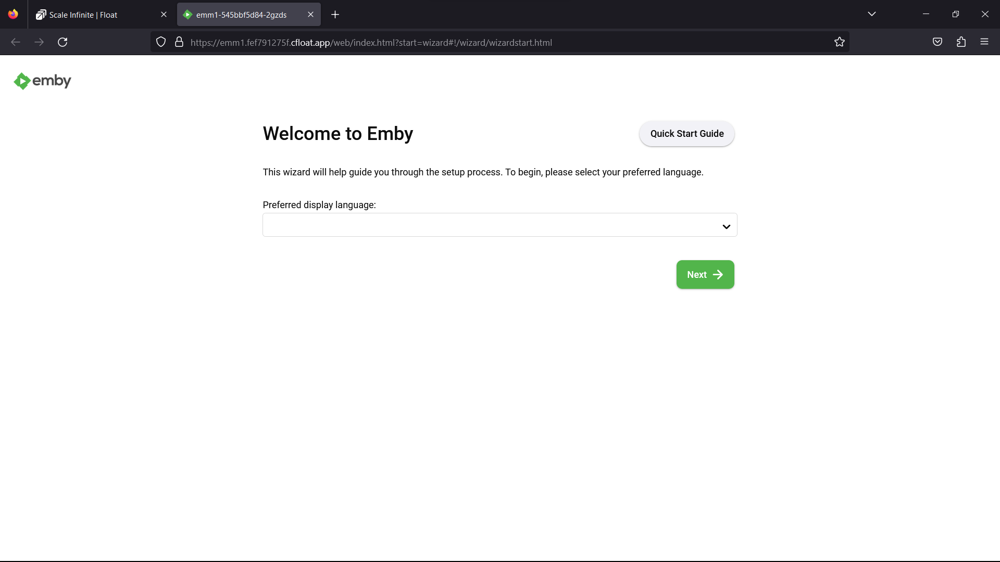
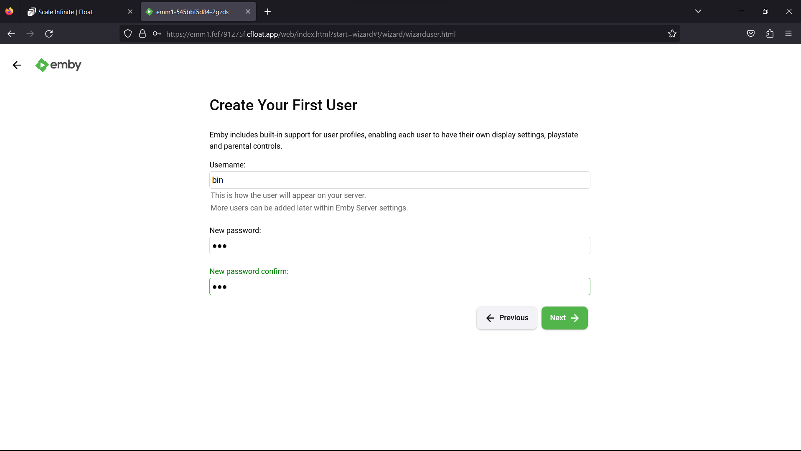
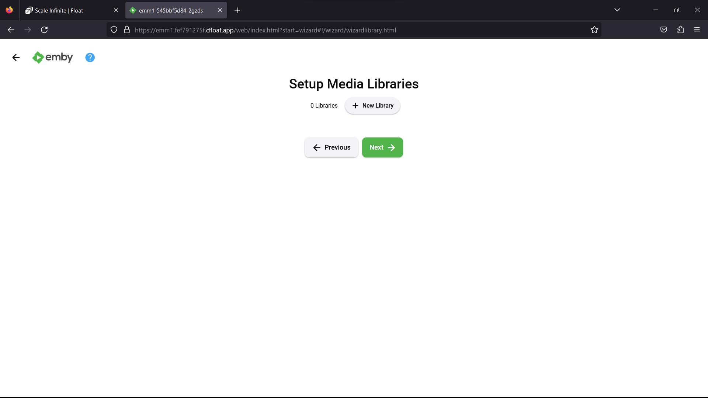
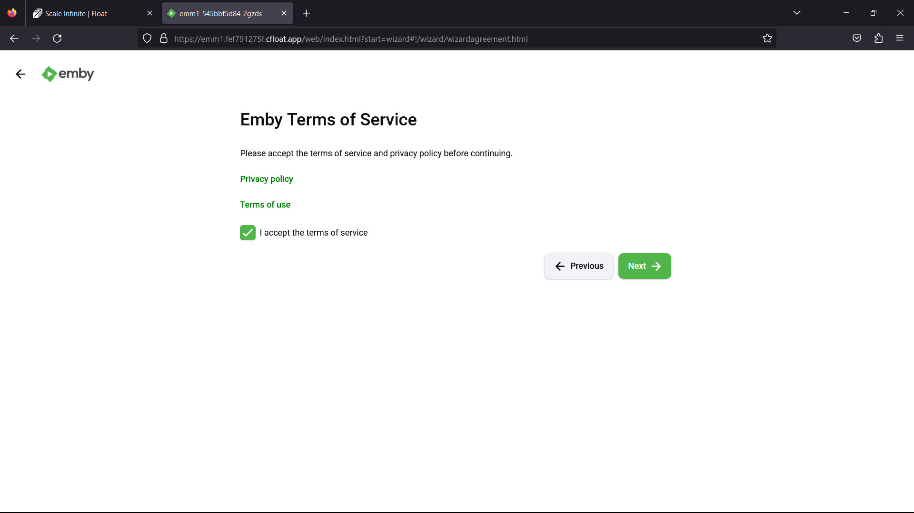
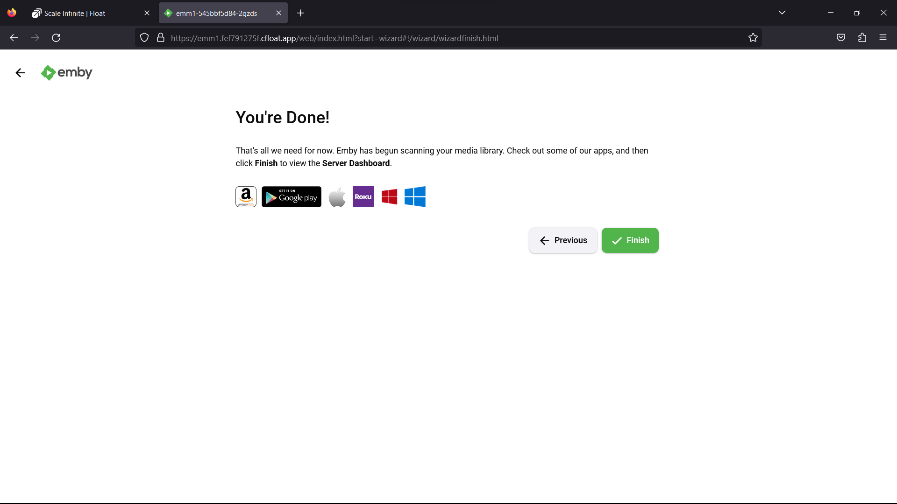
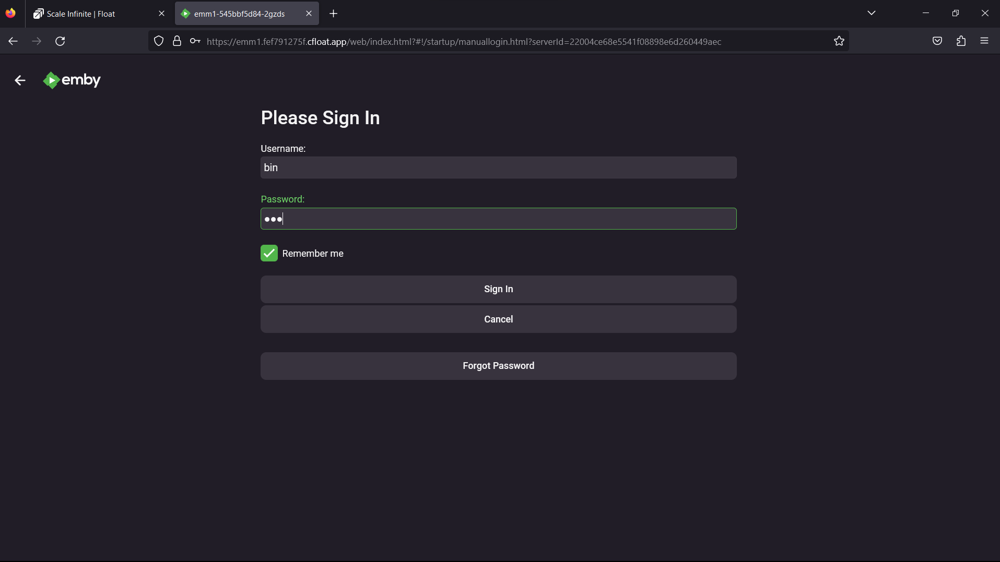
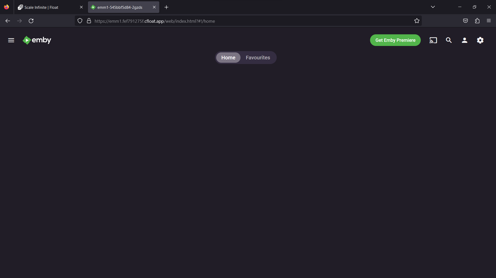

# 📺 Emby DeployMent

### <mark style="color:blue;">What's  emby?</mark>

<mark style="color:orange;">Emby is like a personal media butler, here to help you bring order to your multimedia chaos. It's not just software; it's a trusted companion in your media journey. Here's how Emby adds magic to your media world:</mark>

**Media Organization:** Picture Emby as your dedicated librarian. It empowers you to create libraries for different media types, like a movie library, a music archive, or a TV show collection. You're not just storing files; you're creating a multimedia haven. And the best part? You can add all the bells and whistles—metadata, descriptions, posters, and more—to make your library visually stunning and incredibly easy to navigate.

**Server Setup:** Emby is the guardian of your media kingdom, but it needs a home. It operates as a server application, and you can host it on various machines, be it your trusty desktop, a sleek laptop, a dedicated server, or even a NAS (Network Attached Storage). It's like having your media castle, and Emby is the gatekeeper.

**Library Scanning:** Once Emby takes residence, it's time to put it to work. You point it to the directories where your media treasures are tucked away. Then, like a diligent archivist, Emby goes to work. It scans and indexes these directories, meticulously cataloging your media based on their type and metadata. It's like having a detective in your library, automatically sorting and categorizing your media so that you can find anything with ease.

In a world where our media collections grow by the day, Emby is your media curator, ensuring that your multimedia treasures are organized, beautiful, and accessible whenever and wherever you want them. It's like having a dedicated assistant who makes sure your media is ready to entertain at a moment's notice

### <mark style="color:blue;">**How It Works:**</mark>

**Installation:** Your Emby journey begins with a simple yet crucial step—installing the Emby server software. It's like finding the perfect spot for your media haven. You can choose from a range of compatible devices, be it your trusted desktop, a nimble laptop, a dedicated server, or the reliable NAS (Network Attached Storage). This chosen device will become the guardian of your media library, ensuring seamless content streaming.

**Library Setup:** With Emby in place, it's time to lay the foundation for your media empire. You configure Emby by telling it where your precious media files reside. It's like giving your librarian a map to all the hidden bookshelves. Your media may include movies, TV shows, music, cherished photos, and more, all waiting to be organized and enjoyed.

**Media Scanning and Metadata Retrieval:** Emby becomes your meticulous archivist. It embarks on a quest through the directories you've specified, identifying each media file and categorizing it like a seasoned librarian. But here's the magic: Emby doesn't stop there. It reaches out to online databases like The Movie Database (TMDb) and TheTVDB to fetch all the juicy details. Imagine it as your personal librarian who not only sorts your books but also adds beautifully crafted book jackets, intriguing blurbs, cast lists, and even trailers to make your library come alive.

**User Profiles:** In a household of diverse tastes, Emby is your diplomat. It supports multiple user profiles, allowing each member to have their own unique view of the media library. It's like having a custom-made reading nook for every family member in your library. Each user can tailor their preferences and settings, ensuring that everyone gets to enjoy their favorite books or media content.

Emby transforms your media experience into something that's not just organized but also personalized. It's like having a team of experts dedicated to making sure your media library is not only well-kept but also a delight to explore. Your media world becomes a place of discovery, entertainment, and tailored enjoyment.

### <mark style="color:blue;">Steps And Procedure</mark>

&#x20; <mark style="background-color:purple;">**This deployment utilizes the official EMBY image. Here's a step-by-step guide to get you started:**</mark>

1. Begin by navigating to the "Create Apps" page and use the search bar to find the emby/embyserver application.
2. Click on the "Install" button to initiate the installation process.
3. Fill in all the required fields with the necessary information.
4. If you prefer, you can click on the "Advanced" option to access additional settings (this step is optional).
5. After making your selections, press the "Install" button to proceed.
6. Once the installation is complete, you'll be directed to the "My Apps" page, where you'll find a list of all the applications you've deployed.
7. Copy the Hostname of the emby application without the NodePort and paste it into your preferred browser's address bar.
8. Voilà! You're now able to access the   emby webpage and explore its content.

### <mark style="color:blue;">Installation</mark>

| Docker Image                                                                                                                       |
| ---------------------------------------------------------------------------------------------------------------------------------- |
| [emby](https://hub.docker.com/r/emby/embyserver)<mark style="background-color:yellow;">👈(click me,for the dockerhub image)</mark> |

| Application name                                                             |
| ---------------------------------------------------------------------------- |
| <mark style="background-color:yellow;">Eg: emby(you can put any name)</mark> |

| Resource Allocation                                                                                                                                                     |
| ----------------------------------------------------------------------------------------------------------------------------------------------------------------------- |
| <mark style="background-color:yellow;">0-100%(</mark><mark style="color:orange;">10 % of your allocated resources (CPU, RAM) will be used for this application.)</mark> |

<mark style="background-color:yellow;">`PROTOCOL`</mark>

<table><thead><tr><th width="417">Protocol</th><th>Protocol Value</th></tr></thead><tbody><tr><td><mark style="background-color:yellow;">Http</mark></td><td>8096</td></tr><tr><td><mark style="background-color:yellow;">Tcp</mark></td><td></td></tr></tbody></table>

| Install with Default                                                                                                                                        | Advanced                                                                                                                                                               |
| ----------------------------------------------------------------------------------------------------------------------------------------------------------- | ---------------------------------------------------------------------------------------------------------------------------------------------------------------------- |
| <mark style="background-color:yellow;">(select this if you want install with default settings if don't have environment value and working directory)</mark> | <mark style="background-color:yellow;">(select this if you want to go with advanced settings, where you select you own environment value and working directory)</mark> |

If you choose Advanced option:

| ENV VARIABLE                                                            |
| ----------------------------------------------------------------------- |
| 
<code>Give env variable.</code>

<code>Eg:key==value</code>
 |

| WORKING DIR                                                                             |
| --------------------------------------------------------------------------------------- |
| 
<code>WORKDIR for the application.</code>

 <code>Eg:usr/src/yourAPP</code>
 |
| <mark style="color:red;">Here use ( use the path after   " :"  )</mark>                 |
| /path/to/tvshows:/mnt/share1                                                            |

<mark style="background-color:yellow;">`Access`</mark>

| Public                                      | Private                                      |
| ------------------------------------------- | -------------------------------------------- |
| (select this if you want to make it public) | (select this if you want to make it private) |

<mark style="color:purple;">**Step-by-Step Guide to emby Deployment**</mark>

1. <mark style="color:blue;">**Docker Image Selection**</mark>**:**
   * <mark style="color:orange;">Docker Image Name: emby</mark>
2. <mark style="color:orange;">**Application Details**</mark>**:**
   * Application Name: emby1
   * Resource Allocation: Set the desired resource allocation from 0-100%.
3. <mark style="color:orange;">**Protocol Configuration**</mark>**:**
   * Protocol: http
   * Port: 8096
4. <mark style="color:orange;">**Installation Options**</mark>**:**
   * Choose between "Default" or "Advanced" installation.
5. <mark style="color:orange;">**Advanced Installation (Optional**</mark>**):**
   * If selecting "Advanced," you can customize the environment variables and working directory:
   *   **Environment Variables:**

       Environment variables are dynamic values used by a containerized application for configuration. They are defined as key-value pairs, like `API_KEY=xyz`, and provide flexibility to adjust an app's behavior without changing its code.

       * Environment Variables: Define environment variables with keys and values (e.g., `key=value`).
   *   **Working Directory:**

       The working directory is the starting point inside a container where an app's files are located. It affects relative file paths and operations. For example, if set to `/usr/src/yourAPP`, an app will reference files from there, like `/usr/src/yourAPP/data.txt`.

       * Working Directory: Set the working directory for the application (e.g., `usr/src/yourAPP`).
       * <mark style="color:red;">Here use ( use the path after   " :"  )</mark>
       * /path/to/tvshows:/mnt/share1
6. <mark style="color:orange;">**Access Configuration**</mark>**:**
   * Choose between "Public" or "Private" access to the deployed application.
7. <mark style="color:orange;">**Installation**</mark>**:**
   * Click the "Install" button to initiate the deployment process.

By following these steps, you can effortlessly deploy an EMBY instance with your chosen configurations. This enables you to tailor the environment to match your application's requirements and specifications. Whether opting for the default installation or delving into advanced settings, our platform ensures a seamless deployment experience while providing you the flexibility to customize according to your needs.

### <mark style="color:blue;">Visual Snapshots</mark>

<figure><figcaption></figcaption></figure>

 

<figure><figcaption></figcaption></figure>

 

<figure><figcaption></figcaption></figure>

<figure><figcaption></figcaption></figure>

 

<figure><figcaption></figcaption></figure>

 

<figure><figcaption></figcaption></figure>

<figure><figcaption></figcaption></figure>

 

<figure><figcaption></figcaption></figure>

### <mark style="color:orange;">Youtube Tutorial</mark>&#x20;

Check out our youtube video for more clarification.

### <mark style="color:blue;">FAQ</mark>

**About emby image we used.**

This is the official emby image.

**Can I deploy my own emby image with modified configuration ?**

Yes, you can simply deploy any version or modified image to our platform by linking your docker hub account to our platform.

**Are my data persistent ?**

For the free user there is no persistence, and for the premium user you can different type of persistence.

### Join us

Stay informed and engaged with our project's latest developments and support on [Slack](https://app.slack.com/client/T04QS32JX6E/C04QKEWE146). Join us today to connect, collaborate, and keep the momentum going!&#x20;

Category

Kubernetes, cloud computing, DevOps, cloud services, hosting platform, container orchestration, cloud infrastructure, cloud deployment, cloud management, cloud technology, cloud solutions&#x20;

