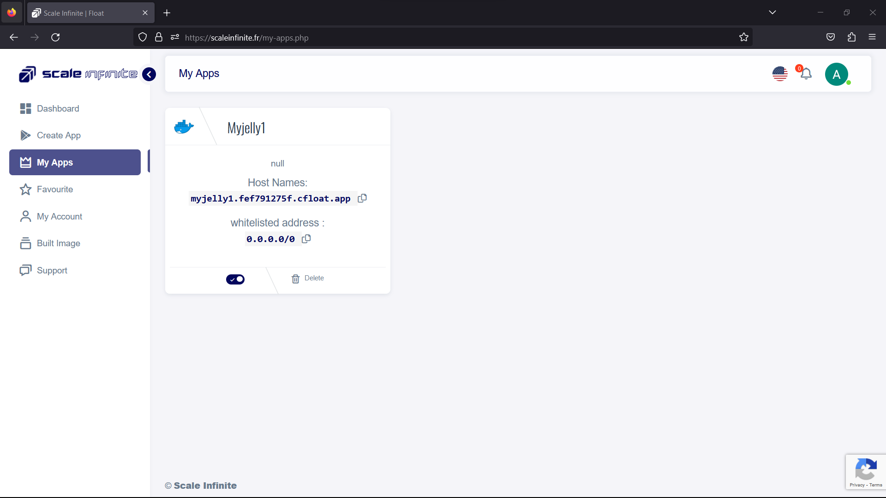
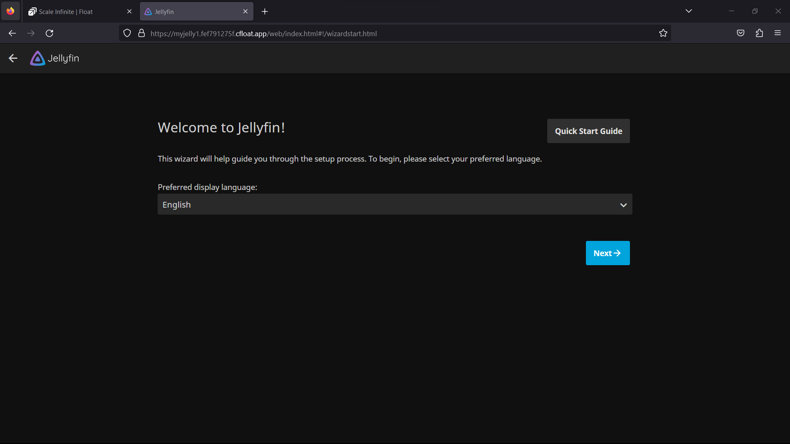
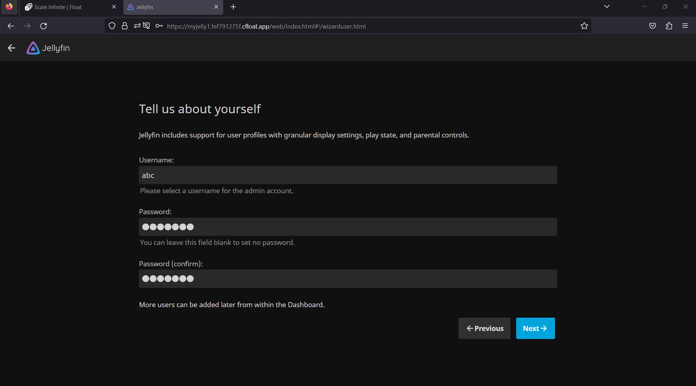
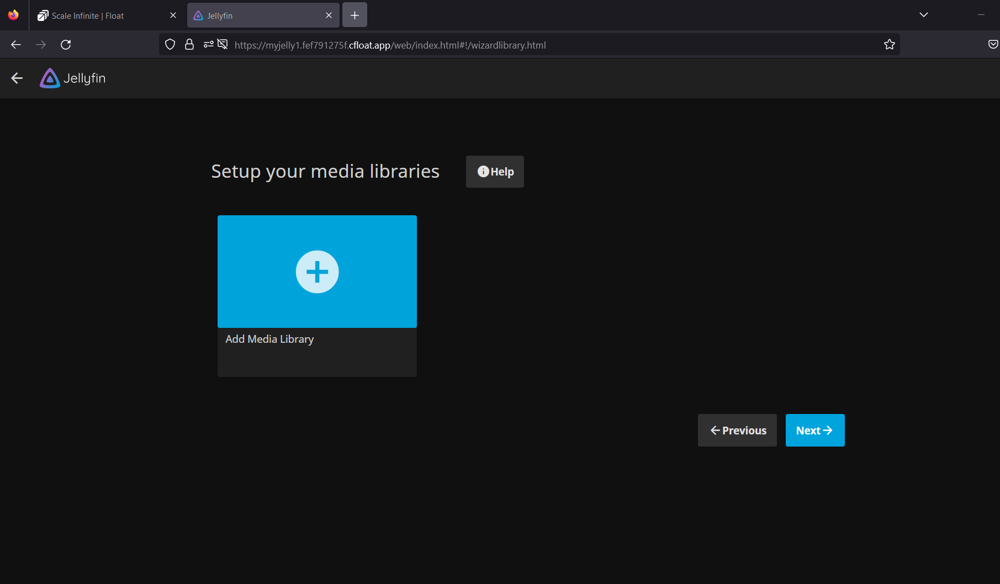
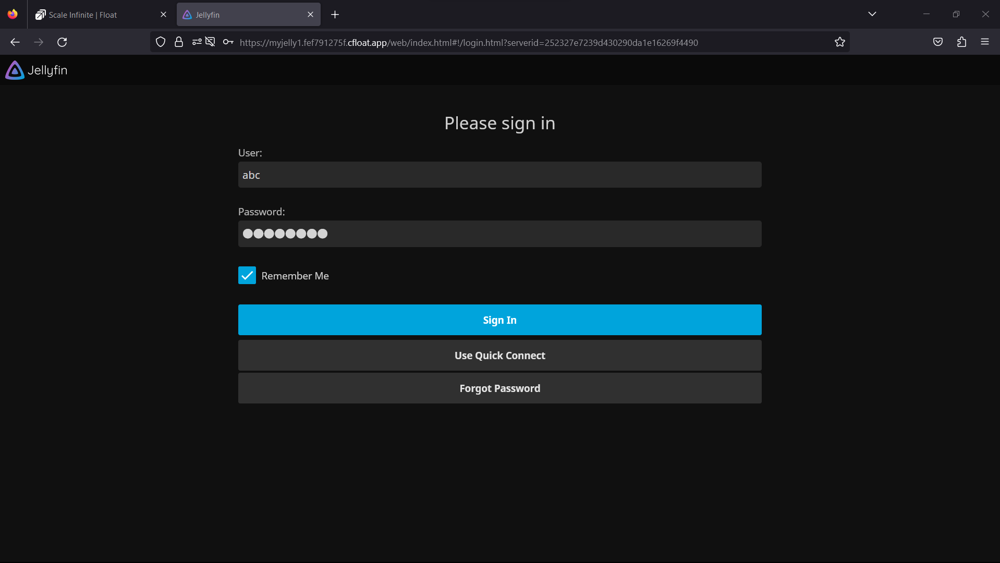

# 📺 Jellyfin Deployment

### <mark style="color:blue;">What's Jellyfin?</mark>

<mark style="color:orange;">Jellyfin is like a personal media maestro, here to help you orchestrate, organize, and enjoy your media collection with ease. Here are the key points that make Jellyfin shine:</mark>

**Open-Source Media Server:** Jellyfin believes in the freedom of media. It's open-source and completely accessible to all, offering a powerful platform to organize and stream your personal media without any hidden costs.

**Media Variety:** Whether you're a cinephile, a music aficionado, or a photography enthusiast, Jellyfin has you covered. It gracefully handles a wide range of media types, from your favorite music tracks to cherished videos and treasured pictures.

**Device Compatibility:** No matter where you are or what you're using, Jellyfin ensures your media is at your fingertips. It harmoniously streams your content to a diverse array of devices, ensuring a seamless and accessible experience.

**Customization:** Jellyfin knows that personal taste matters. That's why it allows you to tailor your media server's interface and functionality to your liking. It's like having your own private media sanctuary, designed just the way you want it.

**User Privacy:** Your media kingdom stays private and secure. Since it's self-hosted, there's no need to worry about external sharing or prying eyes. It's like having a locked vault for your digital treasures.

In a world where media is an integral part of our lives, Jellyfin is the conductor of your media orchestra, ensuring that your collection is organized, accessible, and completely under your control. It's like having your own personal media curator, ready to deliver entertainment whenever and wherever you desire.

### <mark style="color:blue;">**Working in Brief:**</mark>

**Media Organization:** Picture Jellyfin as your personal librarian, diligently cataloging your media library. It lets you arrange your content just the way you like it—by type, genre, or artist. It's like having a beautifully organized bookshelf for your movies, music, and more.

**Streaming Capability:** At your beck and call, Jellyfin effortlessly streams your media to connected devices, whether they're in the same room or across the globe. It's like having a magic genie who grants your media wishes, no matter where you are.

**User Authentication:** For a personalized experience, users simply log in to their Jellyfin accounts. It's like having your own VIP pass to your media wonderland, where everything is tailored to your taste.

**Transcoding & Formats:** Jellyfin is the ultimate media translator. It adapts media formats on-the-fly to match the devices you're using, ensuring compatibility. It's like having a universal remote control for your media.

**Remote Access:** The world is your media oyster with Jellyfin. You can enjoy your media on-the-go by accessing your Jellyfin server from anywhere. It's like carrying your entire media library in your pocket, ready to entertain you wherever you roam.

Jellyfin is your media maestro, simplifying the sometimes complex world of media management. It offers a self-hosted solution, putting you in control of your media, while its open-source nature means you can customize it to your heart's content. With Jellyfin, your media stays private and secure, ensuring that your entertainment experience is tailored to your unique preferences.

### <mark style="color:blue;">Steps And Procedure</mark>

&#x20; <mark style="background-color:purple;">**This deployment utilizes the official jellyfin Docker image. Here's a step-by-step guide to get you started:**</mark>

1. Begin by navigating to the "Create Apps" page and use the search bar to find the <mark style="color:orange;">jellyfin</mark> application.
2. Click on the "Install" button to initiate the installation process.
3. Fill in all the required fields with the necessary information.
4. If you prefer, you can click on the "Advanced" option to access additional settings (this step is optional).
5. After making your selections, press the "Install" button to proceed.
6. Once the installation is complete, you'll be directed to the "My Apps" page, where you'll find a list of all the applications you've deployed.
7. Copy the Hostname of the <mark style="color:orange;">jellyfin</mark> application without the NodePort and paste it into your preferred browser's address bar.
8. Voilà! You're now able to access the  <mark style="color:orange;">jellyfin</mark> webpage and explore its content.

### <mark style="color:blue;">Installation</mark>

| Docker Image                                                                                                                               |
| ------------------------------------------------------------------------------------------------------------------------------------------ |
| [`Jellyfin`](https://hub.docker.com/r/jellyfin/jellyfin)<mark style="background-color:yellow;">👈(click me,for the dockerhub image)</mark> |

| Application name                                                              |
| ----------------------------------------------------------------------------- |
| <mark style="background-color:yellow;">Eg: jelly(you can put any name)</mark> |

| Resource Allocation                                                                                                                                                     |
| ----------------------------------------------------------------------------------------------------------------------------------------------------------------------- |
| <mark style="background-color:yellow;">0-100%(</mark><mark style="color:orange;">10 % of your allocated resources (CPU, RAM) will be used for this application.)</mark> |

<mark style="background-color:yellow;">`PROTOCOL`</mark>

<table><thead><tr><th width="417">Protocol</th><th>Protocol Value</th></tr></thead><tbody><tr><td><mark style="background-color:yellow;">Http</mark></td><td><mark style="color:orange;">8096</mark></td></tr><tr><td><mark style="background-color:yellow;">Tcp</mark></td><td>-</td></tr></tbody></table>

| Install with Default                                                                                                                                        | Advanced                                                                                                                                                               |
| ----------------------------------------------------------------------------------------------------------------------------------------------------------- | ---------------------------------------------------------------------------------------------------------------------------------------------------------------------- |
| <mark style="background-color:yellow;">(select this if you want install with default settings if don't have environment value and working directory)</mark> | <mark style="background-color:yellow;">(select this if you want to go with advanced settings, where you select you own environment value and working directory)</mark> |

If you choose Advanced option:

| ENV VARIABLE                                                            |
| ----------------------------------------------------------------------- |
| 
<code>Give env variable.</code>

<code>Eg:key==value</code>
 |

| WORKING DIR                                                                             |
| --------------------------------------------------------------------------------------- |
| 
<code>WORKDIR for the application.</code>

 <code>Eg:usr/src/yourAPP</code>
 |
| <mark style="color:red;">Here use ( use the path after   " :"  )</mark>                 |
| 
-v /path/to/tvseries:/data/tvshows -v /path/to/movies:/data/movies
            |

<mark style="background-color:yellow;">`Access`</mark>

| Public                                      | Private                                      |
| ------------------------------------------- | -------------------------------------------- |
| (select this if you want to make it public) | (select this if you want to make it private) |

<mark style="color:purple;">**Step-by-Step Guide to jellyfin Deployment**</mark>

1. <mark style="color:blue;">**Docker Image Selection**</mark>**:**
   * <mark style="color:orange;">Docker Image Name:</mark> <mark style="color:orange;"></mark><mark style="color:orange;">`jellyfin`</mark>
2. <mark style="color:orange;">**Application Details**</mark>**:**
   * Application Name: `jelly`
   * Resource Allocation: Set the desired resource allocation from 0-100%.
3. <mark style="color:orange;">**Protocol Configuration**</mark>**:**
   * Protocol: `HTTP`
   * Port: `8096`
4. <mark style="color:orange;">**Installation Options**</mark>**:**
   * Choose between "Default" or "Advanced" installation.
5. <mark style="color:orange;">**Advanced Installation (Optional**</mark>**):**
   * If selecting "Advanced," you can customize the environment variables and working directory:
   *   **Environment Variables:**

       Environment variables are dynamic values used by a containerized application for configuration. They are defined as key-value pairs, like `API_KEY=xyz`, and provide flexibility to adjust an app's behavior without changing its code.

       * Environment Variables: Define environment variables with keys and values (e.g., `key=value`).
   *   **Working Directory:**

       The working directory is the starting point inside a container where an app's files are located. It affects relative file paths and operations. For example, if set to `/usr/src/yourAPP`, an app will reference files from there, like `/usr/src/yourAPP/data.txt`.

       * Working Directory: Set the working directory for the application (e.g., `usr/src/yourAPP`).
       * <mark style="color:red;">Here use ( use the path after   " :"  )</mark>
       * \-v /path/to/tvseries:/data/tvshows\
         \-v /path/to/movies:/data/movies
6. <mark style="color:orange;">**Access Configuration**</mark>**:**
   * Choose between "Public" or "Private" access to the deployed application.
7. <mark style="color:orange;">**Installation**</mark>**:**
   * Click the "Install" button to initiate the deployment process.

By following these steps, you can effortlessly deploy and JELLY instance with your chosen configurations. This enables you to tailor the environment to match your application's requirements and specifications. Whether opting for the default installation or delving into advanced settings, our platform ensures a seamless deployment experience while providing you the flexibility to customize according to your needs.

### <mark style="color:blue;">Visual Snapshots</mark>

<figure><figcaption></figcaption></figure>

 

<figure><figcaption></figcaption></figure>

<figure><figcaption></figcaption></figure>

 

<figure><figcaption></figcaption></figure>

<figure><figcaption></figcaption></figure>

 

<figure><figcaption></figcaption></figure>

### <mark style="color:blue;">FAQ</mark>

**About Jellyfin image we used.**

This is the official linuxserver/jellyfin image.

**Are there any restrictions on adding data sources ?**

you can add any data source that Jellyfin supports.

**Can i deploy older version of Jellyfin or my own modified Jellyfin image ?**

Yes, you can simply deploy any version or modified image to our platform by linking your docker hub account to our platform.

**Are my data persistent ?**

For the free user there is no persistence, and for the premium user you can different type of persistence.

### Join us

Stay informed and engaged with our project's latest developments and support on [Slack](https://app.slack.com/client/T04QS32JX6E/C04QKEWE146). Join us today to connect, collaborate, and keep the momentum going!&#x20;

Category

Kubernetes, cloud computing, DevOps, cloud services, hosting platform, container orchestration, cloud infrastructure, cloud deployment, cloud management, cloud technology, cloud solutions&#x20;

