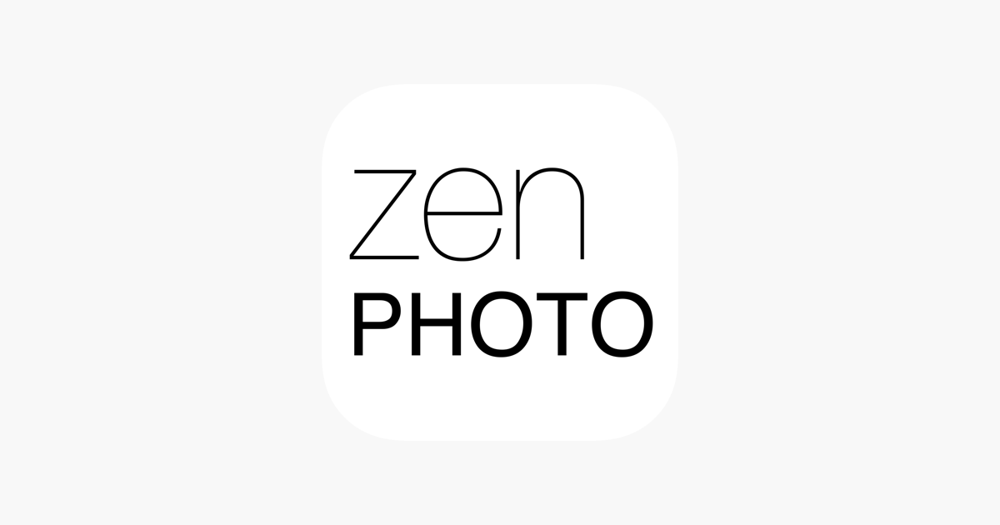

# 📸 Photo and Video Galleries

### **A General Introduction**

**Gallery Software: Where Your Visual Stories Shine Bright**

In a world dominated by visual storytelling, having a reliable gallery software at your disposal is like owning a treasure chest for your digital memories. These digital sanctuaries are where your photos, images, videos, and artistic creations come to life and find their spotlight.

So, whether you're an amateur photographer sharing your travel adventures or a professional artist showcasing your portfolio, gallery software is your digital canvas. It transforms your media into visual stories, making sure your memories and creations shine bright in the digital realm.

### Sub-page Explanation:

<table><thead><tr><th width="294.3333333333333"></th><th></th><th></th></tr></thead><tbody><tr><td>

<a href="https://docs.scaleinfinite.fr/demo-deployment/cloud-services/next-cloud-deployment"><em><strong>ZEN PHOTO</strong></em></a>
 
<a href="https://docs.scaleinfinite.fr/demo-deployment/photo-and-video-galleries/zenphoto-deployment">Your Ideal CMS for Gallery-Focused Self-Hosted Websites</a>
</td><td></td><td></td></tr></tbody></table>

Category

Kubernetes, cloud computing, DevOps, cloud services, hosting platform, container orchestration, cloud infrastructure, cloud deployment, cloud management, cloud technology, cloud solutions, photo, video

