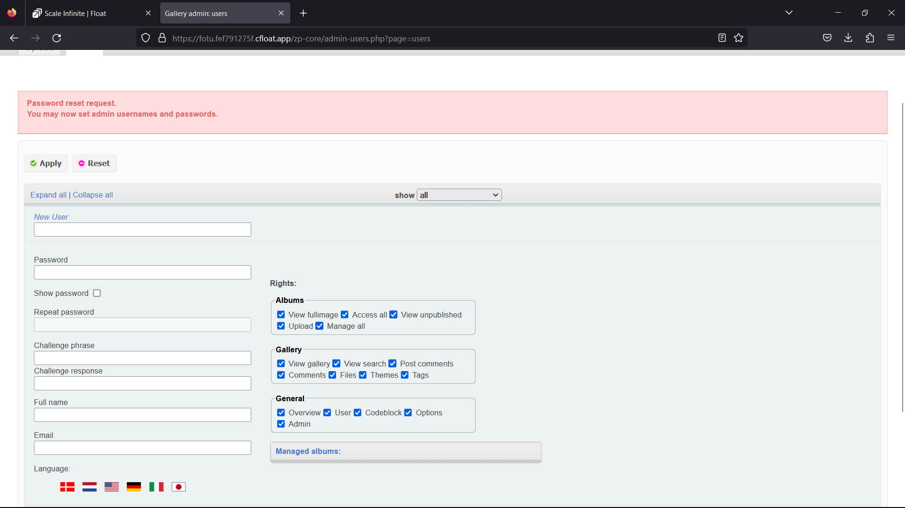
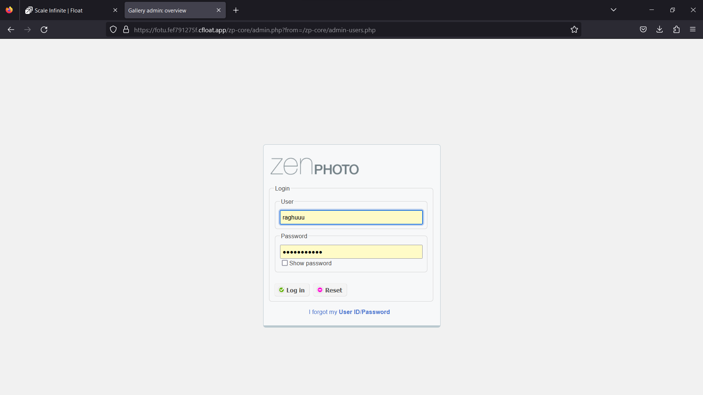
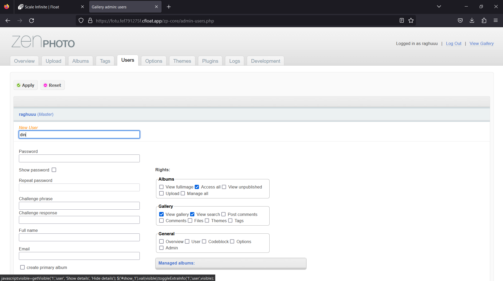
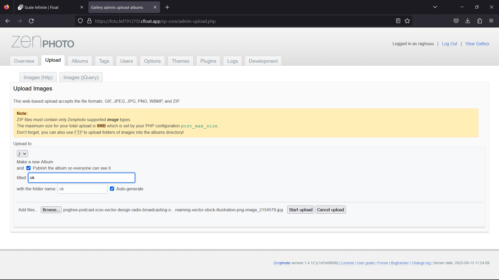
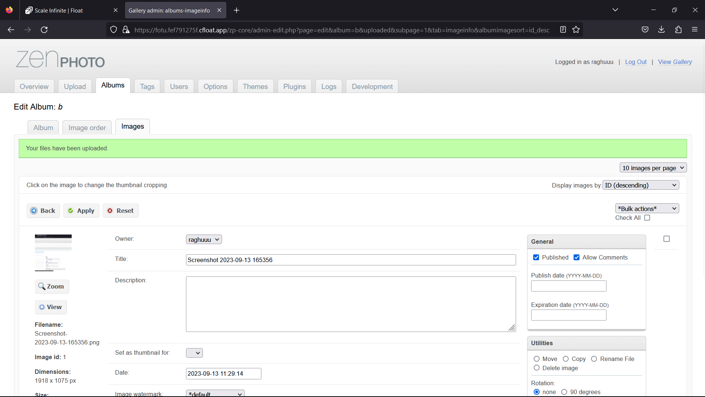
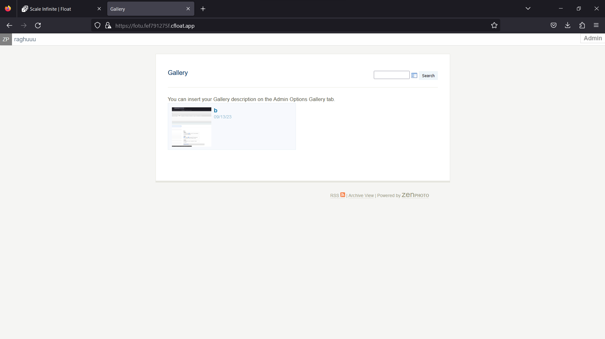
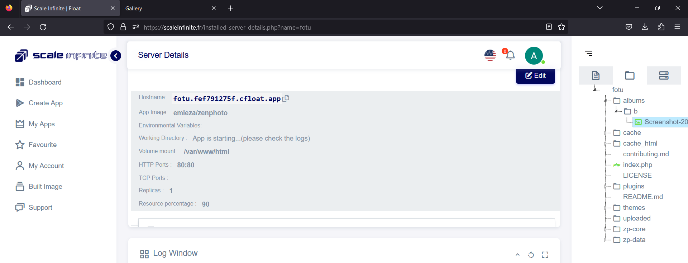

# 🖥 ZenPhoto Deployment

### <mark style="color:blue;">What's  zenphoto?</mark>

n the digital age, showcasing your creativity through images, videos, and audio is essential. Zenphoto, a powerful Content Management System (CMS), caters specifically to self-hosted websites with a strong focus on galleries. Here's why Zenphoto stands out:

**1. Multimedia Versatility:**

* Zenphoto supports a wide range of media formats, including images, videos, and audio. This versatility is perfect for individuals in creative fields such as photography, design, filmmaking, and music.

**2. Customized Page Management:**

* Take control of your website's structure with Zenphoto's custom pages management. You can create and organize pages, including nested subpages, and effortlessly manage your content.

**3. Intuitive Menu Creation:**

* Design your website's navigation with ease using custom menus. Zenphoto allows you to create menus that reflect your site's unique structure.

**4. Feature-Rich Blogging:**

* Zenphoto's news section, akin to a blog, comes with nested categories, enabling you to share your thoughts and updates effectively.
* Seamlessly integrate new gallery items into your blog posts, making your content engaging and dynamic.

**5. Robust File Management:**

* Zenphoto includes a file manager for handling non-gallery files, ensuring that all your website's resources are organized efficiently.

**6. Scheduled Publishing:**

* Plan your content strategy effortlessly with Zenphoto's scheduled publishing feature. Prepare your posts in advance and have them go live when you want.

**7. Community Interaction:**

* Engage with your audience using features like comments, RSS feeds, tags, and statistics. Zenphoto empowers you to connect with your visitors effectively.

**8. User Management:**

* Zenphoto offers comprehensive user management, including user groups and per-user rights assignment. You can also password-protect specific albums and pages for added security.

**9. Multilingual Capabilities:**

* Reach a global audience with Zenphoto's multilingual support. Create separate language sites with subdomain functionality, such as fr.domain.com and en.domain.com.

Zenphoto is more than just a CMS; it's a platform that elevates your online presence, especially if your focus is on visual and multimedia content. With Zenphoto, your self-hosted website becomes a canvas to express your creativity and captivate your audience. Whether you're an artist, photographer, filmmaker, or musician, Zenphoto empowers you to share your passion with the world.

### <mark style="color:blue;">**How It Works**</mark>

<mark style="color:orange;">**How Does Zenphoto Work? Unveiling the Magic Behind Your Creative Website**</mark>

<mark style="color:orange;">Zenphoto isn't just your average CMS; it's a powerful tool designed to help you manage and showcase your creative work effectively. Let's delve into how Zenphoto works its magic:</mark>

**1. Multimedia Content Harmony:**

* Zenphoto embraces all your creative expressions, from images and videos to audio files. It's your virtual gallery, supporting a wide range of formats that cater to artists, photographers, filmmakers, and musicians.

**2. Tailoring Your Online Space:**

* Ever wished for a website that's uniquely yours? Zenphoto makes it a reality. You can mold your website's structure with custom pages. These can even nest neatly under one another, making organization a breeze.

**3. Navigational Bliss:**

* Creating a user-friendly website isn't rocket science with Zenphoto. Custom menus are your best friends here. They allow you to design navigation that perfectly fits your website's character.

**4. Blogging with Pizzazz:**

* Zenphoto's blog-like news section is your platform for sharing your thoughts and updates. It's not your average blog; it's equipped with nested categories. Plus, it's a snap to incorporate gallery items right into your blog posts, keeping your content dynamic.

**5. Efficient File Handling:**

* Zenphoto plays the role of an adept file manager for everything that isn't part of your gallery. With this feature, you can ensure your website's resources remain neatly organized.

**6. Timing is Everything:**

* Zenphoto understands that timing is crucial. The scheduled publishing feature lets you plan your content strategy in advance. Prepare your posts and set them to go live at just the right moment.

**7. Engaging Your Audience:**

* Zenphoto doesn't stop at managing your content; it also helps you connect with your audience. Features like comments, RSS feeds, tags, and statistics facilitate interactions, making your website more engaging.

**8. User Empowerment:**

* Controlling who can do what is easy with Zenphoto. It offers comprehensive user management, including user groups and individual rights assignments. And, for added security, you can even password-protect specific albums and pages.

**9. Multilingual Flexibility:**

* In a globalized world, Zenphoto ensures your website can speak multiple languages. Create separate language sites with subdomains like fr.domain.com and en.domain.com, reaching a diverse audience effortlessly.

**In a Nutshell: A Canvas for Your Creativity**

Zenphoto is more than just a CMS; it's your creative hub. Whether you're an artist showcasing your portfolio, a photographer displaying your best shots, a filmmaker sharing your videos, or a musician promoting your tracks, Zenphoto empowers you to express your creativity and captivate your audience. It's where your digital world finds order and harmony while staying visually pleasing and efficient.

With Zenphoto, your website becomes your canvas, your stage, and your platform for making an impact. Showcase your creativity with ease and elegance, all thanks to Zenphoto.


### <mark style="color:blue;">Steps And Procedure</mark>

*   &#x20;<mark style="background-color:purple;">**This deployment utilizes the official zenphoto Docker image. Here's a step-by-step guide to get you started:**</mark>

    1. Begin by navigating to the "Create Apps" page and use the search bar to find the  [emieza/zenphoto](https://hub.docker.com/r/emieza/zenphoto) application.
    2. Click on the "Install" button to initiate the installation process.
    3. Fill in all the required fields with the necessary information.
    4. If you prefer, you can click on the "Advanced" option to access additional settings (this step is optional).
    5. After making your selections, press the "Install" button to proceed.
    6. Once the installation is complete, you'll be directed to the "My Apps" page, where you'll find a list of all the applications you've deployed.
    7. Copy the Hostname of the Zenphoto application without the NodePort and paste it into your preferred browser's address bar.
    8. Voilà! You're now able to access the Zenphoto webpage and explore its content.

    By following these straightforward steps, you'll have successfully deployed the Zenphoto  application and gained access to its features through a seamless and user-friendly process.

### <mark style="color:blue;">Installation</mark>

| Docker Image                                                                                                                              |
| ----------------------------------------------------------------------------------------------------------------------------------------- |
| [Zenphoto ](https://hub.docker.com/r/emieza/zenphoto)  <mark style="background-color:yellow;">👈(click me,for the dockerhub image)</mark> |

| Application name                                                             |
| ---------------------------------------------------------------------------- |
| <mark style="background-color:yellow;">Eg: zenn(you can put any name)</mark> |

| Resource Allocation                                                                                                                                                     |
| ----------------------------------------------------------------------------------------------------------------------------------------------------------------------- |
| <mark style="background-color:yellow;">0-100%(</mark><mark style="color:orange;">10 % of your allocated resources (CPU, RAM) will be used for this application.)</mark> |

<mark style="background-color:yellow;">`PROTOCOL`</mark>

<table><thead><tr><th width="417">Protocol</th><th>Protocol Value</th></tr></thead><tbody><tr><td><mark style="background-color:yellow;">Http</mark></td><td><mark style="color:orange;">80</mark></td></tr><tr><td><mark style="background-color:yellow;">Tcp</mark></td><td>-</td></tr></tbody></table>

| Install with Default                                                                                                                                        | Advanced                                                                                                                                                               |
| ----------------------------------------------------------------------------------------------------------------------------------------------------------- | ---------------------------------------------------------------------------------------------------------------------------------------------------------------------- |
| <mark style="background-color:yellow;">(select this if you want install with default settings if don't have environment value and working directory)</mark> | <mark style="background-color:yellow;">(select this if you want to go with advanced settings, where you select you own environment value and working directory)</mark> |

If you choose Advanced option:

| ENV VARIABLE                                                            |
| ----------------------------------------------------------------------- |
| <p><code>Give env variable.</code></p><p><code>Eg:key==value</code></p> |

| WORKING DIR                                                                                                                                         |
| --------------------------------------------------------------------------------------------------------------------------------------------------- |
| <p><code>WORKDIR for the application.</code></p><p> <code>Eg:usr/src/yourAPP</code></p>                                                             |
| <mark style="color:red;">Here use ( use the path after   " :"  )</mark>                                                                             |
| <p></p><pre class="language-sh"><code class="lang-sh"> -v ~/zenphoto/mysql:/var/lib/mysql \
        -v ~/zenphoto/www:/var/www/html \
</code></pre> |

<mark style="background-color:yellow;">`Access`</mark>

| Public                                      | Private                                      |
| ------------------------------------------- | -------------------------------------------- |
| (select this if you want to make it public) | (select this if you want to make it private) |

<mark style="color:purple;">**Step-by-Step Guide to zenphoto Deployment**</mark>

1. <mark style="color:blue;">**Docker Image Selection**</mark>**:**
   * <mark style="color:orange;">Docker Image Name: zenphoto</mark>&#x20;
2. <mark style="color:orange;">**Application Details**</mark>**:**
   * Application Name: Zenphoto
   * Resource Allocation: Set the desired resource allocation from 0-100%.
3. <mark style="color:orange;">**Protocol Configuration**</mark>**:**
   * Protocol: `HTTP`
   * Port: `80`
4. <mark style="color:orange;">**Installation Options**</mark>**:**
   * Choose between "Default" or "Advanced" installation.
5. <mark style="color:orange;">**Advanced Installation (Optional**</mark>**):**
   * If selecting "Advanced," you can customize the environment variables and working directory:
   *   **Environment Variables:**

       Environment variables are dynamic values used by a containerized application for configuration. They are defined as key-value pairs, like `API_KEY=xyz`, and provide flexibility to adjust an app's behavior without changing its code.

       * Environment Variables: Define environment variables with keys and values (e.g., `key=value`).
   *   **Working Directory:**

       The working directory is the starting point inside a container where an app's files are located. It affects relative file paths and operations. For example, if set to `/usr/src/yourAPP`, an app will reference files from there, like `/usr/src/yourAPP/data.txt`.

       * Working Directory: Set the working directory for the application (e.g., `usr/src/yourAPP`).
       * <mark style="color:red;">Here use ( use the path after   " :"  )</mark>
       *

           ```sh
            -v ~/zenphoto/mysql:/var/lib/mysql \
                   -v ~/zenphoto/www:/var/www/html \
           ```
6. <mark style="color:orange;">**Access Configuration**</mark>**:**
   * Choose between "Public" or "Private" access to the deployed application.
7. <mark style="color:orange;">**Installation**</mark>**:**
   * Click the "Install" button to initiate the deployment process.

By following these steps, you can effortlessly deploy an Zenphoto instance with your chosen configurations. This enables you to tailor the environment to match your application's requirements and specifications. Whether opting for the default installation or delving into advanced settings, our platform ensures a seamless deployment experience while providing you the flexibility to customize according to your needs.

### <mark style="color:blue;">Visual Snapshots</mark>


<div>

<figure><figcaption></figcaption></figure>

 

<figure><figcaption></figcaption></figure>

 

<figure><figcaption></figcaption></figure>

</div>

<div>

<figure><figcaption></figcaption></figure>

 

<figure><figcaption></figcaption></figure>

 

<figure><figcaption></figcaption></figure>

</div>

<div>

<figure><figcaption></figcaption></figure>

 

<figure><figcaption></figcaption></figure>

 

<figure><figcaption></figcaption></figure>

</div>

### <mark style="color:orange;">Youtube Tutorial</mark>&#x20;

Check out our youtube video for more clarification.


### <mark style="color:blue;">FAQ</mark>

**About** Zenphoto **image we used.**

This is the official Zenphoton image.

**Can I deploy my own** Zenphoto **image with modified configuration ?**

Yes, you can simply deploy any version or modified image to our platform by linking your docker hub account to our platform.

**Are my data persistent ?**

For the free user there is no persistence, and for the premium user you can different type of persistence.

### Join us

Stay informed and engaged with our project's latest developments and support on [Slack](https://app.slack.com/client/T04QS32JX6E/C04QKEWE146). Join us today to connect, collaborate, and keep the momentum going!&#x20;

<details>

<summary>Category</summary>

Kubernetes, cloud computing, DevOps, cloud services, hosting platform, container orchestration, cloud infrastructure, cloud deployment, cloud management, cloud technology, cloud solutions, zen photo

</details>
