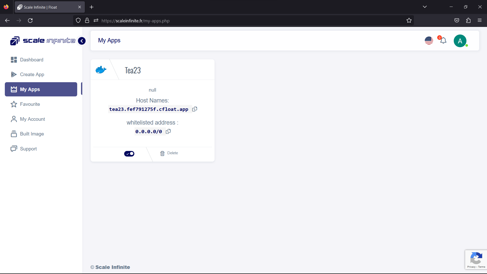
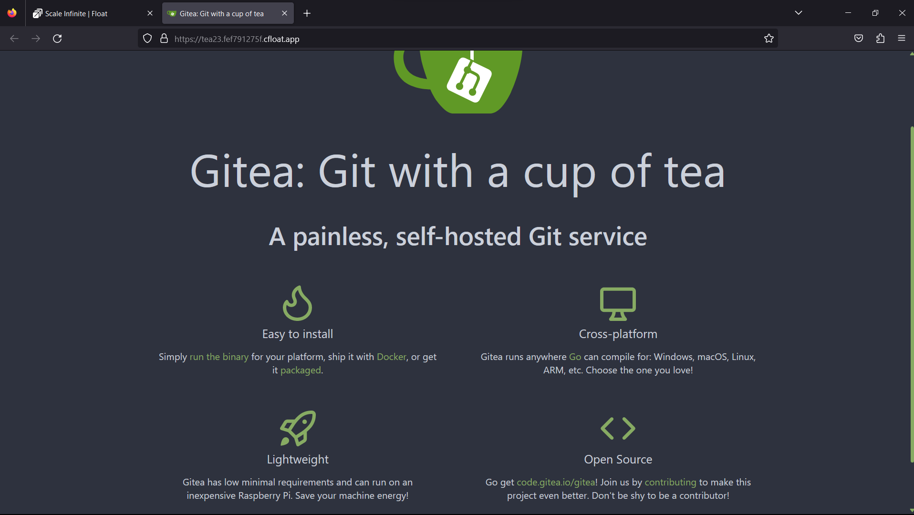
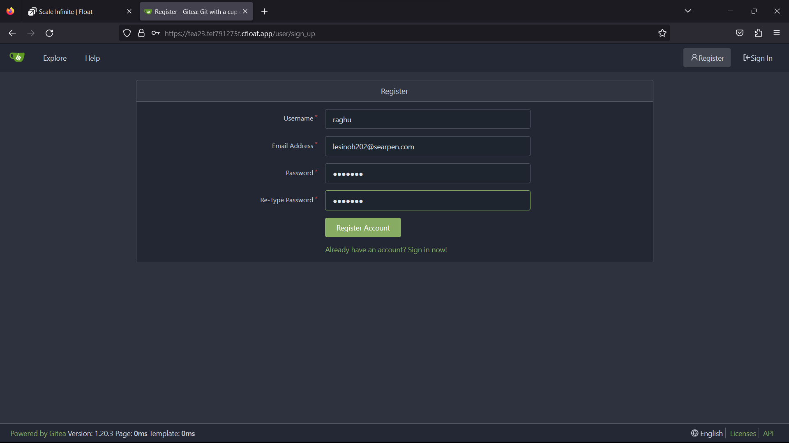
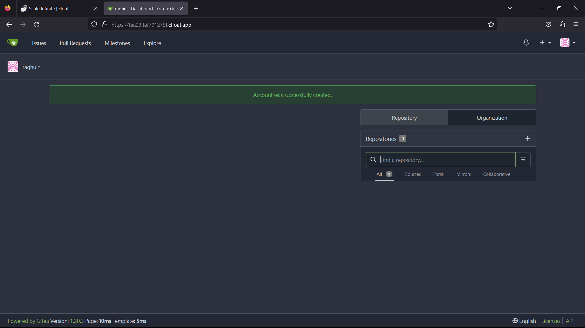
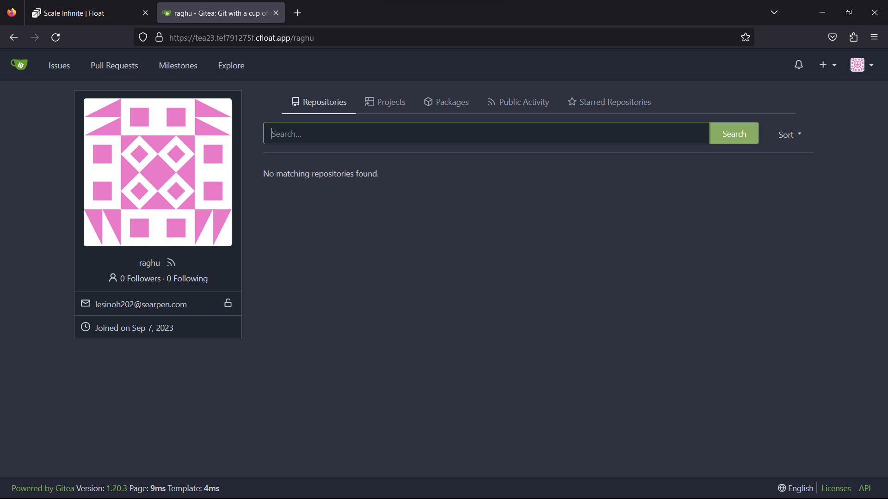
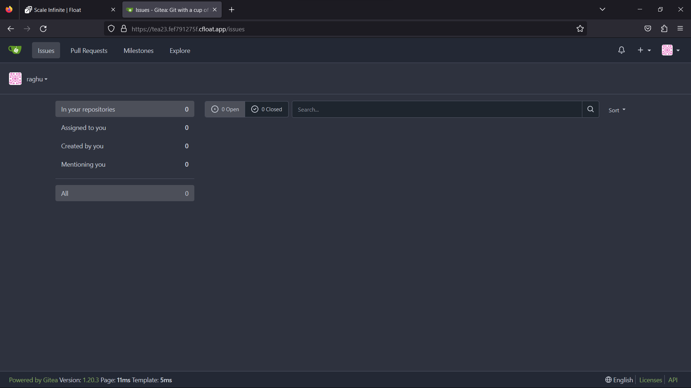

# ☕ Gitea

### <mark style="color:blue;">What's  Gitea?</mark>

<mark style="color:orange;">Gitea emerges as a user-friendly, self-hosted comprehensive software development platform that encompasses an array of essential features, including:</mark>

1. **Git Hosting**: Gitea provides a seamless environment for hosting Git repositories. It offers a reliable foundation for version control, enabling teams to efficiently manage their source code.
2. **Code Review**: Collaborative development is made easy through built-in code review capabilities. Teams can collectively assess and refine code changes, fostering code quality and collaboration.
3. **Team Collaboration**: Gitea serves as a hub for team collaboration. It brings developers together, facilitating communication, knowledge sharing, and project management within a unified platform.
4. **Package Registry**: Developers can make use of Gitea's package registry, allowing them to store and manage software packages. This feature streamlines package distribution and access.
5. **CI/CD (Continuous Integration/Continuous Deployment)**: Gitea simplifies the CI/CD process, enabling automation of software builds, testing, and deployment. It supports the efficient delivery of code changes to production environments.

Gitea's roots trace back to Gogs, but it has evolved significantly through extensive code modifications. It stands as a compelling alternative to popular services like GitHub, Bitbucket, and GitLab, offering a self-hosted solution that grants teams greater control over their software development processes while fostering collaboration and code quality.

### <mark style="color:blue;">**How It Works**</mark>

<mark style="color:orange;">In summary, Gitea simplifies and streamlines the software development lifecycle by offering a comprehensive suite of tools for version control, collaboration, and automation. It empowers users to take control of their code, enabling efficient and secure development practices.</mark>

1. **Git Hosting**: Gitea is at its core a Git repository hosting service. It allows users to create and manage Git repositories for their projects. Users can push, pull, and clone repositories, making it a central hub for version control.
2. **Code Review**: Gitea provides tools for code review, making collaboration among developers smooth. It supports features like pull requests, where developers can propose changes to a project's codebase, and other team members can review and discuss these changes before merging them.
3. **Team Collaboration**: Gitea fosters team collaboration by offering user and organization accounts. Users can be part of organizations and collaborate on projects collectively. Features like issue tracking, project management, and wikis further enhance teamwork.
4. **Package Registry**: Gitea allows users to host their package repositories, which can be used for dependency management in software development. This feature is particularly valuable for projects that rely on package-based workflows.
5. **CI/CD (Continuous Integration/Continuous Deployment)**: Gitea supports CI/CD pipelines, enabling developers to automate the building, testing, and deployment of their software. This streamlines the development process and ensures the reliability of software releases.
6. **User-Friendly Web Interface**: Gitea offers a web-based interface that users can access via their browsers. This interface provides an intuitive and user-friendly experience for managing repositories, conducting code reviews, and collaborating with team members.
7. **Customization**: Users can customize their Gitea instance to suit their preferences and requirements. This includes themes, branding, and various configuration settings to tailor the service to their specific needs.
8. **Security**: Gitea prioritizes the security of code and data. It incorporates security features such as user authentication, access controls, and encryption to protect sensitive information and ensure secure access.
9. **Open Source**: Being open-source, Gitea encourages community contributions, transparency, and customization. Users can extend its functionality through plugins and integrations.
10. **Cross-Platform Compatibility**: Gitea's Go-based architecture ensures that it can run on a wide range of operating systems and hardware architectures, making it versatile and accessible to users across different environments.\

### <mark style="color:blue;">Steps And Procedure</mark>

*   <mark style="background-color:purple;">**This deployment utilizes the official gitea Docker image. Here's a step-by-step guide to get you started:**</mark>

    1. Begin by navigating to the "Create Apps" page and use the search bar to find the [gitea/gitea](https://hub.docker.com/r/gitea/gitea) application.
    2. Click on the "Install" button to initiate the installation process.
    3. Fill in all the required fields with the necessary information.
    4. If you prefer, you can click on the "Advanced" option to access additional settings (this step is optional).
    5. After making your selections, press the "Install" button to proceed.
    6. Once the installation is complete, you'll be directed to the "My Apps" page, where you'll find a list of all the applications you've deployed.
    7. Copy the Hostname of the GITEA application without the NodePort and paste it into your preferred browser's address bar.
    8. Voilà! You're now able to access the  GITEA webpage and explore its content.

    By following these straightforward steps, you'll have successfully deployed  GITEA application and gained access to its features through a seamless and user-friendly process.

### <mark style="color:blue;">Installation</mark>

| Docker Image                                                                                                                    |
| ------------------------------------------------------------------------------------------------------------------------------- |
| [Gitea](https://hub.docker.com/r/gitea/gitea)<mark style="background-color:yellow;">👈(click me,for the dockerhub image)</mark> |

| Application name                                                              |
| ----------------------------------------------------------------------------- |
| <mark style="background-color:yellow;">Eg: gitea(you can put any name)</mark> |

| Resource Allocation                                                                                                                                                     |
| ----------------------------------------------------------------------------------------------------------------------------------------------------------------------- |
| <mark style="background-color:yellow;">0-100%(</mark><mark style="color:orange;">10 % of your allocated resources (CPU, RAM) will be used for this application.)</mark> |

<mark style="background-color:yellow;">`PROTOCOL`</mark>

<table><thead><tr><th width="417">Protocol</th><th>Protocol Value</th></tr></thead><tbody><tr><td><mark style="background-color:yellow;">Http</mark></td><td><mark style="color:orange;">3000</mark></td></tr><tr><td><mark style="background-color:yellow;">Tcp</mark></td><td>-</td></tr></tbody></table>

| Install with Default                                                                                                                                        | Advanced                                                                                                                                                               |
| ----------------------------------------------------------------------------------------------------------------------------------------------------------- | ---------------------------------------------------------------------------------------------------------------------------------------------------------------------- |
| <mark style="background-color:yellow;">(select this if you want install with default settings if don't have environment value and working directory)</mark> | <mark style="background-color:yellow;">(select this if you want to go with advanced settings, where you select you own environment value and working directory)</mark> |

If you choose Advanced option:

| ENV VARIABLE                                                            |
| ----------------------------------------------------------------------- |
| 
<code>Give env variable.</code>

<code>Eg:key==value</code>
 |

| WORKING DIR                                                                             |
| --------------------------------------------------------------------------------------- |
| 
<code>WORKDIR for the application.</code>

 <code>Eg:usr/src/yourAPP</code>
 |
| <mark style="color:red;">Here use ( use the path after   " :"  )</mark>                 |

<mark style="background-color:yellow;">`Access`</mark>

| Public                                      | Private                                      |
| ------------------------------------------- | -------------------------------------------- |
| (select this if you want to make it public) | (select this if you want to make it private) |

<mark style="color:purple;">**Step-by-Step Guide to gitea Deployment**</mark>

1. <mark style="color:blue;">**Docker Image Selection**</mark>**:**
   * <mark style="color:orange;">Docker Image Name:</mark> <mark style="color:orange;"></mark><mark style="color:orange;">`Gitea`</mark>
2. <mark style="color:orange;">**Application Details**</mark>**:**
   * Application Name: Gitea
   * Resource Allocation: Set the desired resource allocation from 0-100%.
3. <mark style="color:orange;">**Protocol Configuration**</mark>**:**
   * Protocol: `HTTP`
   * Port: `3000`
4. <mark style="color:orange;">**Installation Options**</mark>**:**
   * Choose between "Default" or "Advanced" installation.
5. <mark style="color:orange;">**Advanced Installation (Optional**</mark>**):**
   * If selecting "Advanced," you can customize the environment variables and working directory:
   *   **Environment Variables:**

       Environment variables are dynamic values used by a containerized application for configuration. They are defined as key-value pairs, like `API_KEY=xyz`, and provide flexibility to adjust an app's behavior without changing its code.

       * Environment Variables: Define environment variables with keys and values (e.g., `key=value`).
   *   **Working Directory:**

       The working directory is the starting point inside a container where an app's files are located. It affects relative file paths and operations. For example, if set to `/usr/src/yourAPP`, an app will reference files from there, like `/usr/src/yourAPP/data.txt`.

       * Working Directory: Set the working directory for the application (e.g., `usr/src/yourAPP`).
       * <mark style="color:red;">Here use ( use the path after   " :"  )</mark>
6. <mark style="color:orange;">**Access Configuration**</mark>**:**
   * Choose between "Public" or "Private" access to the deployed application.
7. <mark style="color:orange;">**Installation**</mark>**:**
   * Click the "Install" button to initiate the deployment process.

By following these steps, you can effortlessly deploy an  GITEA instance with your chosen configurations. This enables you to tailor the environment to match your application's requirements and specifications. Whether opting for the default installation or delving into advanced settings, our platform ensures a seamless deployment experience while providing you the flexibility to customize according to your needs.

### <mark style="color:blue;">Visual Snapshots</mark>

<figure><figcaption></figcaption></figure>

 

<figure><figcaption></figcaption></figure>

 

<figure><figcaption></figcaption></figure>

<figure><figcaption></figcaption></figure>

 

<figure><figcaption></figcaption></figure>

 

<figure><figcaption></figcaption></figure>

### <mark style="color:orange;">Youtube Tutorial</mark>&#x20;

Check out our youtube video for more clarification.

### <mark style="color:blue;">FAQ</mark>

**About** GITEA **image we used.**

This is the official GITEA  image.

**Can I deploy my own**  GITEA **image with modified configuration ?**

Yes, you can simply deploy any version or modified image to our platform by linking your docker hub account to our platform.

**Are my data persistent ?**

For the free user there is no persistence, and for the premium user you can different type of persistence.

### Join us

Stay informed and engaged with our project's latest developments and support on [Slack](https://app.slack.com/client/T04QS32JX6E/C04QKEWE146). Join us today to connect, collaborate, and keep the momentum going!&#x20;

Category

Kubernetes, cloud computing, DevOps, cloud services, hosting platform, container orchestration, cloud infrastructure, cloud deployment, cloud management, cloud technology, cloud solutions, Gitea

