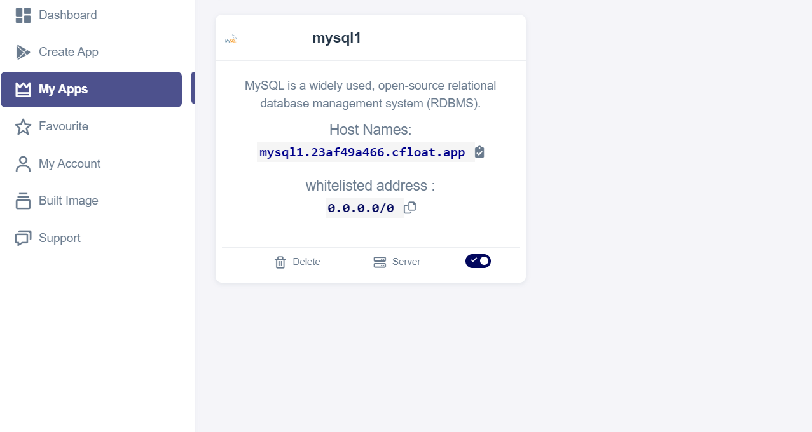

# Mysql deployment

MYSQL is a widely used, open-source relational database management system (RDBMS).

* **This deployment uses the official Mysql Docker image.**
* Go to create apps page and Search mysql on the search bar.
* &#x20;Click on install button.
* &#x20;Fill all the reqired feilds.

| PRODUCT NAME |
| ------------ |
| `mysql`      |

`PROTOCOL`

| HTTP | TCP/UDP |
| ---- | ------- |
| `80` |         |

* &#x20;click on Advanced.

| ENV VARIABLE        | WHITELIST                                       | WORKING DIR                   |
| ------------------- | ----------------------------------------------- | ----------------------------- |
| `Give env variable` | `If you want to white list any ports list here` | `WORKDIR for the application` |

* &#x20;Click on the Install button.
* &#x20;You will be redirected to My Apps page, Here you can find all the applications you deployed.

<figure><figcaption></figcaption></figure>

* &#x20;Copy the mysql application Hostname without NodePort and search the Url.

### FAQ

**About mysql image we used.**

This is the official mysql image.

**Are there any restrictions on adding data sources ?**

you can add any data source that mysql supports.

**Are my data persistent ?**

For the free user there is no persistence, and for the premium user you can different type of persistence.
