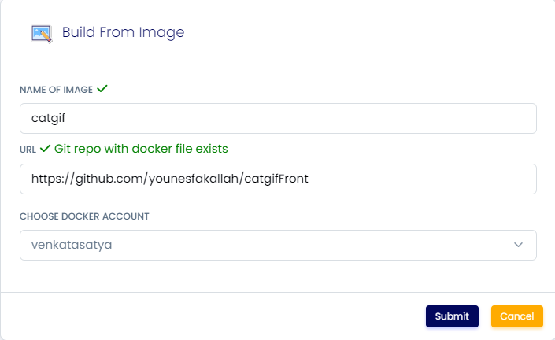

# Docker image

<mark style="color:orange;">**Mastering Docker Image Building**</mark>

Welcome to the world of containerization! Building Docker images is a pivotal skill, and we're here to guide you through the process step by step. Buckle up, and let's dive into the realm of container magic.

**1. Account Setup: Dockerhub First!** Before we embark on this containerization journey, ensure you've got a Dockerhub account ready to roll. If you don't have one, head to [Dockerhub ](https://hub.docker.com/)and sign up. Don't worry; we'll be here when you get back.

**2. Linking Dockerhub to **<mark style="color:orange;">**MY Account**</mark> Once your Dockerhub account is set, navigate to the <mark style="color:orange;">"My Account"</mark>  page on our platform. Here, you'll find the option to link your Dockerhub account. This step is essential to seamlessly integrate Dockerhub into our platform.

**3. Providing Image Details** Now that your Dockerhub account is linked, it's time to feed our system with the details of the Docker image you wish to create. Remember, your project must contain a Dockerfile. This file acts as the blueprint for your image, outlining all the instructions required to build it.

**4. The GitHub Connection** Your Dockerfile alone isn't enough; you'll also need a valid GitHub URL. Ensure your GitHub repository contains all the necessary files and configurations for your project.

**5. The Image Building Process** Once you've filled in the details and initiated the build, our platform will work its magic. Below the form, you'll find a historical log of all the images you've built. Each time you build an image, this log captures the journey, so you can trace back your steps.

**6. Monitoring the Build** Click on an app, and you'll unveil the detailed logs of your Docker image creation. Every step of the process is meticulously recorded, giving you insights into what's happening under the hood.

**7. The Sweet Success Message** Now, here's the moment of triumph. Keep your eyes peeled for the message that says, "Docker image successfully pushed to the Docker account." When you see this, it's time to celebrate – you've successfully created and pushed a Docker image to Dockerhub!

**8. Finding Your Image** To locate your newly minted Docker image, simply head to the "Create App" section and search for it using the format: `dockerhub-username/image-name`.

And there you have it – you've navigated the Docker image building process like a pro. With your newfound containerization skills, you're ready to harness the power of Docker and take your projects to the next level.

Happy containerizing! 🐳✨

### Images

<figure><figcaption></figcaption></figure>

 

<figure><figcaption></figcaption></figure>

### FAQ

**Is it possible to build from any github repository?**

Yes, as long as the repositiory is public

### Join us

Stay informed and engaged with our project's latest developments and support on [Slack](https://app.slack.com/client/T04QS32JX6E/C04QKEWE146). Join us today to connect, collaborate, and keep the momentum going!&#x20;
