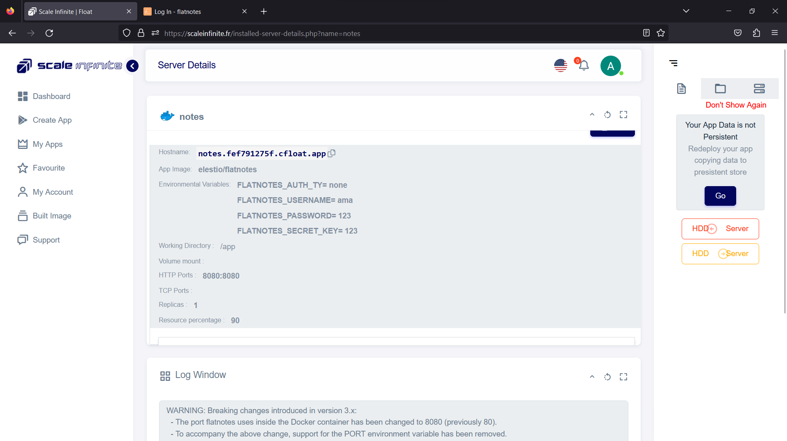

# Server Detail Page

<mark style="color:orange;">Welcome to the Server Detail page – your command center for fine-tuning, monitoring, and managing your deployed app.  Imagine this as your backstage pass to the inner workings of your app. It's where you can fine-tune, troubleshoot, and ensure everything is running like a well-oiled machine. From a developer's perspective, it's like having a control panel for your digital creation.</mark>

Here's your backstage pass to what you can do:

**1. Edit Port Numbers**: Need to reroute your app's traffic? No problem. You can easily edit port numbers here, ensuring your app communicates exactly as you want it to.

**2. Resource Percentage**: Adjust the resource allocation for your app. Give it more power or scale it down – it's all at your fingertips. Keep your app's performance finely tuned.

**3. Volume Mount**: Managing data is a breeze. You can set up volume mounts, ensuring your app has access to the data it needs. It's like giving your app its own storage space.

**4. Redeploy the App**: Sometimes, updates are necessary. With just a few clicks, you can redeploy your app, ensuring that the latest changes take effect seamlessly.

**5. Log Window**: Keep a watchful eye on your app's performance. The log window provides real-time insights into how your app is configured, whether it's running smoothly, and how long it takes to respond to requests.

**6. Terminal Access**: Feeling like a tech wizard today? Dive into the terminal, where you can execute command-line prompts. It's your direct line to interact with your app's environment.

In the Server Detail Page's IP Details segment, the Inbound and Outbound Traffic Rules play a crucial role in managing network traffic to and from your server. Here's a breakdown of these rules and their significance:

**Inbound Traffic Rules**:

1. **Access Control**: Inbound traffic rules define who can connect to your server. They allow you to specify the allowed sources or IP addresses that can establish connections with your server. This is vital for security as it prevents unauthorized access.
2. **Port Configuration**: You can configure specific ports that should be open to incoming connections. For example, you might open port 80 for HTTP traffic or port 443 for HTTPS. This rule ensures that only the necessary ports are accessible, reducing the attack surface.
3. **Protocol Selection**: Inbound rules often allow you to specify the allowed network protocols. For instance, you can permit incoming traffic using TCP, UDP, or other protocols, depending on your application's requirements.
4. **Load Balancing**: In more advanced setups, inbound rules can be used for load balancing. They distribute incoming traffic across multiple servers to ensure high availability and optimal performance.
5. **Security Groups**: In some cloud environments, security groups or network security policies are applied through inbound traffic rules. These groups define which servers can communicate with each other based on predefined rules.

**Outbound Traffic Rules**:

1. **Egress Control**: Outbound traffic rules determine which outbound connections your server is allowed to establish. This is important for security and compliance, as it prevents data leaks or unauthorized access from your server.
2. **Restricting Outbound Ports**: Similar to inbound rules, you can restrict which ports are accessible for outgoing connections. This helps in limiting the services and destinations your server can interact with.
3. **Protocol Filtering**: Outbound rules can also filter traffic based on protocols, ensuring that only necessary protocols are used for outgoing connections.
4. **Content Filtering**: Some advanced firewall solutions allow content filtering in outbound rules. This means you can inspect and control the data being sent out, which is valuable for data loss prevention and compliance.
5. **Logging and Monitoring**: Outbound rules often include logging capabilities. They can log details of outbound connections, which can be useful for security audits and troubleshooting.
6. **Throttling and QoS**: Outbound rules can also be used to implement Quality of Service (QoS) policies, limiting the bandwidth or prioritizing certain types of outbound traffic over others.

In essence, Inbound and Outbound Traffic Rules provide granular control over your server's network communication. They help you manage security, optimize performance, and ensure that your server interacts with other systems and services in a controlled and efficient manner. Properly configured rules are essential for maintaining a secure and well-functioning server environment.

So, welcome to the Server Detail page – your go-to place for app optimization and monitoring. Whether you're making tweaks, analyzing performance, or diving into the command line, this is where the magic happens. Happy managing!

\

### Visual SnapShot

<figure><figcaption></figcaption></figure>

 

<figure><figcaption></figcaption></figure>

 

<figure><figcaption></figcaption></figure>

