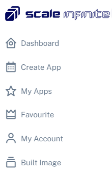
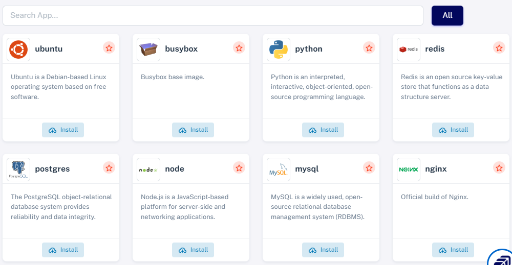
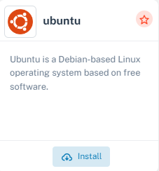
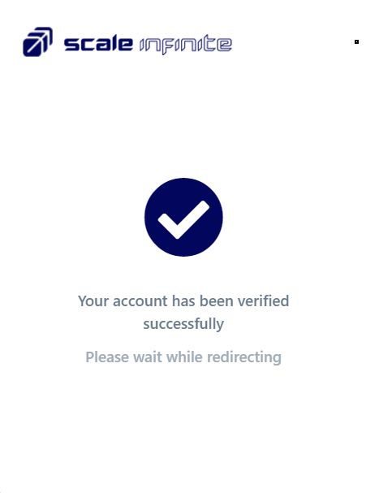
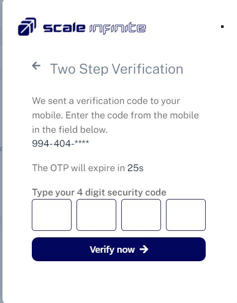
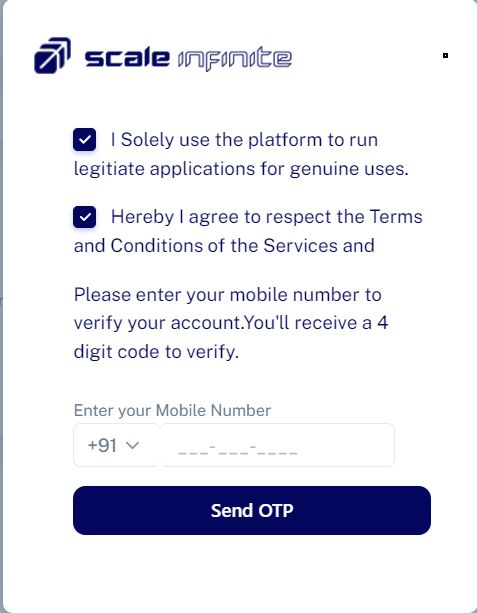
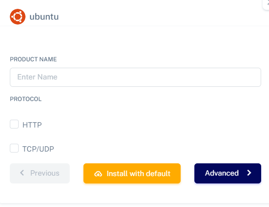
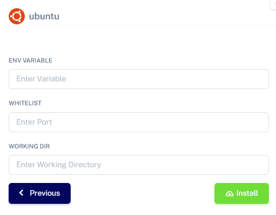
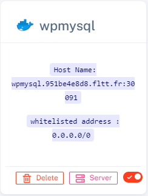
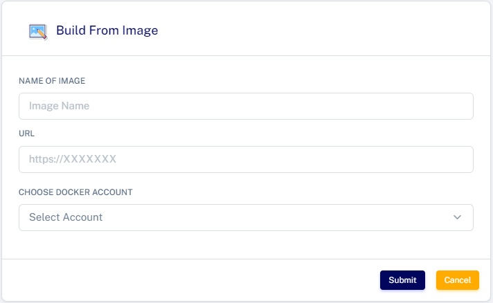

# Create account

&#x20;Go to Scaleinfinite platform.

* SignUP simply by using your Google account or email.

<figure><figcaption></figcaption></figure>

* &#x20;Go to Create App section in the side menu.

<figure><figcaption></figcaption></figure>

* &#x20;Here you can find pre-selected Images to deploy on the Go and Quickly or search here in the searchbar for the app you want.

<figure><figcaption></figcaption></figure>

* &#x20;Select the respected app you require to deploy and press the Install button.

<figure><figcaption></figcaption></figure>

* &#x20;Only for the first time you need to agreee the terms and condictions and verify with phone number.

<figure><figcaption></figcaption></figure>

 

<figure><figcaption></figcaption></figure>

 

<figure><figcaption></figcaption></figure>

* &#x20;Fill the details like App name, HTTP address, TCP/UDP address.

<figure><figcaption></figcaption></figure>

&#x20;Define the ENVIRONMENT variables, whitelisted ports, and WORKING directory and click on finish.

<figure><figcaption></figcaption></figure>

* You will be redirected to this page. Here your can see all the installed applications in your account.

<figure><figcaption></figcaption></figure>

* To access the application copy and search the Host name without nodeport.

<figure><figcaption></figcaption></figure>

* &#x20;And you can also link your Docker Hub account with scale infinite platform.

<figure><figcaption></figcaption></figure>

* &#x20;If you has a docker file you can also add it here to built the application.
