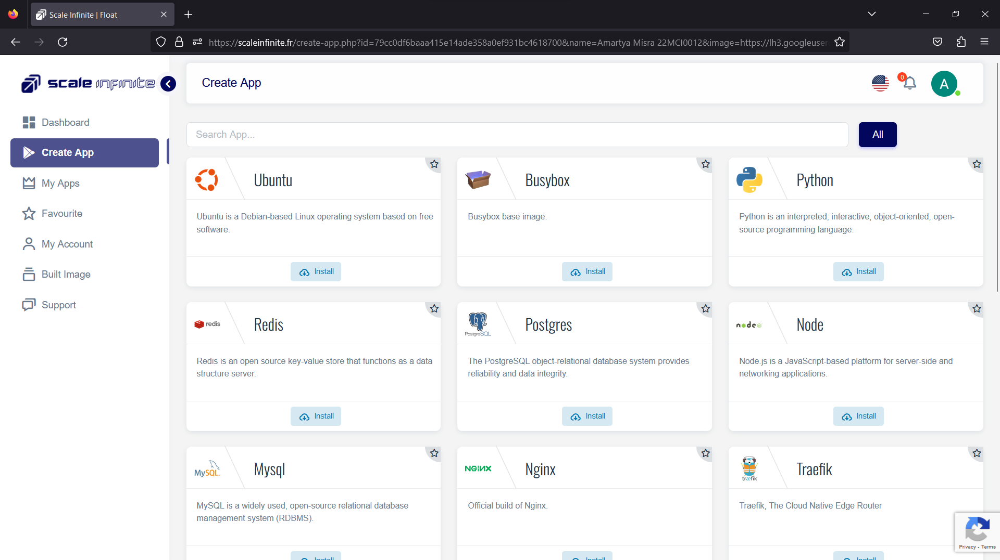

# ☁ Built Image Page

_<mark style="color:orange;">**Building a Docker image is a fundamental step in containerized application deployment.**</mark>_&#x20;

_<mark style="color:orange;">**Here's an expanded explanation of the process:**</mark>_

_**Building a Docker Image: Step by Step**_

1. _<mark style="color:blue;">**Dockerhub Account Setup:**</mark>_ Before you start building a <mark style="color:orange;">Docker image</mark>, you need to ensure that you have a <mark style="color:orange;">Dockerhub account</mark>. If you don't have one, you can sign up for free on the <mark style="color:orange;">Dockerhub</mark> website. Once you have an account, you need to link it to your application management platform. This is typically done in the _<mark style="color:orange;">**"My Account"**</mark>_ or a similar section of the platform.

<figure><figcaption></figcaption></figure>

1. <mark style="color:yellow;">**Adding Dockerfile and GitHub Repository:**</mark> To create a _<mark style="color:orange;">Docker image</mark>_, you must have a _<mark style="color:orange;">**Dockerfile**</mark>_. A _<mark style="color:orange;">**Dockerfile is**</mark>_ a script that contains instructions for building the image. It defines what base image to use, what files to include, and what commands to run. Make sure your project includes a Dockerfile, and it's available in a GitHub repository. You will need a valid GitHub URL to proceed.
2. &#x20;<mark style="color:purple;">**Linking Dockerhub**</mark>** to **<mark style="color:orange;">**MY Account**</mark> Once your Dockerhub account is set, navigate to the <mark style="color:orange;">"My Account"</mark>  page on our platform. Here, you'll find the option to link your Dockerhub account. This step is essential to seamlessly integrate Dockerhub into our platform.
3. <mark style="color:purple;">**Accessing the Build Image Page:**</mark> Once your Dockerhub account is set up, and you have your Dockerfile and GitHub URL ready, access the "Build Image" page on your application management platform. This page is where you initiate the image-building process.

<figure><figcaption></figcaption></figure>

1. <mark style="color:orange;">**Providing Image Details:**</mark> On the "Build Image" page, you'll be prompted to provide details about the image you want to create. This includes specifying the GitHub repository URL where the Dockerfile is located.

<figure><figcaption></figcaption></figure>

1. <mark style="color:orange;">**Building the Image:**</mark> After providing the necessary details, click the _<mark style="color:orange;">**"Build"**</mark>_ or a similar button to start the image-building process. The platform will use the Dockerfile and GitHub repository you specified to create the Docker image.
2. <mark style="color:orange;">**Monitor the Build:**</mark> During the image-building process, you can monitor the progress through log messages. These logs will show the various steps being executed, such as downloading dependencies and running commands defined in the Dockerfile.

<figure><figcaption></figcaption></figure>

1. <mark style="color:orange;">**Successful Image Push:**</mark> If the image build is successful, you will receive a confirmation message like _<mark style="color:orange;">**"Docker image successfully pushed to the Docker account."**</mark>_ This indicates that the image has been built and pushed to your Dockerhub account, making it available for deployment.
2. <mark style="color:orange;">**Accessing the Built Image:**</mark> To access the built image, you can go to the <mark style="color:purple;">"Create App"</mark> or a similar section of your application management platform. There, you can search for the image using your Dockerhub username and the image name.
3. To locate your newly minted Docker image, simply head to the _<mark style="color:blue;">**"Create App"**</mark>_ section and search for it using the format: `dockerhub-username/image-name`.

<figure><figcaption></figcaption></figure>

_In summary, building a Docker image involves linking your Dockerhub account, providing details about the image, and using a Dockerfile from a GitHub repository to create the image. This image can then be used for deploying your containerized application. It's a crucial step in containerization, as it ensures that your application and its dependencies are packaged into a portable container for easy deployment and scalability._

Category

Kubernetes, cloud computing, DevOps, cloud services, hosting platform, container orchestration, cloud infrastructure, cloud deployment, cloud management, cloud technology, cloud solutions, built image

