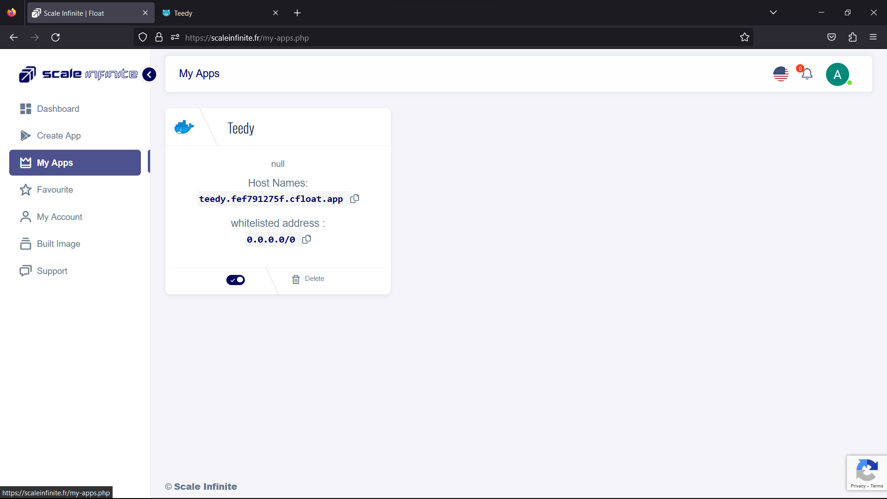

# ☁ My APP Page

\
Exploring your deployed apps on the <mark style="color:red;">"My Apps"</mark> page is a delightful journey. Here's how to embark on this adventure:

<mark style="color:blue;">**1. Discover Your Apps**</mark>: Once you're on the <mark style="color:red;">**"My Apps"**</mark> page, you'll see a list of your successfully deployed applications. These are the digital wonders you've brought to life.

<mark style="color:orange;">**2. Spot Your App**</mark><mark style="color:orange;">:</mark> Among the listed apps, look for the one you want to explore. You'll usually find the app's name and maybe some additional information like its current status.

<mark style="color:orange;">**3. Access the Service**</mark><mark style="color:orange;">:</mark> To dive into your app's world, simply click on the provided link. This link will whisk you away to the live instance of your app, where all its fantastic features await.

<mark style="color:blue;">**4. Experience Firsthand**</mark><mark style="color:blue;">:</mark> Now that you're in the heart of your app, take the time to explore and interact with it firsthand. Try out its functionalities, navigate its user interface, and see how it performs in the real world.

<mark style="color:orange;">**5. Enjoy the Ride**</mark><mark style="color:orange;">:</mark> Whether you're testing a new web application, a game, or any other digital creation, relish the experience. After all, this is the culmination of your hard work and creativity.

By following these steps, you'll effortlessly explore and enjoy your deployed apps on the _<mark style="color:orange;">"My Apps"</mark>_ page. It's where your digital creations come to life, and where you can witness the magic of your own work. Happy exploring!

\

<figure><figcaption></figcaption></figure>

Category

Kubernetes, cloud computing, DevOps, cloud services, hosting platform, container orchestration, cloud infrastructure, cloud deployment, cloud management, cloud technology, cloud solutions , my app page

