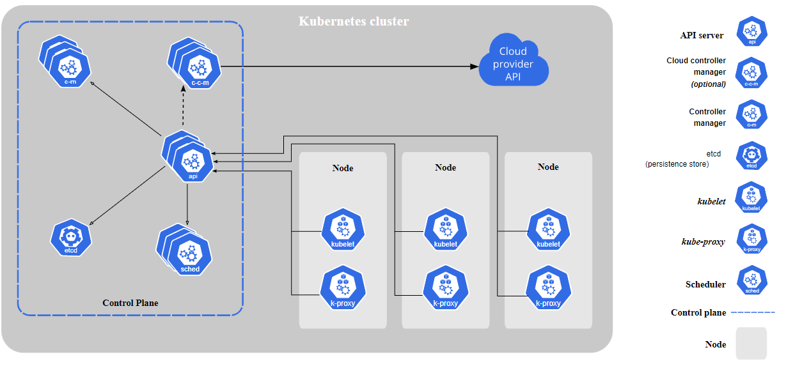

# 🛳 Containers and Kubernetes

### <mark style="color:blue;">**Containers**</mark>&#x20;

* <mark style="color:orange;">**Portable Units**</mark>**:** Containers encapsulate code and dependencies, ensuring swift and reliable application execution across different computing environments.
* <mark style="color:orange;">**Docker Container Image**</mark>**:** A compact, self-contained package, encompassing code, runtime, system tools, libraries, and settings, enabling seamless application execution.
* <mark style="color:orange;">**Runtime Transformation**</mark>**:** Container images metamorphose into containers during runtime, delivering consistent functionality across varying environments.
* <mark style="color:orange;">**Isolation Champions**</mark>**:** Containers shield software from its surroundings, maintaining uniformity irrespective of disparities between development and staging environments.

Experience the power of containers – where reliability and adaptability converge.

### <mark style="color:blue;">**Kubernetes**</mark>&#x20;

* An open-source container-orchestration system streamlining deployment, scaling, and management of containerized applications.
* Boasts an expansive, rapidly evolving ecosystem with abundant services, support, and tools accessible.
* Empowers you with a robust framework to execute distributed systems resiliently.

**A Kubernetes Cluster:**

* Comprises worker machines known as nodes, tasked with executing containerized applications.
* Every cluster holds at least one worker node.
* Worker nodes host Pods – pivotal components of the application workload.
* The control plane supervises worker nodes and Pods within the cluster.
* In production settings, the control plane spans multiple computers while clusters feature several nodes, ensuring fault-tolerance and high availability.

Discover Kubernetes, where orchestration transforms containerization into a symphony of efficiency and reliability.

#### <mark style="color:orange;">**Kubernetes Benefits**</mark>&#x20;

* <mark style="color:blue;">**Extreme Scaling**</mark>**:** Kubernetes' decoupled architecture empowers diverse scaling approaches. Horizontal scaling for servers, auto and manual scaling for containers, and replication controllers for pods offer unparalleled flexibility.
* <mark style="color:blue;">**Swift Deployment**</mark>**:** Enjoy uninterrupted application updates. Kubernetes supports immutable infrastructure, self-healing, and declarative configuration, ensuring seamless deployments without downtime.
* <mark style="color:blue;">**High Availability**</mark>**:** Designed for both applications and infrastructure, Kubernetes boasts auto-replacement capabilities to heal crashed pods. Built-in load balancers automatically balance network loads.
* <mark style="color:blue;">**Unmatched Portability**</mark>**:** Kubernetes transcends platforms. Embrace it on public clouds, on-premises environments, or multi-cloud setups. Its adaptability thrives in any setting.
* <mark style="color:blue;">**Enhanced Security**</mark>**:** Confidential data rests secure within Kubernetes secret objects. Passwords, OAuth tokens, SSH keys – all are safeguarded, enabling easy and secure data replacement.

Delve into the world of Kubernetes – where scalability, speed, availability, portability, and security unite in harmony.

### <mark style="color:blue;">Visual Snapshots</mark>

#### <mark style="color:blue;">**Virtual machines vs Containers**</mark>&#x20;

<figure><figcaption></figcaption></figure>

#### <mark style="color:blue;">Kubernetes</mark>

<figure><figcaption></figcaption></figure>

#### Join us

Stay informed and engaged with our project's latest developments and support on [Slack](https://app.slack.com/client/T04QS32JX6E/C04QKEWE146). Join us today to connect, collaborate, and keep the momentum going!&#x20;
