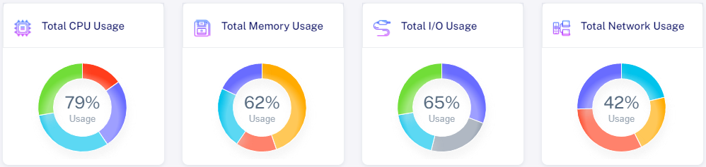

# About Scale Infinite

## <mark style="color:blue;">Introduction</mark>

<mark style="color:blue;">**Welcome to Scale Infinite**</mark>, where hosting becomes an art of simplicity and possibilities. Whether you're a pioneering startup, a thriving enterprise, or an ambitious individual, our platform transforms hosting into an extraordinary experience. Your journey to unhindered application growth starts now.

* <mark style="color:orange;">**Simplified Hosting**</mark>**:** Scale Infinite takes care of infrastructure provisioning, maintenance, and scaling for your containerized applications.
* <mark style="color:orange;">**Instant Accessibility**</mark>**:** Easily host and access applications with just a few clicks.
* <mark style="color:orange;">**Data Insights:**</mark> Get rich telemetry data on CPU usage, Memory usage, I/O, Network usage, and a public IP address.
* <mark style="color:orange;">**Tailored Security**</mark>**:** Choose the right security level for your application needs with multiple layers of protection.
* <mark style="color:orange;">**User-Centric Design**</mark>**:** The platform suits both technical and non-technical users for secure application deployment.
* <mark style="color:orange;">**Limitless Choices**</mark>**:** Deploy any public Docker Hub app or sync from your private registry.
* <mark style="color:orange;">**Instant Deployment**</mark>**:** Link your Docker Hub account and deploy images in seconds.
* <mark style="color:orange;">**Insights at a Glance**</mark>**:** Monitor CPU, Memory, I/O, and Network usage in the Dashboard section.

### <mark style="color:blue;">Visual Snapshot</mark>

<figure><figcaption></figcaption></figure>

<figure><figcaption></figcaption></figure>

<figure><figcaption></figcaption></figure>

## <mark style="color:blue;">Demo for Deploying applications on scale infinite platform</mark>

1. [Xampp Deployment](https://scaleinfinite.gitbook.io/untitled/demo-deployment/tcp/xampp-deployment)
2. [Wordpress Mysql Deployment](https://scaleinfinite.gitbook.io/untitled/demo-deployment/http/wordpress-sqlite)
3. [Wordpress Sqlite Deployment](https://scaleinfinite.gitbook.io/untitled/demo-deployment/http/wordpress-mysql)
4. [Grafana Deployment](https://scaleinfinite.gitbook.io/untitled/demo-deployment/http/grafana-deployment)
5. [Linux VPS Deployment](https://scaleinfinite.gitbook.io/untitled/demo-deployment/http/linux-vps-deployment)
6. [Nginx Deployment](https://scaleinfinite.gitbook.io/untitled/demo-deployment/http/nginx-deployment)
7. [Drupal Deployment](https://scaleinfinite.gitbook.io/untitled/demo-deployment/http/drupal-deployment)

🔗 Link

* [LinkedIn](https://www.linkedin.com/company/scaleinfinite/)
* [Scale Infinite](https://scaleinfinite.fr/)

#### Join us

Stay informed and engaged with our project's latest developments and support on [Slack](https://app.slack.com/client/T04QS32JX6E/C04QKEWE146). Join us today to connect, collaborate, and keep the momentum going!&#x20;
